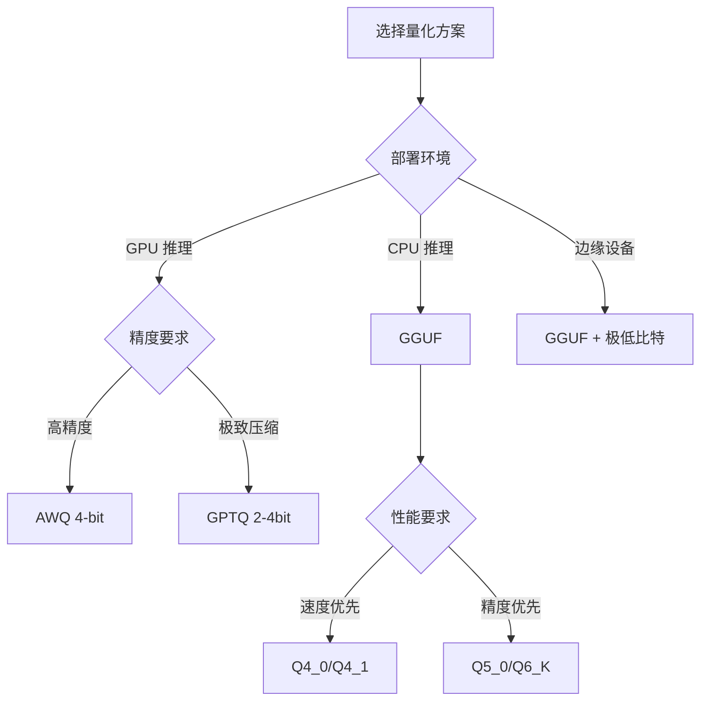

# 量化技术综述（GPTQ/AWQ/GGUF/INT8/INT4）

## 量化基础

量化是将浮点权重/激活转换为低比特表示的技术，核心目标是在最小精度损失下减少模型大小和推理成本。

### 量化类型分类

#### 1. 对称 vs 非对称量化

**对称量化（Symmetric）：**
```python
# 零点固定为 0，只需要一个缩放因子
def symmetric_quantize(x, bits=8):
    scale = x.abs().max() / (2**(bits-1) - 1)
    x_quant = torch.round(x / scale).clamp(-(2**(bits-1)), 2**(bits-1)-1)
    return x_quant.to(torch.int8), scale

def symmetric_dequantize(x_quant, scale):
    return x_quant.to(torch.float32) * scale
```

**非对称量化（Asymmetric）：**
```python
# 需要缩放因子和零点，范围利用更充分
def asymmetric_quantize(x, bits=8):
    x_min, x_max = x.min(), x.max()
    scale = (x_max - x_min) / (2**bits - 1)
    zero_point = torch.round(-x_min / scale).clamp(0, 2**bits-1)
    x_quant = torch.round(x / scale + zero_point).clamp(0, 2**bits-1)
    return x_quant.to(torch.uint8), scale, zero_point
```

#### 2. 粒度分类

```python
# Per-tensor: 整个张量共享一个量化参数
scale_tensor = tensor.abs().max() / max_val

# Per-channel: 每个输出通道独立量化参数  
scale_channel = tensor.abs().max(dim=1, keepdim=True) / max_val

# Per-group: 将通道分组，每组共享量化参数
group_size = 128
scales_group = []
for i in range(0, tensor.shape[0], group_size):
    group = tensor[i:i+group_size]
    scales_group.append(group.abs().max() / max_val)
```

## 主流量化方案对比

### 1. GPTQ (Gradient-Free Post-Training Quantization)

基于 Hessian 矩阵的二阶信息进行权重量化：

```python
class GPTQ:
    def __init__(self, layer):
        self.layer = layer
        self.H = None  # Hessian 逆矩阵
        
    def add_batch(self, inp, out):
        """收集 Hessian 信息"""
        if self.H is None:
            self.H = torch.zeros_like(inp.T @ inp)
        self.H += inp.T @ inp / inp.shape[0]
    
    def quantize(self, bits=4):
        """基于 Hessian 的最优量化"""
        W = self.layer.weight.data
        Q = torch.zeros_like(W)
        Losses = torch.zeros_like(W)
        
        H_inv = torch.linalg.inv(self.H + 1e-8 * torch.eye(self.H.shape[0]))
        
        for i in range(W.shape[1]):
            w_col = W[:, i]
            q_col = self.quantize_column(w_col, bits)
            Q[:, i] = q_col
            
            # 更新后续权重以补偿量化误差
            error = (w_col - q_col) / H_inv[i, i]
            W[:, i+1:] -= error.unsqueeze(1) * H_inv[i, i+1:].unsqueeze(0)
            
        return Q
```

**特点：**
- 精度高，适合极低比特（2-4 bit）
- 计算开销大，需要校准数据
- AutoGPTQ、GPTQ-for-LLaMA 等实现

### 2. AWQ (Activation-aware Weight Quantization)

基于激活重要性的权重量化：

```python
class AWQ:
    def __init__(self, model):
        self.model = model
        self.activation_scales = {}
    
    def search_scale_subset(self, layer, subset):
        """寻找最优缩放因子"""
        best_loss = float('inf')
        best_scale = None
        
        # 尝试不同的缩放候选
        for scale_candidate in self.generate_scale_candidates():
            # 应用缩放并量化
            scaled_weights = layer.weight * scale_candidate
            quantized_weights = self.quantize_weights(scaled_weights)
            
            # 计算重构误差
            loss = self.compute_reconstruction_loss(
                layer.weight, quantized_weights / scale_candidate
            )
            
            if loss < best_loss:
                best_loss = loss
                best_scale = scale_candidate
                
        return best_scale
    
    def quantize_model(self, bits=4):
        """AWQ 量化流程"""
        for name, module in self.model.named_modules():
            if isinstance(module, torch.nn.Linear):
                # 搜索最优激活缩放
                scale = self.search_scale_subset(module, subset_size=512)
                
                # 应用缩放并量化
                module.weight.data *= scale
                quantized_weight = self.quantize_weights(module.weight, bits)
                module.weight.data = quantized_weight / scale
```

**特点：**
- 激活感知，保护重要权重
- 速度快，不需要大量校准数据
- 适合 4-bit 量化

### 3. GGUF (GPT-Generated Unified Format)

llama.cpp 生态系统的量化格式：

```python
# GGUF 支持的量化类型
GGUF_QUANTIZATION_TYPES = {
    'Q4_0': {'bits': 4, 'block_size': 32, 'symmetric': True},
    'Q4_1': {'bits': 4, 'block_size': 32, 'symmetric': False}, 
    'Q5_0': {'bits': 5, 'block_size': 32, 'symmetric': True},
    'Q5_1': {'bits': 5, 'block_size': 32, 'symmetric': False},
    'Q8_0': {'bits': 8, 'block_size': 32, 'symmetric': True},
    'Q2_K': {'bits': 2, 'block_size': 256, 'k_quantization': True},
    'Q3_K': {'bits': 3, 'block_size': 256, 'k_quantization': True},
    'Q4_K': {'bits': 4, 'block_size': 256, 'k_quantization': True},
    'Q5_K': {'bits': 5, 'block_size': 256, 'k_quantization': True},
    'Q6_K': {'bits': 6, 'block_size': 256, 'k_quantization': True},
}

class GGUFQuantizer:
    def quantize_q4_0(self, tensor):
        """Q4_0: 4-bit symmetric, block_size=32"""
        block_size = 32
        blocks = tensor.view(-1, block_size)
        
        scales = []
        quantized_blocks = []
        
        for block in blocks:
            # 计算对称量化的 scale
            scale = block.abs().max() / 7  # 4-bit symmetric: [-7, 7]
            scales.append(scale)
            
            # 量化到 4-bit
            q_block = torch.round(block / scale).clamp(-8, 7)
            quantized_blocks.append(q_block.to(torch.int8))
            
        return torch.cat(quantized_blocks), torch.tensor(scales)
```

**特点：**
- CPU 推理优化，支持多种精度
- 块量化减少精度损失
- 生态系统完善（llama.cpp、Ollama 等）

### 4. SmoothQuant

激活和权重联合量化：

```python
class SmoothQuant:
    def __init__(self, alpha=0.5):
        self.alpha = alpha
    
    def smooth_layer(self, layer, act_scales):
        """对激活和权重应用平滑变换"""
        # 计算平滑因子
        weight_scales = layer.weight.abs().max(dim=0)[0]
        smooth_scales = (act_scales ** self.alpha) / (weight_scales ** (1 - self.alpha))
        
        # 应用平滑变换
        layer.weight.data *= smooth_scales.unsqueeze(0)
        
        # 返回激活缩放（需要在推理时应用）
        return 1.0 / smooth_scales
```

### 5. FP8 量化

新兴的 8-bit 浮点格式：

```python
# E4M3: 4-bit 指数，3-bit 尾数（范围大，精度中等）
# E5M2: 5-bit 指数，2-bit 尾数（范围小，精度高）

def convert_to_fp8_e4m3(tensor):
    """转换为 FP8 E4M3 格式"""
    # 模拟 FP8 E4M3：范围 ±448，最小正值 2^-9
    max_val = 448.0
    min_val = 2**(-9)
    
    # 截断到有效范围
    tensor_clamped = torch.clamp(tensor.abs(), min_val, max_val) * tensor.sign()
    
    # 量化（简化版本，实际需要按 IEEE 754 标准）
    return tensor_clamped  # 实际实现更复杂
```

## 实践指南

### 场景选择策略



### 具体建议

**GPU 推理（CUDA/ROCm）：**
- **生产环境**: AWQ 4-bit（速度与精度平衡）
- **研究/实验**: GPTQ 3-4bit（最高压缩比）
- **长序列**: 考虑激活量化（SmoothQuant）

**CPU 推理：**
- **通用**: GGUF Q4_0/Q4_1
- **高精度**: GGUF Q5_0/Q6_K  
- **超低延迟**: GGUF Q3_K/Q4_K

**模型大小参考：**
```python
def estimate_model_size(param_count, bits):
    """估算量化后模型大小"""
    base_size_gb = param_count / (8 / bits) / 1e9
    overhead = 0.1  # 10% 元数据开销
    return base_size_gb * (1 + overhead)

# 7B 模型不同量化精度的大小
print(f"FP16: {estimate_model_size(7e9, 16):.1f} GB")  # ~14 GB
print(f"8-bit: {estimate_model_size(7e9, 8):.1f} GB")  # ~7.7 GB  
print(f"4-bit: {estimate_model_size(7e9, 4):.1f} GB")  # ~3.9 GB
print(f"3-bit: {estimate_model_size(7e9, 3):.1f} GB")  # ~2.9 GB
```

## 面试常见问题

### Q1: GPTQ 和 AWQ 的核心区别是什么？
**A**: GPTQ 基于二阶 Hessian 信息进行全局最优化，精度高但计算开销大；AWQ 基于激活重要性进行启发式优化，速度快但可能不是全局最优。GPTQ 适合极低比特量化（2-3bit），AWQ 更适合 4bit 的速度与精度平衡场景。

### Q2: 为什么 Per-channel 量化比 Per-tensor 效果更好？
**A**: Per-tensor 使用全局统计信息，不同通道的数值分布差异会导致精度损失。Per-channel 为每个输出通道独立计算量化参数，更好地适应各通道的统计特性。虽然存储开销稍增，但精度提升显著，是主流做法。

### Q3: GGUF 格式相比其他方案有什么优势？
**A**: GGUF 专为 CPU 推理优化，支持多种量化精度（Q2K 到 Q8_0），使用块量化减少精度损失，并有完整的推理生态系统（llama.cpp、Ollama）。对于边缘部署和 CPU 推理场景，GGUF 是事实标准。

### Q4: 激活量化为什么比权重量化更困难？
**A**: 激活值在运行时动态产生，分布多变且与输入相关，难以预先统计。权重是固定的，可以离线分析分布特征。激活量化需要动态量化或校准数据集统计，计算开销和实现复杂度都更高。

### Q5: 如何选择量化比特数？
**A**: 需要在模型大小、推理速度和精度间平衡。8bit 几乎无精度损失，4bit 是甜点（3-5% 精度损失，50% 大小减少），3bit 开始显著影响质量，2bit 仅适合特定任务。建议从 4bit 开始测试，根据实际任务精度要求调整。