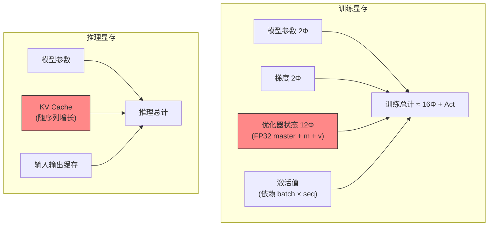

# GPU 显存计算指南：从参数到集群

## 概述

GPU 显存计算是 LLM 项目规划的核心环节，直接影响模型训练和推理的可行性。准确估算显存需求不仅关系到硬件选型，更决定了项目的成本控制和性能表现。本指南深入解析模型显存组成、训练推理场景差异、主流 GPU 对比分析，提供实用的多卡配置建议。

## 模型显存基础计算

### 参数存储显存

**基础公式**
```
模型显存 = 参数量 × 每参数字节数 × 存储倍数
```

**精度类型对比**

| 精度类型 | 每参数字节 | 适用场景 | 精度损失 |
|----------|------------|----------|----------|
| **FP32** | 4 bytes | 训练（梯度计算） | 无 |
| **FP16** | 2 bytes | 训练（混合精度）/推理 | 极小 |
| **BF16** | 2 bytes | 训练（数值稳定） | 极小 |
| **INT8** | 1 byte | 推理（量化） | 轻微 |
| **INT4** | 0.5 bytes | 推理（极端量化） | 明显但可接受 |

**典型模型计算示例**

```python
# 7B 模型示例
params = 7_000_000_000  # 70亿参数

# 不同精度下的显存需求
fp32_memory = params * 4 / 1024**3  # 26.0 GB
fp16_memory = params * 2 / 1024**3  # 13.0 GB
int8_memory = params * 1 / 1024**3  # 6.5 GB
int4_memory = params * 0.5 / 1024**3  # 3.3 GB

print(f"7B模型显存需求:")
print(f"FP32: {fp32_memory:.1f}GB")
print(f"FP16: {fp16_memory:.1f}GB") 
print(f"INT8: {int8_memory:.1f}GB")
print(f"INT4: {int4_memory:.1f}GB")
```

## 训练显存详细分解

### 完整显存组成

> 来源：ZeRO arXiv:1910.02054, Sec. 3; EleutherAI Transformer Math 101

**训练时显存 = 模型参数 + 优化器状态 + 梯度 + 激活值 + 临时缓存**

$$M_{total} = M_{params} + M_{optimizer} + M_{gradients} + M_{activations} + M_{buffer}$$

### 1. 模型参数显存

$$M_{params} = \Phi \times b_{precision} \quad (\Phi = \text{参数量}, b = \text{每参数字节数})$$

### 2. 优化器状态显存

**Adam 优化器**（最常用）
```python
# Adam 需要存储 momentum 和 variance
optimizer_memory = params * precision * 2

# 示例：7B 模型 + FP16
adam_memory = 7e9 * 2 * 2 / 1024**3  # 26.0 GB
```

**其他优化器对比**

| 优化器 | 状态倍数 | 7B模型(FP16) | 特点 |
|--------|----------|---------------|------|
| **SGD** | 0x | 0 GB | 无状态，但收敛慢 |
| **AdamW** | 2x | 26.0 GB | 标准选择 |
| **8-bit Adam** | 2x | 6.5 GB | 量化状态，节省75%显存 |

### 3. 梯度显存
```python
# 梯度显存 = 参数量 × 精度
gradient_memory = params * precision

# 7B 模型 FP16 梯度
grad_mem = 7e9 * 2 / 1024**3  # 13.0 GB
```

### 4. 激活值显存

> 来源：Reducing Activation Recomputation — arXiv:2205.05198 (Korthikanti et al., 2022)

**计算公式**（Transformer layer 激活值，无重计算）：

$$M_{act} \approx s \cdot b \cdot h \cdot L \cdot \left(34 + 5\frac{a \cdot s}{h}\right) \quad \text{bytes (混合精度)}$$

其中 $s$ = seq\_len, $b$ = batch\_size, $h$ = hidden\_dim, $L$ = layers, $a$ = attention heads。

简化估算：

**实际计算示例**
```python
# LLaMA-7B 配置
batch_size = 8
seq_length = 2048
hidden_dim = 4096
num_layers = 32

# FP16 激活值显存
activation_mem = (batch_size * seq_length * hidden_dim * 
                 num_layers * 2) / 1024**3
print(f"激活值显存: {activation_mem:.1f}GB")  # ~16.8GB
```

### 训练显存总量估算

**保守估算公式（Adam + 混合精度训练）**：

> 来源：ZeRO arXiv:1910.02054, Table 1

$$M_{train} \approx 16\Phi + M_{activations}$$

分解（以混合精度 + Adam 为例）：
- 模型参数（FP16）：$2\Phi$
- 梯度（FP16）：$2\Phi$
- 优化器状态（FP32 master weights + momentum + variance）：$4\Phi + 4\Phi + 4\Phi = 12\Phi$
- **合计**：$16\Phi$（不含激活值）

**7B 模型训练显存估算**
```python
model_params_gb = 7e9 * 2 / 1024**3  # 13.0 GB
total_training_memory = model_params_gb * 16 + 16.8  # ~225 GB

print(f"7B模型训练总显存需求: ~{total_training_memory:.0f}GB")
```

## 推理显存分解

### 推理显存组成

**推理显存 = 模型参数 + KV Cache + 输入输出缓存**

### KV Cache 详细计算

**KV Cache 原理**
- 存储每个 attention layer 的 Key/Value 矩阵
- 避免重复计算，加速生成过程
- 大小与序列长度线性增长

**计算公式**

$$M_{KV} = 2 \times L \times n_{kv} \times d_h \times s \times b \times b_{precision}$$

其中 $L$ = layers, $n_{kv}$ = KV heads（GQA 时 < $n_h$），$d_h$ = head\_dim, $s$ = seq\_len, $b$ = batch\_size。
```python
def calculate_kv_cache(batch_size, seq_length, num_layers, 
                      hidden_dim, num_heads, precision=2):
    """
    KV Cache 显存计算
    
    Args:
        batch_size: 批次大小
        seq_length: 序列长度  
        num_layers: transformer 层数
        hidden_dim: 隐藏维度
        num_heads: 注意力头数
        precision: 精度字节数(FP16=2)
    """
    head_dim = hidden_dim // num_heads
    
    # 每层的 KV cache
    kv_per_layer = 2 * batch_size * num_heads * seq_length * head_dim * precision
    
    # 总 KV cache
    total_kv = kv_per_layer * num_layers / 1024**3
    
    return total_kv

# LLaMA-7B KV Cache 示例
kv_cache_gb = calculate_kv_cache(
    batch_size=1,
    seq_length=2048, 
    num_layers=32,
    hidden_dim=4096,
    num_heads=32
)
print(f"KV Cache 显存: {kv_cache_gb:.1f}GB")  # ~1.0GB
```

### 推理显存优化

**分页注意力（PagedAttention）**
```python
# vLLM 中的实现概念
class PagedKVCache:
    def __init__(self, page_size=16):
        self.page_size = page_size  # 每页token数
        self.pages = []  # 物理页池
        
    def allocate_sequence(self, seq_len):
        """为序列分配物理页"""
        num_pages = (seq_len + self.page_size - 1) // self.page_size
        return [self.allocate_page() for _ in range(num_pages)]
```

**显存节省效果**
- **连续内存**：传统方式，预分配最大序列长度
- **分页内存**：按需分配，减少60-80%显存浪费

## GPU 硬件对比分析

### 主流 GPU 规格对比

| GPU 型号 | 显存 | 显存带宽 | 计算能力 | 价格区间 | 适用场景 |
|----------|------|----------|----------|----------|----------|
| **A100 40GB** | 40GB | 1555 GB/s | 19.5 TFLOPS | $10,000+ | 训练/推理 |
| **A100 80GB** | 80GB | 2039 GB/s | 19.5 TFLOPS | $15,000+ | 大模型训练 |
| **H100 80GB** | 80GB | 3350 GB/s | 67 TFLOPS | $25,000+ | 新一代训练 |
| **H200 141GB** | 141GB | 4800 GB/s | 67 TFLOPS | $30,000+ | 超大模型 |
| **L40S 48GB** | 48GB | 864 GB/s | 91 TFLOPS | $8,000+ | 推理优化 |
| **MI300X 192GB** | 192GB | 5200 GB/s | 61 TFLOPS | $15,000+ | AMD 方案 |

### 性价比分析

**训练场景**
```python
def training_efficiency(gpu_memory, bandwidth, price):
    """训练效率评估"""
    # 显存效率 (GB per $1000)
    memory_efficiency = gpu_memory / (price / 1000)
    
    # 带宽效率 (GB/s per $1000)  
    bandwidth_efficiency = bandwidth / (price / 1000)
    
    return memory_efficiency, bandwidth_efficiency

# 示例计算
gpus = {
    "A100-80GB": (80, 2039, 15000),
    "H100-80GB": (80, 3350, 25000), 
    "H200-141GB": (141, 4800, 30000),
    "L40S-48GB": (48, 864, 8000)
}

for name, (mem, bw, price) in gpus.items():
    mem_eff, bw_eff = training_efficiency(mem, bw, price)
    print(f"{name}: {mem_eff:.1f}GB/$1k, {bw_eff:.1f}GB/s/$1k")
```

**推理场景优先级**
1. **显存容量** > 计算能力（模型要能装下）
2. **显存带宽** > 峰值算力（生成受带宽限制）
3. **功耗效率**（大规模部署成本考虑）

### 特殊用途 GPU

**边缘推理**
- **RTX 4090**: 24GB, 性价比高，适合小团队
- **RTX A6000**: 48GB, 专业卡稳定性好
- **T4**: 16GB, 云服务器标配，成本低

**科研环境**  
- **RTX 3090**: 24GB, 已停产但二手性价比高
- **RTX 4080**: 16GB, 中等模型推理

## 多卡配置建议

### 不同规模模型配置

**小模型（< 7B）**
```yaml
配置方案:
  单卡推理: RTX 4090 (24GB) / L40S (48GB)
  训练配置: 2x A100 40GB
  成本优化: 4x RTX 3090 (二手)
  
推荐配置:
  - 开发测试: 1x RTX 4090
  - 生产推理: 2x L40S  
  - 研究训练: 2x A100 40GB
```

**中型模型（7B-30B）**
```yaml
配置方案:
  推理配置: 
    - 7B: 1x A100 40GB / 2x RTX 4090
    - 13B: 1x A100 80GB / 1x H100 80GB
    - 30B: 2x A100 80GB / 1x H200 141GB
    
  训练配置:
    - 7B: 4x A100 80GB
    - 13B: 8x A100 80GB 
    - 30B: 8x H100 80GB
```

**大模型（30B-70B）**
```yaml
配置方案:
  推理配置:
    - 34B: 2x A100 80GB / 1x MI300X 192GB
    - 70B: 4x A100 80GB / 2x H200 141GB
    
  训练配置:
    - 34B: 16x A100 80GB
    - 70B: 32x H100 80GB + NVLink
```

**超大模型（> 100B）**
```yaml
配置方案:
  推理配置:
    - 175B: 8x A100 80GB / 4x MI300X 192GB
    - 现实建议: 使用 API 服务更经济
    
  训练配置:
    - 需要专业级集群（64+ GPU）
    - 考虑云服务或模型 API
```

### 集群网络配置

**高速互连**
```yaml
网络拓扑:
  GPU 内部: NVLink (600 GB/s)
  节点内部: PCIe 4.0 (64 GB/s)
  节点间: InfiniBand HDR (200 Gb/s)
  
推荐配置:
  小集群: 2-4x GPU + NVLink
  中集群: 8x GPU + NVSwitch  
  大集群: 多节点 + InfiniBand
```

## 面试常见问题

### Q1: 如何估算 LLM 训练的显存需求？

**答案要点：**
- **基础公式**：模型参数 × 16 + 激活值显存
- **组成分解**：模型(2x) + 优化器(4x) + 梯度(2x) + 缓存(8x) = 16x
- **激活值**：与 batch size、sequence length 成正比
- **实际建议**：预留20-30%缓冲，考虑峰值情况

### Q2: 推理时 KV Cache 如何影响显存使用？

**答案要点：**
- **作用机制**：存储注意力的 Key/Value，避免重复计算
- **显存占用**：与序列长度、批次大小线性增长
- **优化方法**：PagedAttention 技术减少60-80%浪费
- **计算公式**：2 × batch × heads × seq_len × head_dim × precision

### Q3: 如何选择训练和推理的 GPU 配置？

**答案要点：**
- **训练优先级**：显存容量 > 计算能力 > 带宽
- **推理优先级**：显存容量 > 带宽 > 计算能力
- **成本考虑**：云服务 vs 自建，短期 vs 长期投资
- **扩展性**：预留升级空间，考虑模型规模增长

### Q4: 多卡部署时如何处理显存不足问题？

**答案要点：**
- **模型并行**：将模型参数分散到多张卡
- **管道并行**：不同层在不同卡上执行
- **梯度累积**：小批次训练，累积梯度后更新
- **显存优化**：梯度检查点、混合精度、量化

### Q5: H100 相比 A100 的优势在哪里？

**答案要点：**
- **性能提升**：3.5倍计算能力，2倍显存带宽
- **新架构**：Hopper 架构，原生支持 Transformer Engine
- **精度优化**：FP8 精度，在精度和速度间平衡
- **成本考虑**：价格昂贵，需评估性价比

## 实用工具

### 显存监控脚本

```python
import torch
import psutil

def gpu_memory_info():
    """获取 GPU 显存信息"""
    if torch.cuda.is_available():
        for i in range(torch.cuda.device_count()):
            props = torch.cuda.get_device_properties(i)
            allocated = torch.cuda.memory_allocated(i) / 1024**3
            cached = torch.cuda.memory_reserved(i) / 1024**3
            total = props.total_memory / 1024**3
            
            print(f"GPU {i} ({props.name}):")
            print(f"  Total: {total:.1f}GB")
            print(f"  Allocated: {allocated:.1f}GB")
            print(f"  Cached: {cached:.1f}GB")
            print(f"  Free: {total-cached:.1f}GB")

# 使用示例
gpu_memory_info()
```

### 模型显存计算器

```python
def model_memory_calculator(params_billion, precision="fp16", 
                           scenario="inference"):
    """模型显存需求计算器"""
    
    precision_bytes = {
        "fp32": 4, "fp16": 2, "bf16": 2, 
        "int8": 1, "int4": 0.5
    }
    
    model_memory = params_billion * precision_bytes[precision]
    
    if scenario == "inference":
        # 推理：模型 + KV Cache 缓冲
        total_memory = model_memory * 1.2
    else:  # training
        # 训练：模型 × 16 + 激活值
        total_memory = model_memory * 16 + 20  # 20GB 激活值估算
    
    return {
        "model_memory": model_memory,
        "total_memory": total_memory,
        "scenario": scenario,
        "precision": precision
    }

# 使用示例
result = model_memory_calculator(7, "fp16", "inference")
print(f"7B 模型 FP16 推理显存需求: {result['total_memory']:.1f}GB")
```

## 显存占用全景图



## 🔧 落地应用

### 直接可用场景
- **硬件选型**：用 $16\Phi$ 公式快速估算训练需要多少 GPU（如 7B 模型需 ~112GB + 激活值，至少 2×A100-80GB）
- **成本预算**：根据 GPU 显存价格比（$/GB）选择最优方案
- **推理部署**：KV Cache 公式决定了同一 GPU 能服务多少并发用户

### 工程实现要点
- **Gradient Checkpointing**：用 ~33% 额外计算换 ~60% 激活值显存，$M_{act}$ 降至 $\sqrt{L}$ 量级
- **ZeRO 选择**：ZeRO-3 将 $16\Phi$ 降至 $16\Phi/N$（$N$ 张卡），但增加通信
- **KV Cache 量化**：FP8 KV Cache 可将推理显存减半

### 面试高频问法
- **Q: 训练 70B 模型需要多少 GPU？**
  A: $16 \times 70\text{B} \times 2\text{B/param} = 2240\text{GB}$ 参数相关 + ~200GB 激活值 ≈ 2.4TB。用 32×A100-80GB（2.56TB），ZeRO-3 或 TP=8 + PP=2 + DP=2。

## 💡 启发与思考

### So What？对老板意味着什么
- 显存计算是**一切大模型项目的第一步**——选错硬件 = 烧钱，算错显存 = 训练跑不起来
- $16\Phi$ 公式意味着训练成本是推理的 8 倍（训练存 16 份，推理只存 2 份参数）

### 未解问题与局限
- 激活值显存高度依赖实现细节（是否用 FlashAttention、是否做 activation checkpointing），公式只是近似
- MoE 模型的显存计算更复杂——总参数量巨大但每次只激活一部分
- FP8 训练的显存节省理论上可达 2x，但实际因精度补偿可能只有 1.5x

### 脑暴：如果往下延伸
- [[AI/LLM/Infra/混合精度训练|混合精度训练]] 直接影响 $b_{precision}$——从 FP32 到 BF16 再到 FP8，每降一级显存减半
- [[AI/LLM/Architecture/Multi-Head Latent Attention|MLA]] 将 KV Cache 公式中的 $n_{kv} \times d_h$ 替换为 $d_c$（潜在维度），实现数量级压缩

## 📚 推荐阅读

### 原始论文
- [ZeRO: Memory Optimizations Toward Training Trillion Parameter Models](https://arxiv.org/abs/1910.02054) — 显存分解分析的奠基之作 ⭐⭐⭐⭐⭐
- [Reducing Activation Recomputation in Large Transformer Models](https://arxiv.org/abs/2205.05198) — 激活值显存的精确公式

### 深度解读
- [Transformer Math 101](https://blog.eleuther.ai/transformer-math/) — EleutherAI ⭐⭐⭐⭐⭐，训练显存/计算/通信一站式计算，本文核心参考
- [LLM Training: FLOPS, Memory and GPU Selection](https://www.substratus.ai/blog/calculating-gpu-memory-for-llm) — 实操向显存估算指南 ⭐⭐⭐⭐

### 实践资源
- [HuggingFace Model Memory Calculator](https://huggingface.co/spaces/hf-accelerate/model-memory-usage) — 在线估算工具
- [DeepSpeed ZeRO Infinity](https://www.deepspeed.ai/tutorials/zero-offload/) — 显存不够时的 CPU/NVMe offload 方案

---

## See Also

- [[AI/LLM/Infra/分布式训练|分布式训练]] — ZeRO/TP/PP 策略直接决定每卡显存分配；本文的 $16\Phi$ 公式在 ZeRO-3 下变为 $16\Phi/N$
- [[AI/LLM/Infra/混合精度训练|混合精度训练]] — 精度选择（FP32/BF16/FP8）直接影响每参数字节数，是显存公式的核心变量
- [[AI/LLM/Architecture/Multi-Head Latent Attention|Multi-Head Latent Attention]] — MLA 将 KV Cache 压缩 8-93x，彻底改变推理显存估算
- [[AI/LLM/Infra/DeepSpeed|DeepSpeed]] — ZeRO 系列的工程实现，支持 offload 突破 GPU 显存限制
- [[AI/LLM/Architecture/长上下文技术|长上下文技术]] — 128K+ 上下文的 KV Cache 是推理显存的主要瓶颈