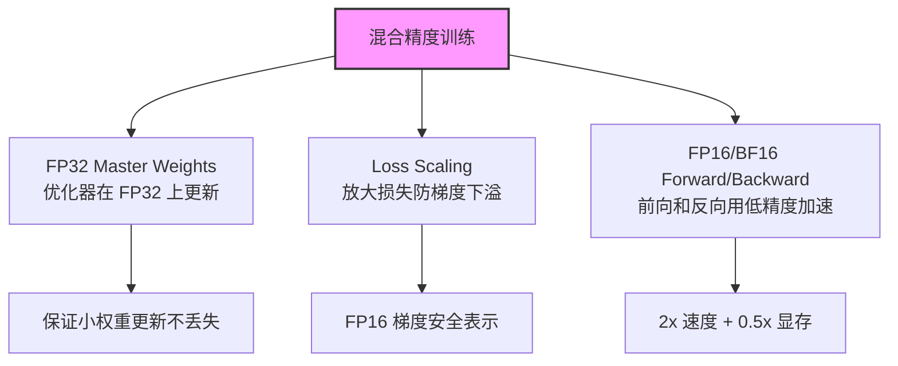
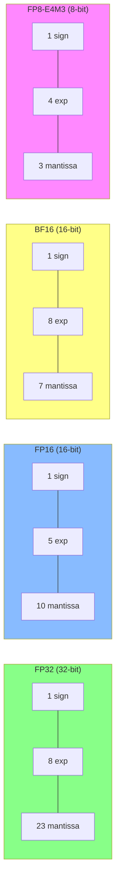

> [!info] 另有面试版
> Foundations 精简版：[[AI/Foundations/Training/混合精度训练]]

# 混合精度训练：FP32/FP16/BF16/FP8 全景

> 来源：Mixed Precision Training — arXiv:1710.03740 (Micikevicius et al., 2018)

混合精度训练（Mixed Precision Training）通过在训练过程中使用多种数值精度来平衡计算效率和数值稳定性。本文深入分析各种数据格式的特点、混合精度的实现原理，以及在大语言模型训练中的实践经验。

## 数据格式对比分析

### 浮点格式规范

#### FP32（标准单精度）
- **格式**：1 符号位 + 8 指数位 + 23 尾数位
- **范围**：$\pm 3.4 \times 10^{38}$
- **精度**：约 7 位十进制数
- **特点**：高精度、大范围，训练稳定但内存和计算开销大

#### FP16（半精度）
- **格式**：1 符号位 + 5 指数位 + 10 尾数位
- **范围**：$\pm 6.55 \times 10^4$
- **精度**：约 3-4 位十进制数
- **特点**：内存减半、速度翻倍，但容易溢出和精度丢失

#### BF16（Brain Float 16）
- **格式**：1 符号位 + 8 指数位 + 7 尾数位
- **范围**：与 FP32 相同（$\pm 3.4 \times 10^{38}$）
- **精度**：约 2-3 位十进制数
- **特点**：Google 设计，专为机器学习优化，减少溢出问题

#### FP8（8位浮点）
- **E4M3**：1 符号位 + 4 指数位 + 3 尾数位
- **E5M2**：1 符号位 + 5 指数位 + 2 尾数位
- **特点**：H100 原生支持，极致压缩但需要精心调优

```python
import torch
import numpy as np

def compare_precision_formats():
    """对比不同精度格式的数值特性"""
    
    # 精度范围对比
    formats = {
        'FP32': {'min_pos': 1.175494e-38, 'max_val': 3.402823e+38, 'eps': 1.192093e-07},
        'FP16': {'min_pos': 6.103516e-05, 'max_val': 65504.0, 'eps': 0.0009765625},
        'BF16': {'min_pos': 1.175494e-38, 'max_val': 3.389531e+38, 'eps': 0.0078125},
    }
    
    print("数值格式对比:")
    print(f"{'格式':<8} {'最小正值':<15} {'最大值':<15} {'机器精度':<15}")
    print("-" * 60)
    for fmt, props in formats.items():
        print(f"{fmt:<8} {props['min_pos']:<15.2e} {props['max_val']:<15.2e} {props['eps']:<15.2e}")

    # 梯度范围示例
    def analyze_gradient_distribution():
        """分析典型 LLM 训练中的梯度分布"""
        # 模拟真实梯度分布
        gradients = torch.randn(1000000) * 1e-5  # 典型 LLM 梯度尺度
        
        print(f"\n梯度分布分析:")
        print(f"均值: {gradients.mean():.2e}")
        print(f"标准差: {gradients.std():.2e}")
        print(f"最小值: {gradients.min():.2e}")
        print(f"最大值: {gradients.max():.2e}")
        
        # 检查各格式的表示能力
        fp16_underflow = (torch.abs(gradients) < 6.103516e-05).sum()
        print(f"FP16 下溢数量: {fp16_underflow} ({fp16_underflow/len(gradients)*100:.2f}%)")
        
        return gradients

compare_precision_formats()
```

### 数值稳定性分析

```python
class PrecisionAnalyzer:
    """精度格式的数值稳定性分析工具"""
    
    def __init__(self):
        self.formats = ['float32', 'float16', 'bfloat16']
    
    def test_overflow_underflow(self):
        """测试溢出和下溢情况"""
        test_values = [1e-10, 1e-5, 1e5, 1e10]
        
        for fmt in self.formats:
            print(f"\n{fmt.upper()} 溢出测试:")
            for val in test_values:
                try:
                    if fmt == 'bfloat16':
                        converted = val  # PyTorch 自动处理
                        result = "正常"
                    else:
                        converted = torch.tensor(val, dtype=getattr(torch, fmt))
                        result = "正常" if torch.isfinite(converted) else "溢出"
                    
                    print(f"  {val:.1e} -> {result}")
                except:
                    print(f"  {val:.1e} -> 错误")
    
    def gradient_accumulation_error(self, steps=1000):
        """测试梯度累积误差"""
        small_grad = 1e-7
        
        # FP32 基准
        fp32_sum = torch.tensor(0.0, dtype=torch.float32)
        for _ in range(steps):
            fp32_sum += small_grad
        
        # FP16 累积
        fp16_sum = torch.tensor(0.0, dtype=torch.float16)
        for _ in range(steps):
            fp16_sum += small_grad
        
        # BF16 累积
        bf16_val = torch.tensor(small_grad)
        bf16_sum = torch.tensor(0.0)
        for _ in range(steps):
            bf16_sum += bf16_val.to(torch.bfloat16)
        
        print(f"\n梯度累积测试 ({steps} 步, 每步 {small_grad:.1e}):")
        print(f"FP32 结果: {fp32_sum:.8f}")
        print(f"FP16 结果: {fp16_sum:.8f} (误差: {abs(fp32_sum - fp16_sum)/fp32_sum*100:.2f}%)")
        print(f"BF16 结果: {bf16_sum:.8f} (误差: {abs(fp32_sum - bf16_sum.float())/fp32_sum*100:.2f}%)")

# 运行分析
analyzer = PrecisionAnalyzer()
analyzer.test_overflow_underflow()
analyzer.gradient_accumulation_error()
```

## 混合精度训练原理

### 混合精度训练核心流程

> 来源：arXiv:1710.03740, Sec. 3

混合精度训练的三大支柱：



**Loss Scaling 数学原理**：

$$\hat{L} = L \times S \quad \text{(放大损失)}$$

$$\hat{g} = \frac{\partial \hat{L}}{\partial w} = S \cdot \frac{\partial L}{\partial w} \quad \text{(梯度同步放大)}$$

$$g = \hat{g} / S \quad \text{(优化器更新前反缩放)}$$

其中 $S$ 是动态缩放因子（初始 $2^{16}$），遇到 Inf/NaN 时减半，连续成功 $N$ 步后翻倍。

### 自动混合精度（AMP）框架

```python
import torch.cuda.amp as amp

class MixedPrecisionTrainer:
    def __init__(self, model, optimizer, loss_fn):
        self.model = model
        self.optimizer = optimizer
        self.loss_fn = loss_fn
        
        # GradScaler 用于防止梯度下溢
        self.scaler = amp.GradScaler()
        
        # 记录损失缩放历史
        self.scale_history = []
        
    def train_step(self, inputs, targets):
        """混合精度训练步骤"""
        self.optimizer.zero_grad()
        
        # 前向传播使用 autocast
        with amp.autocast():
            outputs = self.model(inputs)
            loss = self.loss_fn(outputs, targets)
        
        # 缩放损失并反向传播
        self.scaler.scale(loss).backward()
        
        # 记录当前缩放因子
        current_scale = self.scaler.get_scale()
        self.scale_history.append(current_scale)
        
        # 缩放梯度并更新
        self.scaler.step(self.optimizer)
        self.scaler.update()
        
        return loss.item(), current_scale
    
    def analyze_gradient_scale(self):
        """分析梯度缩放的变化情况"""
        import matplotlib.pyplot as plt
        
        plt.figure(figsize=(12, 4))
        
        # 缩放因子变化
        plt.subplot(1, 2, 1)
        plt.plot(self.scale_history)
        plt.yscale('log')
        plt.title('Gradient Scale Factor')
        plt.xlabel('Step')
        plt.ylabel('Scale Factor')
        
        # 缩放调整频率
        scale_changes = np.diff(np.log2(self.scale_history))
        plt.subplot(1, 2, 2)
        plt.hist(scale_changes, bins=50, alpha=0.7)
        plt.title('Scale Change Distribution')
        plt.xlabel('Log2 Scale Change')
        plt.ylabel('Frequency')
        
        plt.tight_layout()
        plt.show()
```

### Loss Scaling 机制

```python
class DynamicLossScaler:
    """动态损失缩放实现"""
    
    def __init__(self, init_scale=2**16, scale_factor=2.0, scale_window=2000):
        self.scale = init_scale
        self.scale_factor = scale_factor
        self.scale_window = scale_window
        self.unskipped_steps = 0
        
    def scale_loss(self, loss):
        """缩放损失值"""
        return loss * self.scale
    
    def unscale_gradients(self, parameters):
        """反缩放梯度"""
        inv_scale = 1. / self.scale
        for param in parameters:
            if param.grad is not None:
                param.grad.data.mul_(inv_scale)
    
    def update_scale(self, found_inf):
        """根据是否出现无穷大值更新缩放因子"""
        if found_inf:
            # 发现无穷大，减小缩放因子
            self.scale /= self.scale_factor
            self.unskipped_steps = 0
            print(f"Loss scaling down to {self.scale}")
        else:
            self.unskipped_steps += 1
            
            # 连续成功步数达到窗口大小，增加缩放因子
            if self.unskipped_steps >= self.scale_window:
                self.scale *= self.scale_factor
                self.unskipped_steps = 0
                print(f"Loss scaling up to {self.scale}")
    
    def step(self, optimizer, parameters):
        """执行优化步骤"""
        # 检查梯度是否有无穷大值
        found_inf = any(
            torch.isinf(param.grad).any() or torch.isnan(param.grad).any()
            for param in parameters if param.grad is not None
        )
        
        if not found_inf:
            self.unscale_gradients(parameters)
            optimizer.step()
        
        self.update_scale(found_inf)
        return not found_inf
```

### Master Weights 机制

```python
class MasterWeightOptimizer:
    """使用 FP32 主权重的优化器包装器"""
    
    def __init__(self, optimizer, model):
        self.optimizer = optimizer
        self.model = model
        
        # 创建 FP32 主权重副本
        self.master_weights = []
        self.model_params = []
        
        for param_group in optimizer.param_groups:
            master_group = []
            model_group = []
            
            for param in param_group['params']:
                # 创建 FP32 主权重
                master_param = param.detach().clone().float()
                master_param.requires_grad = True
                master_group.append(master_param)
                model_group.append(param)
            
            self.master_weights.append(master_group)
            self.model_params.append(model_group)
    
    def zero_grad(self):
        """清零主权重梯度"""
        for group in self.master_weights:
            for param in group:
                if param.grad is not None:
                    param.grad.zero_()
    
    def copy_grads_to_master(self):
        """将模型梯度复制到主权重"""
        for master_group, model_group in zip(self.master_weights, self.model_params):
            for master_param, model_param in zip(master_group, model_group):
                if model_param.grad is not None:
                    if master_param.grad is None:
                        master_param.grad = torch.empty_like(master_param)
                    master_param.grad.copy_(model_param.grad.float())
    
    def copy_master_to_model(self):
        """将主权重更新复制回模型"""
        for master_group, model_group in zip(self.master_weights, self.model_params):
            for master_param, model_param in zip(master_group, model_group):
                model_param.data.copy_(master_param.data.to(model_param.dtype))
    
    def step(self):
        """执行优化步骤"""
        # 复制梯度到主权重
        self.copy_grads_to_master()
        
        # 在 FP32 主权重上执行优化
        self.optimizer.step()
        
        # 将更新的权重复制回模型
        self.copy_master_to_model()
```

## BF16 vs FP16 选择

### 为什么 LLM 训练偏好 BF16？

```python
def compare_bf16_fp16():
    """对比 BF16 和 FP16 在 LLM 训练中的表现"""
    
    # 1. 数值范围对比
    print("数值范围对比:")
    print(f"FP16 最大值: {torch.finfo(torch.float16).max}")
    print(f"BF16 最大值: {torch.finfo(torch.bfloat16).max}")
    print(f"FP16 最小正值: {torch.finfo(torch.float16).tiny}")
    print(f"BF16 最小正值: {torch.finfo(torch.bfloat16).tiny}")
    
    # 2. 典型 LLM 权重分布测试
    def test_weight_distribution():
        """测试典型 LLM 权重分布下的表现"""
        
        # 模拟 Transformer 权重分布（接近正态分布）
        weights = torch.randn(1000000) * 0.02  # 典型初始化标准差
        
        # 转换到不同格式
        weights_fp16 = weights.half()
        weights_bf16 = weights.bfloat16()
        
        # 计算量化误差
        fp16_error = (weights - weights_fp16.float()).abs().mean()
        bf16_error = (weights - weights_bf16.float()).abs().mean()
        
        print(f"\n权重量化误差:")
        print(f"FP16 平均误差: {fp16_error:.2e}")
        print(f"BF16 平均误差: {bf16_error:.2e}")
        
        # 检查梯度累积稳定性
        small_updates = torch.randn(1000) * 1e-6
        
        fp16_acc = torch.zeros(1, dtype=torch.float16)
        bf16_acc = torch.zeros(1, dtype=torch.bfloat16)
        fp32_acc = torch.zeros(1, dtype=torch.float32)
        
        for update in small_updates:
            fp16_acc += update.half()
            bf16_acc += update.bfloat16()
            fp32_acc += update
        
        print(f"\n小梯度累积测试:")
        print(f"FP32 基准: {fp32_acc.item():.8f}")
        print(f"FP16 结果: {fp16_acc.float().item():.8f}")
        print(f"BF16 结果: {bf16_acc.float().item():.8f}")
        print(f"FP16 相对误差: {abs(fp32_acc - fp16_acc.float())/abs(fp32_acc)*100:.2f}%")
        print(f"BF16 相对误差: {abs(fp32_acc - bf16_acc.float())/abs(fp32_acc)*100:.2f}%")
    
    test_weight_distribution()

# 实际应用中的选择策略
class PrecisionSelector:
    @staticmethod
    def recommend_precision(model_type, hardware, stability_priority=True):
        """根据模型和硬件推荐精度格式"""
        
        recommendations = {}
        
        if hardware == "A100" or hardware == "H100":
            if model_type == "LLM":
                if stability_priority:
                    recommendations['forward'] = 'BF16'
                    recommendations['backward'] = 'FP32'
                    recommendations['optimizer'] = 'FP32'
                    recommendations['reason'] = 'BF16 前向传播，FP32 梯度计算，最佳稳定性'
                else:
                    recommendations['forward'] = 'FP16'
                    recommendations['backward'] = 'FP16'
                    recommendations['optimizer'] = 'FP32'
                    recommendations['reason'] = 'FP16 前向/后向，FP32 优化器，最佳性能'
        
        elif hardware == "V100":
            recommendations['forward'] = 'FP16'
            recommendations['backward'] = 'FP16'  
            recommendations['optimizer'] = 'FP32'
            recommendations['reason'] = 'V100 不支持 BF16，使用 FP16 + loss scaling'
        
        return recommendations

compare_bf16_fp16()
```

### BF16 实践配置

```python
class BF16Trainer:
    """BF16 混合精度训练实现"""
    
    def __init__(self, model, optimizer):
        self.model = model
        self.optimizer = optimizer
        
        # 转换模型到 BF16
        self.model = self.model.to(torch.bfloat16)
        
        # 保持某些层为 FP32（数值敏感的层）
        self.keep_fp32_layers = ['layer_norm', 'embedding']
        self._preserve_fp32_layers()
    
    def _preserve_fp32_layers(self):
        """保持某些层为 FP32 精度"""
        for name, module in self.model.named_modules():
            if any(keep_type in name.lower() for keep_type in self.keep_fp32_layers):
                module.float()
                print(f"保持 {name} 为 FP32 精度")
    
    def train_step(self, inputs, targets):
        """BF16 训练步骤（不需要 loss scaling）"""
        self.optimizer.zero_grad()
        
        # BF16 前向传播（不使用 autocast）
        outputs = self.model(inputs.bfloat16())
        loss = F.cross_entropy(outputs.float(), targets)
        
        # 直接反向传播（BF16 数值范围足够，无需缩放）
        loss.backward()
        
        # 梯度裁剪（在转换为 FP32 后）
        fp32_grads = []
        for param in self.model.parameters():
            if param.grad is not None:
                fp32_grads.append(param.grad.float())
        
        torch.nn.utils.clip_grad_norm_(fp32_grads, max_norm=1.0)
        
        # 优化器更新（自动处理精度转换）
        self.optimizer.step()
        
        return loss.item()
```

## FP8 训练（H100 特性）

### FP8 格式详解

```python
# FP8 需要使用 Transformer Engine 或者 CUDA 专门库
try:
    import transformer_engine.pytorch as te
    FP8_AVAILABLE = True
except ImportError:
    FP8_AVAILABLE = False
    print("Transformer Engine 未安装，FP8 功能不可用")

class FP8Trainer:
    """FP8 混合精度训练（需要 H100）"""
    
    def __init__(self, model, optimizer):
        if not FP8_AVAILABLE:
            raise RuntimeError("FP8 训练需要 Transformer Engine")
        
        self.model = model
        self.optimizer = optimizer
        
        # FP8 配置
        self.fp8_recipe = te.recipe.DelayedScaling(
            margin=0,           # 缩放边际
            interval=1,         # 缩放间隔
            fp8_format=te.recipe.Format.E4M3,  # 前向传播格式
            amax_history_len=16, # 历史最大值长度
            amax_compute_algo='max'  # 最大值计算算法
        )
    
    def convert_to_fp8(self):
        """将模型转换为支持 FP8 的版本"""
        # 替换关键层为 FP8 版本
        for name, module in self.model.named_children():
            if isinstance(module, torch.nn.Linear):
                # 转换为 FP8 Linear 层
                fp8_linear = te.Linear(
                    module.in_features,
                    module.out_features,
                    bias=(module.bias is not None),
                    params_dtype=torch.half  # 参数仍使用 FP16
                )
                
                # 复制权重
                with torch.no_grad():
                    fp8_linear.weight.copy_(module.weight)
                    if module.bias is not None:
                        fp8_linear.bias.copy_(module.bias)
                
                setattr(self.model, name, fp8_linear)
    
    def train_step(self, inputs, targets):
        """FP8 训练步骤"""
        self.optimizer.zero_grad()
        
        # 在 FP8 上下文中训练
        with te.fp8_autocast(enabled=True, fp8_recipe=self.fp8_recipe):
            outputs = self.model(inputs)
            loss = F.cross_entropy(outputs, targets)
        
        loss.backward()
        
        # 梯度裁剪
        torch.nn.utils.clip_grad_norm_(self.model.parameters(), max_norm=1.0)
        
        self.optimizer.step()
        
        return loss.item()

# FP8 性能基准测试
def benchmark_fp8_vs_bf16():
    """对比 FP8 和 BF16 的性能差异"""
    if not FP8_AVAILABLE:
        print("跳过 FP8 基准测试：环境不支持")
        return
    
    import time
    
    # 测试配置
    batch_size = 32
    seq_length = 512
    hidden_size = 4096
    
    # 生成测试数据
    inputs = torch.randn(batch_size, seq_length, hidden_size, device='cuda')
    
    # BF16 基准
    linear_bf16 = torch.nn.Linear(hidden_size, hidden_size).cuda().bfloat16()
    
    start_time = time.time()
    for _ in range(100):
        output = linear_bf16(inputs.bfloat16())
    torch.cuda.synchronize()
    bf16_time = time.time() - start_time
    
    # FP8 基准 (如果可用)
    try:
        linear_fp8 = te.Linear(hidden_size, hidden_size).cuda()
        
        with te.fp8_autocast(enabled=True):
            start_time = time.time()
            for _ in range(100):
                output = linear_fp8(inputs.half())
            torch.cuda.synchronize()
            fp8_time = time.time() - start_time
        
        print(f"BF16 时间: {bf16_time:.4f}s")
        print(f"FP8 时间: {fp8_time:.4f}s")
        print(f"FP8 加速比: {bf16_time/fp8_time:.2f}x")
    
    except Exception as e:
        print(f"FP8 测试失败: {e}")
```

## Nan/Inf 问题排查

### 问题检测工具

```python
class NumericalStabilityMonitor:
    """数值稳定性监控工具"""
    
    def __init__(self, model):
        self.model = model
        self.history = {
            'step': [],
            'loss': [],
            'grad_norm': [],
            'param_norm': [],
            'nan_count': [],
            'inf_count': []
        }
    
    def check_model_health(self, step, loss):
        """检查模型数值健康状况"""
        health_report = {
            'step': step,
            'loss': loss.item() if torch.is_tensor(loss) else loss,
            'issues': []
        }
        
        # 检查损失值
        if torch.isnan(torch.tensor(health_report['loss'])):
            health_report['issues'].append("Loss is NaN")
        if torch.isinf(torch.tensor(health_report['loss'])):
            health_report['issues'].append("Loss is Inf")
        if health_report['loss'] > 100:
            health_report['issues'].append(f"Loss unusually high: {health_report['loss']:.2f}")
        
        # 检查参数
        param_issues = self._check_parameters()
        health_report.update(param_issues)
        
        # 检查梯度
        grad_issues = self._check_gradients()
        health_report.update(grad_issues)
        
        # 记录历史
        self.history['step'].append(step)
        self.history['loss'].append(health_report['loss'])
        self.history['grad_norm'].append(health_report.get('grad_norm', 0))
        self.history['param_norm'].append(health_report.get('param_norm', 0))
        self.history['nan_count'].append(health_report.get('nan_count', 0))
        self.history['inf_count'].append(health_report.get('inf_count', 0))
        
        return health_report
    
    def _check_parameters(self):
        """检查模型参数状态"""
        param_norms = []
        nan_count = 0
        inf_count = 0
        
        for name, param in self.model.named_parameters():
            if param is not None:
                param_norms.append(torch.norm(param).item())
                nan_count += torch.isnan(param).sum().item()
                inf_count += torch.isinf(param).sum().item()
        
        return {
            'param_norm': np.mean(param_norms) if param_norms else 0,
            'param_nan_count': nan_count,
            'param_inf_count': inf_count
        }
    
    def _check_gradients(self):
        """检查梯度状态"""
        grad_norms = []
        nan_count = 0
        inf_count = 0
        
        for name, param in self.model.named_parameters():
            if param.grad is not None:
                grad_norms.append(torch.norm(param.grad).item())
                nan_count += torch.isnan(param.grad).sum().item()
                inf_count += torch.isinf(param.grad).sum().item()
        
        total_grad_norm = np.sqrt(sum([norm**2 for norm in grad_norms])) if grad_norms else 0
        
        return {
            'grad_norm': total_grad_norm,
            'grad_nan_count': nan_count,
            'grad_inf_count': inf_count
        }
    
    def diagnose_instability(self):
        """诊断训练不稳定的原因"""
        if len(self.history['loss']) < 10:
            return "需要更多训练步骤进行诊断"
        
        recent_losses = self.history['loss'][-10:]
        recent_grad_norms = self.history['grad_norm'][-10:]
        
        diagnosis = []
        
        # 检查损失发散
        if any(loss > 1e6 for loss in recent_losses):
            diagnosis.append("损失值爆炸，可能是学习率过高")
        
        # 检查梯度爆炸
        if any(norm > 100 for norm in recent_grad_norms):
            diagnosis.append("梯度爆炸，建议使用梯度裁剪")
        
        # 检查梯度消失
        if all(norm < 1e-6 for norm in recent_grad_norms):
            diagnosis.append("梯度消失，可能是网络太深或激活函数问题")
        
        # 检查 NaN/Inf 频率
        if sum(self.history['nan_count'][-10:]) > 0:
            diagnosis.append("出现 NaN 值，检查数据预处理和损失函数")
        
        return diagnosis if diagnosis else ["模型训练看起来稳定"]

# 自动修复策略
class NumericalStabilityFixer:
    """数值稳定性自动修复"""
    
    def __init__(self, model, optimizer, scaler=None):
        self.model = model
        self.optimizer = optimizer
        self.scaler = scaler
        self.checkpoint = None
    
    def create_checkpoint(self):
        """创建检查点"""
        self.checkpoint = {
            'model_state': {name: param.clone() for name, param in self.model.named_parameters()},
            'optimizer_state': self.optimizer.state_dict()
        }
    
    def fix_nan_inf(self, health_report):
        """修复 NaN/Inf 问题"""
        if health_report.get('grad_nan_count', 0) > 0 or health_report.get('grad_inf_count', 0) > 0:
            print("检测到梯度 NaN/Inf，应用修复策略...")
            
            # 策略1：清零有问题的梯度
            for name, param in self.model.named_parameters():
                if param.grad is not None:
                    param.grad[torch.isnan(param.grad)] = 0
                    param.grad[torch.isinf(param.grad)] = 0
            
            # 策略2：降低学习率
            for param_group in self.optimizer.param_groups:
                param_group['lr'] *= 0.5
                print(f"学习率降低到: {param_group['lr']}")
            
            # 策略3：如果有 scaler，重置缩放因子
            if self.scaler is not None:
                self.scaler._scale = torch.tensor(2048.0)
                print("重置 loss scaling 因子")
            
            return True
        
        return False
    
    def restore_checkpoint(self):
        """恢复到稳定检查点"""
        if self.checkpoint is None:
            print("无可用检查点")
            return False
        
        print("恢复到之前的稳定状态...")
        for name, param in self.model.named_parameters():
            param.data.copy_(self.checkpoint['model_state'][name])
        
        self.optimizer.load_state_dict(self.checkpoint['optimizer_state'])
        return True
```

## 面试常见问题

### Q1: 为什么需要 Loss Scaling？原理是什么？

**答案：**
1. **梯度下溢问题**：FP16 最小表示值是 6e-5，而 LLM 训练中梯度经常小于这个值
2. **缩放原理**：将损失乘以大数（如 65536），使得反向传播的梯度被同比例放大
3. **梯度恢复**：在优化器更新前将梯度除以缩放因子，恢复真实大小
4. **动态调整**：监控梯度是否出现 Inf，自动调整缩放因子大小

### Q2: BF16 相比 FP16 的优势体现在哪里？

**答案：**
1. **数值范围**：BF16 与 FP32 有相同的指数范围，大幅减少溢出风险
2. **无需 Loss Scaling**：由于范围足够大，通常不需要梯度缩放
3. **训练稳定性**：在大规模模型训练中表现更稳定，收敛更一致
4. **硬件支持**：A100、H100 等新硬件原生支持 BF16 计算

### Q3: Master Weights 机制为什么重要？

**答案：**
1. **精度保持**：优化器状态（如 Adam 的 momentum）需要高精度累积
2. **小更新保留**：FP16 可能无法表示小的权重更新，导致训练停滞
3. **数值稳定性**：FP32 主权重确保优化过程的数值稳定性
4. **性能平衡**：前向传播使用 FP16 提速，参数更新使用 FP32 保精度

### Q4: 如何诊断和解决训练中的 NaN/Inf 问题？

**答案：**
1. **检测策略**：
   - 监控损失值、梯度范数变化
   - 定期检查参数和梯度的 NaN/Inf 数量
   - 使用 `torch.autograd.detect_anomaly()` 进行精确定位

2. **常见原因**：
   - 学习率过高导致梯度爆炸
   - Loss scaling 因子不当
   - 数据中存在异常值
   - 网络架构问题（如没有残差连接）

3. **解决方法**：
   - 降低学习率
   - 应用梯度裁剪
   - 调整 loss scaling 策略
   - 回滚到稳定检查点

### Q5: FP8 训练的挑战和前景如何？

**答案：**
1. **技术挑战**：
   - 需要精心设计的量化策略
   - 更复杂的数值稳定性问题
   - 软件生态尚不成熟

2. **硬件要求**：
   - 目前主要支持 H100，硬件普及度有限
   - 需要专门的软件库（如 Transformer Engine）

3. **潜在优势**：
   - 理论上可以大幅提升训练速度
   - 显著降低内存占用
   - 为更大模型训练提供可能

4. **发展前景**：
   - 随着硬件普及会逐步推广
   - 软件工具链将逐步完善
   - 可能成为未来超大模型训练的标配

---

## 精度格式对比图



> 关键洞察：BF16 的 8 位指数与 FP32 相同 → 范围一致（$\pm 3.4 \times 10^{38}$），无需 Loss Scaling。

## 🔧 落地应用

### 直接可用场景
- **BF16 训练**（A100/H100）：大多数 LLM 训练的默认选择，无需 Loss Scaling，代码最简
- **FP16 + AMP**（V100 等老卡）：必须用 GradScaler，注意 LayerNorm/Softmax 保持 FP32
- **FP8 训练**（H100）：Transformer Engine 支持，理论 2x 加速但需要仔细调优

### 工程实现要点
- **哪些层必须保持 FP32**：LayerNorm、Embedding、Softmax、Loss 计算（数值敏感）
- **BF16 的坑**：精度只有 ~2-3 位十进制，梯度累积时误差大——建议 FP32 优化器状态
- **NaN/Inf 排查流程**：先检查 Loss Scaling 是否太大 → 检查数据异常 → 检查学习率 → 开 `detect_anomaly()`

### 面试高频问法
- **Q: BF16 比 FP16 好在哪？**
  A: 范围相同（8位指数 vs 5位指数），BF16 不需要 Loss Scaling（因为不会溢出），训练更稳定。代价是精度更低（7位尾数 vs 10位），但实验表明对 LLM 质量影响极小。
- **Q: 为什么需要 FP32 Master Weights？**
  A: 优化器更新量通常很小（$\sim 10^{-7}$），FP16 的精度 eps=$10^{-3}$ 无法表示 → 小更新被截断 → 训练停滞。FP32 master weights 在高精度上累积更新后再截断回 FP16。

## 💡 启发与思考

### So What？对老板意味着什么
- 混合精度是**零成本的 2x 加速**——几乎所有场景都应该使用，不用等于浪费 GPU
- BF16 的出现使得混合精度从"需要小心调参"变成了"开箱即用"

### 未解问题与局限
- FP8 训练的质量损失边界尚未完全清楚——不同任务/模型大小的容忍度不同
- 超大模型（>100B）中，BF16 的低精度在长距离梯度传播时可能积累显著误差
- Loss Scaling 的动态调整策略仍然是启发式的，缺乏理论最优解

### 脑暴：如果往下延伸
- FP8 + [[AI/LLM/Infra/分布式训练|分布式训练]]：通信量也可以用 FP8，AllReduce 带宽需求直接减半
- [[AI/LLM/Infra/GPU 显存计算指南|显存计算]]中的 $16\Phi$ 公式会随精度策略变化——纯 FP8 训练理论上可降至 $8\Phi$
- 混合精度 + 稀疏性（Sparse + Quantized）可能是下一个效率突破点

## 📚 推荐阅读

### 原始论文
- [Mixed Precision Training](https://arxiv.org/abs/1710.03740) — Micikevicius et al.，混合精度训练的奠基论文 ⭐⭐⭐⭐⭐
- [8-bit Optimizers via Block-wise Quantization](https://arxiv.org/abs/2110.02861) — bitsandbytes 的理论基础，8-bit Adam

### 深度解读
- [NVIDIA Mixed Precision Training Guide](https://docs.nvidia.com/deeplearning/performance/mixed-precision-training/) — 官方最佳实践 ⭐⭐⭐⭐⭐
- [BFloat16: The Secret to High Performance on Cloud TPUs](https://cloud.google.com/blog/products/ai-machine-learning/bfloat16-the-secret-to-high-performance-on-cloud-tpus) — Google 介绍 BF16 的动机

### 实践资源
- [PyTorch AMP Tutorial](https://pytorch.org/tutorials/recipes/recipes/amp_recipe.html) — 官方 AMP 教程
- [NVIDIA Apex](https://github.com/NVIDIA/apex) — O0/O1/O2/O3 混合精度等级
- [NVIDIA Transformer Engine](https://github.com/NVIDIA/TransformerEngine) — H100 FP8 训练工具

---

## See Also

- [[AI/LLM/Infra/分布式训练|分布式训练]] — 混合精度与分布式并行的组合：BF16 减少通信量，ZeRO 的优化器状态仍需 FP32
- [[AI/LLM/Infra/GPU 显存计算指南|GPU 显存计算指南]] — 精度选择直接影响显存公式中的字节数：FP32→BF16 参数显存减半
- [[AI/Foundations/Training/混合精度训练|混合精度训练(Foundations版)]] — 本文的面试精简版
- [[AI/LLM/Infra/DeepSpeed|DeepSpeed]] — ZeRO + 混合精度的工程整合
- [[AI/LLM/Architecture/Multi-Head Latent Attention|Multi-Head Latent Attention]] — MLA + FP8 KV Cache 是推理显存优化的前沿组合