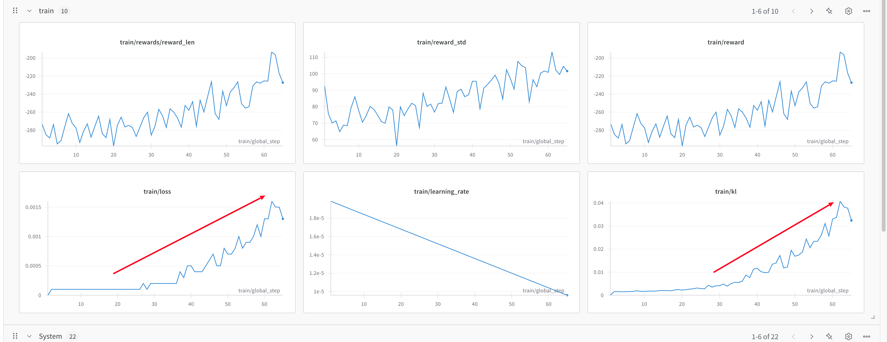

# 4. TRL 中实现 GRPO

在本页中，我们将学习如何使用 Transformer Reinforcement Learning (TRL)库实现 Group Relative Policy Optimization (GRPO)。我们将专注于简洁的代码实现。

我们将通过 TRL 的 GRPOTrainer 来探索 GRPO 的核心概念，并使用官方 TRL 文档中的代码片段来引导我们。

进阶版本：OPEN R1 实现：https://github.com/huggingface/open-r1/blob/main/src/open_r1/grpo.py

首先，让我们回顾一下 GRPO 算法的一些重要概念：

- 组织生成：模型为每个提示生成多个完成项。
- 偏好学习：模型通过比较完成项的奖励函数来学习。
- 训练配置：模型使用配置来控制训练过程。
我们需要做些什么来实现 GRPO？

- 定义一个提示数据集。
- 定义一个奖励函数，它接受一个完成列表作为输入，并返回一个奖励列表。
- 使用 GRPOConfig 配置训练过程。
- 使用 GRPOTrainer 训练模型。
这是一个从头开始使用 GRPO 训练的最小示例：

```
from trl import GRPOTrainer, GRPOConfig
from datasets import load_dataset

# 1. Load your dataset
dataset = load_dataset("your_dataset", split="train")


# 2. Define a simple reward function
def reward_func(completions, **kwargs):
    """Example: Reward longer completions"""
    return [float(len(completion)) for completion in completions]


# 3. Configure training
training_args = GRPOConfig(
    output_dir="output",
    num_train_epochs=3,
    per_device_train_batch_size=4,
    gradient_accumulation_steps=2,
    logging_steps=10,
)

# 4. Initialize and train
trainer = GRPOTrainer(
    model="your_model",  # e.g. "Qwen/Qwen2-0.5B-Instruct"
    args=training_args,
    train_dataset=dataset,
    reward_funcs=reward_func,
)
trainer.train()
```

## Dataset Format  数据集格式

您的数据集应包含模型将响应的提示。GRPO 训练器将为每个提示生成多个完成，并使用奖励函数来比较它们。

## Reward Function  奖励函数

奖励函数至关重要，它决定了模型如何学习。这里有两个实际示例：

```
# Example 1: Reward based on completion length
def reward_length(completions, **kwargs):
    return [float(len(completion)) for completion in completions]


# Example 2: Reward based on matching a pattern
import re


def reward_format(completions, **kwargs):
    pattern = r"^<think>.*?</think><answer>.*?</answer>$"
    return [1.0 if re.match(pattern, c) else 0.0 for c in completions]
```

DeepSeek R1 论文展示了几种有效的方法来设计奖励函数，你可以将这些方法适应到你自己的 GRPO 实现中：

### 1、Length-Based Rewards

实现起来最简单的奖励之一是基于长度的奖励。你可以奖励更长的完成：

```
def reward_len(completions, **kwargs):
    ideal_length = 20
    return [-abs(ideal_length - len(completion)) for completion in completions]
```

这个奖励函数惩罚过短或过长的完成，鼓励模型生成接近理想长度 20 个标记的完成。

### 2、Rule-Based Rewards for Verifiable Tasks

对于有客观正确答案的任务（如数学或编程），你可以实现基于规则的奖励函数：

```
def problem_reward(completions, answers, **kwargs):
    """Reward function for math problems with verifiable answers
    completions: list of completions to evaluate
    answers: list of answers to the problems from the dataset
    """

    rewards = []
    for completion, correct_answer in zip(completions, answers):
        # Extract the answer from the completion
        try:
            # This is a simplified example - you'd need proper parsing
            answer = extract_final_answer(completion)
            # Binary reward: 1 for correct, 0 for incorrect
            reward = 1.0 if answer == correct_answer else 0.0
            rewards.append(reward)
        except:
            # If we can't parse an answer, give a low reward
            rewards.append(0.0)

    return rewards
```

### 3、Format-Based Rewards

```
def format_reward(completions, **kwargs):
    """Reward completions that follow the desired format"""
    # Example: Check if the completion follows a think-then-answer format
    pattern = r"<think>(.*?)</think>\s*<answer>(.*?)</answer>"

    rewards = []
    for completion in completions:
        match = re.search(pattern, completion, re.DOTALL)
        if match:
            # Check if there's substantial content in both sections
            think_content = match.group(1).strip()
            answer_content = match.group(2).strip()

            if len(think_content) > 20 and len(answer_content) > 0:
                rewards.append(1.0)
            else:
                rewards.append(
                    0.5
                )  # Partial reward for correct format but limited content
        else:
            rewards.append(0.0)  # No reward for incorrect format

    return rewards
```

## Training Configuration 训练配置

```
training_args = GRPOConfig(
    *# Essential parameters*
    output_dir="output",
    num_train_epochs=3,
    num_generation=4,  *# Number of completions to generate for each prompt*
    per_device_train_batch_size=4,  *# We want to get all generations in one device batch# Optional but useful*
    gradient_accumulation_steps=2,
    learning_rate=1e-5,
    logging_steps=10,
    *# GRPO specific (optional)*
    use_vllm=True,  *# Speed up generation*
)
```

`num_generation` 参数对于 GRPO 尤为重要，因为它定义了组大小——模型将为每个提示生成多少不同的完成。这与其他 RL 方法的关键区别在于：

- 太小（例如，2-3）：可能无法提供足够的多样性来进行有意义的比较
- 推荐（4-16）：提供了良好的多样性与计算效率之间的平衡
- 较大的值：可能提高学习效果，但会显著增加计算成本
组的大小应根据您的计算资源和任务的复杂性来选择。对于简单的任务，较小的组（4-8）可能就足够了，而对于更复杂的推理任务，较大的组（8-16）可能会更有益。

- 内存管理：根据您的 GPU 内存调整 `per_device_train_batch_size` 和 `gradient_accumulation_steps` 。
- 速度: 如果您的模型支持，请启用 `use_vllm=True` 以加快生成速度。
- 监控: 在训练过程中查看记录的指标：
- `reward` : 完成的平均奖励
- `reward_std` : 每个奖励组内的标准差
- `kl` : 参考模型的 KL 散度
## Practice

训练现象一：你可能会注意到，在训练初期损失值从零开始然后增加，这可能看起来有些反直觉。这种行为在 GRPO 中是预期的，并且直接与算法的数学公式有关。在 GRPO 中，损失值与原始策略的 KL 散度成正比。随着训练的进行，模型学会生成更符合奖励函数的文本，从而使其与初始策略产生更大的偏差。这种增加的偏差在损失值的上升中得到了反映，实际上这表明模型正在成功地适应以优化奖励函数。



训练现象二：可以看到，随着模型学习，奖励函数的奖励值逐渐接近 0。这是一个好迹象，表明模型正在学习生成正确长度的文本。


---

## See Also

- [[AI/LLM/RL/GRPO/GRPO 深度理解|GRPO 深度理解]] — 算法原理，实现的数学基础
- [[AI/LLM/RL/GRPO/GRPO-demo|GRPO Demo]] — Demo 实践，与本篇互补
- [[AI/LLM/Frameworks/TRL/TRL 概述|TRL 概述]] — TRL 框架全貌
- [[AI/LLM/RL/_MOC|RL MOC]] — LLM 强化学习全图谱
