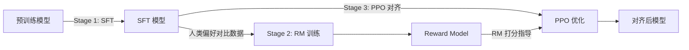

# 强化学习与 RLHF 应用——2026 技术全景

> 面试深度参考。覆盖从经典 RL 到 LLM 对齐的完整技术栈。

---

## 一、RL 基础：从 MDP 到核心二分法

### 1.1 马尔可夫决策过程（MDP）

RL 的数学基础是 MDP 五元组 $(S, A, P, R, \gamma)$：

- **$S$**：状态空间
- **$A$**：动作空间
- **$P(s'|s,a)$**：状态转移概率
- **$R(s,a,s')$**：即时奖励
- **$\gamma \in [0,1)$**：折扣因子，权衡短期与长期收益

**Markov 性**：$P(s_{t+1}|s_t,a_t) = P(s_{t+1}|s_0,...,s_t,a_0,...,a_t)$，未来只依赖当前状态。

### 1.2 Bellman 方程

**状态价值函数**：$V^\pi(s) = \mathbb{E}_\pi[\sum_{t=0}^{\infty}\gamma^t R_t | s_0=s]$

**动作价值函数**：$Q^\pi(s,a) = \mathbb{E}_\pi[\sum_{t=0}^{\infty}\gamma^t R_t | s_0=s, a_0=a]$

**Bellman 期望方程**：
$$V^\pi(s) = \sum_a \pi(a|s) \sum_{s'} P(s'|s,a)[R(s,a,s') + \gamma V^\pi(s')]$$

**Bellman 最优方程**：
$$V^*(s) = \max_a \sum_{s'} P(s'|s,a)[R(s,a,s') + \gamma V^*(s')]$$

### 1.3 核心二分法

| 维度 | 类型 A | 类型 B | 本质区别 |
|------|--------|--------|----------|
| **方法论** | Value-based（DQN） | Policy-based（PG） | 学 Q 值 vs 直接学策略 |
| **数据使用** | Off-policy（DQN/SAC） | On-policy（PPO/A2C） | 能否复用旧数据 |
| **探索策略** | Exploration（ε-greedy） | Exploitation（greedy） | 试新 vs 用已知最优 |

**Policy-based 优势**：可处理连续动作空间、随机策略、更好收敛性  
**Value-based 优势**：样本效率高（off-policy 可复用数据）、更稳定

**Exploration vs Exploitation** 平衡方法：
- ε-greedy：以 ε 概率随机探索
- UCB（Upper Confidence Bound）：考虑不确定性的乐观探索
- Boltzmann/Softmax：按 Q 值概率选择
- Intrinsic Motivation：好奇心驱动（ICM/RND）

### 面试高频问题

**Q: 为什么需要折扣因子 γ？**
> **答题要点**：①数学上保证无限序列和收敛；②建模时间偏好（近期奖励更确定）；③γ→0 短视，γ→1 远视；④γ=1 在 episodic 任务中可用但 continuing 任务会发散。

**Q: On-policy 和 Off-policy 的本质区别？**
> **答题要点**：On-policy（如 SARSA/PPO）用当前策略采样的数据更新当前策略，数据不可复用；Off-policy（如 Q-Learning/SAC）学习的策略与数据采集策略不同，可用 Replay Buffer 提高样本效率。关键公式差异在于 importance sampling ratio。

---

## 二、经典算法全景

### 2.1 Q-Learning → DQN

**Q-Learning**（Tabular）：
$$Q(s,a) \leftarrow Q(s,a) + \alpha[r + \gamma \max_{a'} Q(s',a') - Q(s,a)]$$

**DQN** 的两个关键创新：
1. **Experience Replay**：存储 $(s,a,r,s')$ 到 buffer 随机采样，打破数据相关性
2. **Target Network**：用延迟更新的 $\hat{Q}$ 计算 TD target，减少训练震荡
   - $y = r + \gamma \max_{a'} \hat{Q}(s',a'; \theta^-)$，$\theta^-$ 每 C 步同步

**DQN 改进族**：
- **Double DQN**：解耦动作选择和评估，解决 Q 值过估计
- **Dueling DQN**：分离 V(s) 和 A(s,a)，加速学习
- **Prioritized Replay**：按 TD-error 优先采样重要经验
- **Rainbow**：集成 6 项改进的 SOTA

### 2.2 Policy Gradient 系列

**REINFORCE**（vanilla PG）：
$$\nabla_\theta J(\theta) = \mathbb{E}_\pi[\nabla_\theta \log\pi_\theta(a|s) \cdot G_t]$$

核心思想：增大高回报轨迹动作的概率，降低低回报的。

**问题**：方差极大（$G_t$ 包含整条轨迹的随机性）。

**解决**：引入 baseline 减方差：
$$\nabla_\theta J(\theta) = \mathbb{E}_\pi[\nabla_\theta \log\pi_\theta(a|s) \cdot (G_t - b(s))]$$

### 2.3 Actor-Critic 架构

**A2C**（Advantage Actor-Critic）：
- Actor：策略网络 $\pi_\theta$
- Critic：价值网络 $V_\phi$
- Advantage：$A(s,a) = Q(s,a) - V(s) \approx r + \gamma V(s') - V(s)$（TD 误差）

**A3C**：多线程并行 A2C，利用异步梯度更新。2026 已被 PPO 取代。

### 2.4 PPO（后续专题详解）

### 2.5 SAC（Soft Actor-Critic）

**核心思想**：最大化奖励 + 策略熵（maximum entropy framework）
$$J(\pi) = \sum_t \mathbb{E}[r(s_t,a_t) + \alpha \mathcal{H}(\pi(\cdot|s_t))]$$

- Off-policy + 自动温度调节 $\alpha$
- 天然鼓励探索，对超参不敏感
- 连续控制任务（机器人）的默认选择

### 2.6 TD3（Twin Delayed DDPG）

三个关键技巧：
1. **Twin Critics**：取两个 Q 网络最小值，缓解过估计
2. **Delayed Policy Updates**：Critic 更新 d 次后才更新 Actor
3. **Target Policy Smoothing**：给 target action 加噪声做正则化

### 面试高频问题

**Q: DQN 为什么需要 Experience Replay 和 Target Network？**
> **答题要点**：①Replay 打破时间相关性，使 mini-batch 近似 i.i.d.，满足 SGD 假设；②Replay 提高数据利用率（off-policy）；③Target Network 稳定 TD target（bootstrap 目标不动），避免"用自己更新自己"的正反馈震荡。二者缺一训练都会崩溃。

**Q: SAC vs PPO 怎么选？**
> **答题要点**：连续控制、机器人、需要高样本效率 → SAC（off-policy）；离散动作、LLM 对齐、追求训练稳定性 → PPO（on-policy）。SAC 在同样的环境交互步数下通常性能更高，但 PPO 实现简单、超参鲁棒。

---

## 三、PPO 深度解析

### 3.1 从 TRPO 到 PPO

**TRPO**（Trust Region Policy Optimization）：
$$\max_\theta \mathbb{E}\left[\frac{\pi_\theta(a|s)}{\pi_{\theta_{old}}(a|s)} A^{\pi_{old}}(s,a)\right] \quad \text{s.t.} \quad \mathbb{E}[D_{KL}(\pi_{\theta_{old}} \| \pi_\theta)] \leq \delta$$

TRPO 用 KL 约束保证单调改进，但需要二阶优化（Fisher 信息矩阵 + 共轭梯度），工程复杂。

**PPO 的核心洞察**：用 clipping 近似 trust region，一阶优化即可。

> 来源：Schulman et al., "Proximal Policy Optimization Algorithms", arXiv:1707.06347, Sec. 3

### 3.2 Clipped Objective 数学推导

定义 importance sampling ratio：$r_t(\theta) = \frac{\pi_\theta(a_t|s_t)}{\pi_{\theta_{old}}(a_t|s_t)}$

**PPO-Clip 目标**：
$$L^{CLIP}(\theta) = \mathbb{E}_t\left[\min\left(r_t(\theta) A_t, \; \text{clip}(r_t(\theta), 1-\epsilon, 1+\epsilon) A_t\right)\right]$$

**直觉**：
- 当 $A_t > 0$（好动作）：$r_t$ 增大但被 clip 到 $1+\epsilon$，防止过度更新
- 当 $A_t < 0$（差动作）：$r_t$ 减小但被 clip 到 $1-\epsilon$，同样限制幅度
- $\epsilon$ 通常取 0.1-0.2，定义了 trust region 的宽度

**完整 PPO 损失**：
$$L = L^{CLIP} - c_1 L^{VF} + c_2 S[\pi_\theta]$$

其中 $L^{VF}$ 是 Value 函数的 MSE loss，$S$ 是熵 bonus（鼓励探索）。

### 3.3 GAE（Generalized Advantage Estimation）

多步 TD 的加权平均，平衡偏差和方差：

$$\hat{A}_t^{GAE(\gamma,\lambda)} = \sum_{l=0}^{\infty}(\gamma\lambda)^l \delta_{t+l}$$

其中 $\delta_t = r_t + \gamma V(s_{t+1}) - V(s_t)$ 是 TD 误差。

- $\lambda=0$：$\hat{A}_t = \delta_t$，纯 1-step TD，低方差高偏差
- $\lambda=1$：$\hat{A}_t = \sum \gamma^l \delta_{t+l} = G_t - V(s_t)$，蒙特卡洛，高方差低偏差
- **$\lambda=0.95$ 是默认值**，在 LLM RLHF 中也沿用

### 3.4 KL Penalty vs Clipping

| 方面 | KL Penalty | Clipping |
|------|-----------|----------|
| 机制 | 在 loss 中加 $\beta \cdot D_{KL}$ 项 | 裁剪 ratio 到 $[1-\epsilon, 1+\epsilon]$ |
| 超参 | $\beta$ 需自适应调整（复杂） | $\epsilon$ 固定（简单） |
| 灵活性 | 理论更优雅 | 工程更好用 |
| 实践 | InstructGPT 用 KL penalty | 绝大多数 PPO 实现用 clipping |

OpenAI 的 InstructGPT/ChatGPT 实际使用 **KL penalty + clipping 混合**方案。

### 3.5 PPO 为什么成为 LLM 对齐的默认选择

1. **稳定性**：Clipping 天然限制策略更新幅度，不会一步跑偏
2. **通用性**：离散（token 生成）和连续空间都适用
3. **可扩展**：一阶优化，可在大规模分布式系统上高效运行
4. **KL 约束自然契合**：RLHF 需要新策略不偏离 SFT 太远，PPO 的 trust region 恰好满足
5. **工程成熟度**：OpenAI 验证过，TRL/DeepSpeed-Chat/OpenRLHF 都有成熟实现

### 面试高频问题

**Q: PPO 的 clip 是怎么起作用的？能推导一下吗？**
> **答题要点**：画两种情况的图——$A>0$ 时 clip 限制 $r_t$ 的上界为 $1+\epsilon$，防止对好动作过度强化；$A<0$ 时 clip 限制 $r_t$ 的下界为 $1-\epsilon$，防止对差动作过度惩罚。取 min 保证 clip 是保守的（pessimistic bound）。效果等价于 TRPO 的 trust region，但只需一阶梯度。

**Q: GAE 的 λ 如何影响训练？**
> **答题要点**：$\lambda$ 控制偏差-方差 tradeoff。$\lambda$→0 方差低但 critic 误差会传播（高偏差）；$\lambda$→1 偏差低但轨迹噪声大（高方差）。$\lambda=0.95$ 是默认最优。当 critic 准确时可适当降低 $\lambda$；当 reward 稀疏时需提高 $\lambda$。

---

## 四、RLHF 全链路

### 4.1 三阶段流程

> 来源：Ouyang et al., "Training language models to follow instructions with human feedback" (InstructGPT), arXiv:2203.02155, Fig. 2

### 4.2 Stage 1: SFT

- 在高质量指令-回复数据上微调预训练模型
- 数据量：几千到几万条（质量远重于数量）
- **坑点**：chat template 不一致、loss masking（只对 assistant 回复算 loss）、过拟合（2-3 epochs）

### 4.3 Stage 2: Reward Model 训练

**Bradley-Terry 模型**（InstructGPT 论文的 RM 训练核心）：

> 来源：Ouyang et al., "Training language models to follow instructions with human feedback", arXiv:2203.02155, Sec. 3.2

$$P(y_w \succ y_l | x) = \sigma(r_\theta(x, y_w) - r_\theta(x, y_l))$$

其中 $y_w$ 是人类偏好的回答，$y_l$ 是不偏好的。

**RM Loss**：
$$\mathcal{L}_{RM} = -\mathbb{E}_{(x,y_w,y_l)}\left[\log\sigma(r_\theta(x,y_w) - r_\theta(x,y_l))\right]$$

**RM 架构**：通常基于 SFT 模型，去掉 LM head，加一个 scalar head 输出奖励值。

**关键挑战**：
- 标注一致性仅 65-75%（人类本身就不一致）
- **Length bias**：RM 倾向给长回答高分
- **Position bias**：标注者倾向选第一个选项
- **Verbosity bias**：详细但空洞的回答得高分

### 4.4 Stage 3: PPO 对齐

**RLHF 优化目标**：
$$\max_{\pi_\theta} \mathbb{E}_{x\sim D, y\sim\pi_\theta(\cdot|x)}\left[r_\phi(x,y)\right] - \beta \cdot D_{KL}(\pi_\theta \| \pi_{ref})$$

**四个模型同时存在**：
1. **Actor**（$\pi_\theta$）：正在优化的策略
2. **Critic**（$V_\psi$）：估计状态价值
3. **Reward Model**（$r_\phi$）：冻结，给生成打分
4. **Reference Model**（$\pi_{ref}$）：冻结的 SFT 模型，用于计算 KL penalty

**KL 散度约束的作用**：
- 防止策略偏离 SFT 太远（保持语言质量）
- 抵御 reward hacking（限制模型"作弊空间"）
- $\beta$ 控制保守程度：$\beta$ 大 → 贴近 SFT，$\beta$ 小 → 更激进优化 reward

### 4.5 Reward Hacking

**常见表现**：
- **Length exploitation**：生成过长但低质量回答骗取高 RM 分
- **Sycophancy**：迎合用户偏好而非给出正确答案
- **Formatting tricks**：用 markdown/emoji 等获取高分
- **Distribution shift**：策略偏移后 RM 泛化能力下降

**检测信号**：RM score ↑ 但 human eval ↓（Goodhart's Law）

**防御手段**：
- KL penalty（最基本）
- RM ensemble（多模型投票减少个体偏见）
- Length normalization（按长度归一化 reward）
- 迭代 retrain RM（用新策略数据更新 RM）
- **Verifiable rewards**（代码/数学有 ground truth）——根本性解决方案

### 面试高频问题

**Q: RLHF 为什么需要 KL 约束？去掉会怎样？**
> **答题要点**：①无 KL 约束 → 策略过度优化 RM → reward hacking（Goodhart's Law）；②模型可能退化为不通顺但高 RM 分的输出（语言质量崩溃）；③KL 提供正则化效果，等价于在 SFT 附近做约束优化；④$\beta$ 是关键超参，过大欠优化过小过拟合。

**Q: RLHF 的 PPO 和游戏 RL 的 PPO 有什么区别？**
> **答题要点**：①环境不同——LLM 的"环境"是 RM 而非真实环境，RM 可能有偏；②动作空间巨大——词表 32K-150K 的离散空间；③Reward 稀疏——整个回复只有一个 reward（sequence level），不是每步都有；④多了 KL 约束项；⑤计算规模完全不同——4 个大模型并行。

---

## 五、RLHF 替代方案

### 5.1 DPO（Direct Preference Optimization）

**核心推导**（Rafailov et al., arXiv:2305.18290, Sec. 4）：从 RLHF 的 KL-constrained 优化出发，最优策略有解析解：
$$\pi^*(y|x) = \frac{1}{Z(x)} \pi_{ref}(y|x) \exp\left(\frac{1}{\beta} r(x,y)\right)$$

反解 reward：
$$r(x,y) = \beta \log\frac{\pi^*(y|x)}{\pi_{ref}(y|x)} + \beta \log Z(x)$$

代入 Bradley-Terry 模型，**$Z(x)$ 在做差时消掉**：

$$\mathcal{L}_{DPO} = -\mathbb{E}\left[\log\sigma\left(\beta\log\frac{\pi_\theta(y_w|x)}{\pi_{ref}(y_w|x)} - \beta\log\frac{\pi_\theta(y_l|x)}{\pi_{ref}(y_l|x)}\right)\right]$$

**优势**：
- 2 模型（policy + reference），无需 RM 和 Critic
- 训练稳定，类 supervised learning
- 工程简单，TRL 几行代码搞定

**劣势**：
- **Offline**：数据来自旧策略，无在线探索
- **Mode collapse**：没有熵 bonus，容易坍缩到单一回答模式
- **对噪声敏感**：偏好标签错误直接影响梯度方向

### 5.2 ORPO（Odds Ratio Preference Optimization）

- 不需要 reference model，将偏好优化和 SFT 合并为一步
- 用 odds ratio 替代 log probability ratio
- 更简洁但性能天花板略低于 DPO

### 5.3 KTO（Kahneman-Tversky Optimization）

- **只需 binary signal**：每条数据标注"好"或"坏"，不需要 pairwise 比较
- 基于 Kahneman-Tversky **前景理论**，loss aversion
- 标注成本更低，适合高风险场景（法律/医疗）
- 实验表明性能与 DPO 持平甚至略优

### 5.4 GRPO（后续专题详解）

### 5.5 RLAIF（Constitutional AI）

> 来源：Bai et al., "Constitutional AI: Harmlessness from AI Feedback", arXiv:2212.08073

- 用 AI 代替人类生成偏好数据
- 流程：①LLM 生成回复 → ②AI 根据"宪法原则"评判 → ③用 AI 偏好训练 RM → ④PPO
- Anthropic 的核心方法论，scalable 但可能放大 AI 偏见

### 5.6 Online vs Offline Preference Learning

| 维度 | Online（PPO/GRPO） | Offline（DPO/KTO） |
|------|-------|---------|
| 数据来源 | 当前策略实时生成 | 预先收集的固定数据集 |
| Distribution matching | ✅ on-policy | ❌ off-policy |
| 探索能力 | ✅ 持续探索新回答 | ❌ 受限于已有数据 |
| 工程复杂度 | 高（需在线生成+评分） | 低（纯 supervised） |
| 性能天花板 | 更高 | 较低 |

**2026 共识**：Online > Offline，但 Offline 的简单性使其在实践中广泛使用。最优方案是 **Iterative DPO / Online DPO**（每轮用当前策略生成新数据）。

### 面试高频问题

**Q: 推导 DPO 的 loss function。**
> **答题要点**：①从 RLHF 的 KL-constrained RL 目标出发；②写出最优策略的闭式解（Gibbs distribution）；③反解 reward 表达式 $r = \beta \log(\pi/\pi_{ref}) + \beta \log Z$；④代入 Bradley-Terry 模型 $P(y_w \succ y_l) = \sigma(r_w - r_l)$；⑤$\log Z(x)$ 在 $r_w - r_l$ 做差时消掉；⑥得到只依赖策略概率的 loss。关键洞察：DPO 将 RL 问题转化为 classification 问题。

**Q: DPO 和 RLHF 哪个好？什么时候选哪个？**
> **答题要点**：①DPO 简单稳定但 offline 无探索，可能 mode collapse；②RLHF 性能天花板更高但工程复杂；③有 verifiable reward（代码/数学）→ GRPO/RLVR；④数据充足且追求简单 → DPO；⑤追求极致性能 → Online RL；⑥2026 趋势：Iterative DPO 折中方案。

---

## 六、GRPO 专题：DeepSeek 的创新

### 6.1 GRPO 核心思想

**Group Relative Policy Optimization**（DeepSeek-Math → R1）：

> 来源：Shao et al., "DeepSeekMath: Pushing the Limits of Mathematical Reasoning in Open Language Models", arXiv:2402.03300, Sec. 3.2

对每个 prompt $x$，用当前策略生成 $G$ 个候选回答 $\{y_1, ..., y_G\}$，各自获得 reward $\{r_1, ..., r_G\}$。

**组内标准化 advantage**：
$$\hat{A}_i = \frac{r_i - \mu}{\sigma}, \quad \mu = \frac{1}{G}\sum_j r_j, \quad \sigma = \text{std}(\{r_j\})$$

**GRPO 目标**：
$$\mathcal{L}_{GRPO} = \mathbb{E}\left[\frac{1}{G}\sum_{i=1}^{G} \min\left(r_t(\theta)\hat{A}_i, \text{clip}(r_t(\theta), 1-\epsilon, 1+\epsilon)\hat{A}_i\right) - \beta D_{KL}(\pi_\theta \| \pi_{ref})\right]$$

### 6.2 vs PPO 的关键区别

| 维度 | PPO | GRPO |
|------|-----|------|
| Critic | 需要 Value Network $V_\psi$ | **不需要 Critic** |
| Advantage | GAE（需 $V(s)$） | 组内相对标准化 |
| 显存 | 4 模型 | 3 模型（省 ~25%） |
| 适用 reward | 连续密集 | 特别适合 **稀疏/二值 reward** |

### 6.3 Rule-based Reward 设计

DeepSeek-R1 的 reward 不用 RM，而是用**规则验证**：

- **数学**：答案与标准答案精确匹配（或数值近似）
- **代码**：测试用例通过率
- **格式**：是否包含 `<think>...</think>` 推理过程
- **长度**：惩罚过短或过长回答

$$r(x,y) = \alpha \cdot r_{accuracy} + \beta \cdot r_{format} + \gamma \cdot r_{length}$$

### 6.4 DeepSeek-R1 的 RL 训练流程

1. **Cold Start**：少量 long-CoT 数据 SFT，让模型学会输出推理格式
2. **RL Stage 1**：GRPO + rule-based reward，从 base model 涌现推理能力
3. **Rejection Sampling**：用 RL 模型生成高质量推理轨迹
4. **SFT Stage 2**：在混合数据上再做 SFT（推理 + 非推理任务）
5. **RL Stage 2**：最终 GRPO 对齐，同时优化推理准确性和通用能力

**关键发现**：
- **涌现现象**：模型自发学会 CoT 推理、self-reflection、"aha moment"
- RL **不是教推理**，而是**激发预训练中已有的 latent capability**
- 蒸馏可以将推理能力转移到小模型（R1-distill-Qwen-32B 超越 GPT-4o）

### 6.5 DAPO 对 GRPO 的改进

**Decoupled Alignment from Preference Optimization**（ByteDance）：
1. **Decoupled Clipping**：正向奖励用更大的 clip 范围 $(1-\epsilon_1, 1+\epsilon_2)$，$\epsilon_2 > \epsilon_1$
2. **Dynamic Sampling**：过滤全对/全错的 prompt group（无信息量）
3. **Token-Level Loss**：按 token 归一化 loss，防止长 response 主导梯度
4. **Overlong Reward Shaping**：超长回答 soft penalty 而非硬截断

### 面试高频问题

**Q: GRPO 为什么不需要 Critic？这样做有什么问题？**
> **答题要点**：①GRPO 用同组回答的相对 reward 做 baseline，不需要学习一个 Value Network；②本质上是组内 REINFORCE + variance reduction via normalization；③优势：省显存、实现简单、对稀疏 reward 友好；④问题：需要多次采样（G=8-64），增加生成成本；⑤组内方差过小时 advantage 估计不稳定；⑥只适合 per-episode reward，不适合 dense reward。

**Q: DeepSeek-R1 的 "aha moment" 是怎么回事？**
> **答题要点**：①在纯 RL 训练过程中，模型在某个阶段突然开始输出包含自我纠正、反思性语言的推理链；②这不是训练数据教的，而是 RL 探索过程中涌现的行为；③说明大模型预训练时已经获得了推理的 latent capability，RL 只是激活了它；④类似 scaling law 中的涌现能力，但这次是通过 RL 触发而非模型规模。

---

## 七、多 Agent RL（MARL）

### 7.1 MARL 基础

**核心挑战**：每个 agent 的"环境"包含其他 agent 的行为 → **非平稳性**

**范式分类**：
- **全合作**（Cooperative）：共享奖励，团队最优（如 StarCraft 微操）
- **全竞争**（Competitive）：零和博弈（如围棋、扑克）
- **混合**（Mixed）：合作+竞争（如多人游戏、自动驾驶）

**学习框架**：
- **CTDE**（Centralized Training Decentralized Execution）：训练时共享信息，执行时独立决策
- **Independent Learners**：每个 agent 独立用单 agent RL，简单但忽略协调
- **Communication Learning**：agent 间学习通信协议

### 7.2 经典算法

- **QMIX**：将全局 Q 分解为各 agent 的局部 Q 的单调混合，保证分布式执行
- **CommNet**：学习 agent 间连续通信向量
- **MAPPO**：PPO 直接应用到 MARL，centralized critic + decentralized actors，简单高效
- **AlphaStar**：SC2 的 league training，多 agent 自对弈生态

### 7.3 LLM Agent 中的 MARL 应用

**2026 前沿**：
- **Multi-Agent Debate**：多个 LLM agent 辩论求解，提高推理准确性
- **Agent 分工**：Planner Agent + Coder Agent + Reviewer Agent 协作
- **Agent 博弈**：红队 vs 蓝队（攻防安全测试）
- **Negotiation**：LLM agent 学习谈判策略（商业/外交场景）

**挑战**：
- Agent 间自然语言通信是 lossy channel（信息丢失+误解）
- 信用分配难（Credit Assignment）：团队成功归因于哪个 agent？
- 扩展性：agent 数量增多 → 状态空间指数爆炸

### 面试高频问题

**Q: 为什么 MARL 比单 agent RL 难得多？**
> **答题要点**：①非平稳性——每个 agent 的"环境"在动（其他 agent 在学习）；②联合动作空间指数增长 $|A|^N$；③信用分配问题——团队奖励如何拆分给个体；④通信开销——agent 间需要协调但通信有限；⑤理论保证弱——不再有 Bellman 最优性这样的简洁保证。

---

## 八、RL for LLM：推理时计算与搜索

### 8.1 Test-time Compute Scaling

**核心思想**（OpenAI o1/o3, DeepSeek R1）：在推理阶段花更多计算换更高准确率。

**两种路线**：
- **Internal CoT**：模型自身生成长推理链（o1/R1 路线），通过 RL 训练获得
- **External Search**：用 MCTS/beam search 在解空间搜索，需要 reward model 指导

**Scaling Law**：推理 FLOPs ∝ 准确率提升，但边际递减。在难题上投入更多推理计算比增大模型更高效。

### 8.2 Process Reward Model vs Outcome Reward Model

| 维度 | ORM | PRM |
|------|-----|-----|
| 粒度 | 整个回复一个分数 | 每个推理步骤一个分数 |
| 标注 | 简单（好/坏） | 昂贵（每步标注正确性） |
| Signal | 稀疏 | 密集 |
| 搜索配合 | beam search / rejection sampling | tree search / step-level search |
| 适用场景 | 通用 | 数学/代码推理 |

**PRM + Tree Search** 在数学推理上显著优于 ORM（Math-Shepherd, OpenAI PRM800K）。

### 8.3 MCTS + LLM

将 LLM 的推理过程建模为搜索树：
- **状态**：当前推理步骤序列
- **动作**：生成下一个推理步骤
- **Reward**：PRM 评分或最终答案正确性

**流程**：Selection → Expansion（LLM 生成候选步骤）→ Simulation → Backpropagation

**代表工作**：AlphaGeometry（数学奥赛）、AlphaCode/AlphaCode2（代码竞赛）

### 8.4 Self-Play

- **对抗性 Self-Play**：模型与自己的历史版本博弈（AlphaGo/AlphaZero）
- **合作性 Self-Play**：模型自我辩论提高推理（LLM debate）
- **迭代 Self-Play**：生成数据 → 筛选 → 训练 → 生成更好数据 → ...
- **Self-Rewarding LLM**：模型同时作为 generator 和 judge，迭代自我改进

### 面试高频问题

**Q: Process RM vs Outcome RM 怎么选？**
> **答题要点**：①数学/代码等有明确中间步骤判断的任务 → PRM 显著更优；②通用对话/创意写作 → ORM 足够（中间步骤难定义）；③PRM 的标注成本高 10-100×，可用自动标注（Math-Shepherd: 用蒙特卡洛估计每步正确率）降低成本；④PRM 的价值在于 dense signal 可指导 tree search。

**Q: Test-time compute scaling 的极限在哪？**
> **答题要点**：①对可验证问题（数学/代码）效果显著，对开放式问题提升有限；②边际收益递减——简单问题很快饱和，极难问题可能无解；③成本：每次推理消耗大量算力，延迟高（o1 可能思考 10+ 秒）；④与模型能力的关系：模型太弱时再多推理计算也无济于事（需要基础能力打底）。

---

## 九、RL 在推荐系统中的应用

### 9.1 Bandit 算法

推荐系统的最基本 RL 形式——单步决策的 exploration-exploitation 问题。

**UCB（Upper Confidence Bound）**：
$$a^* = \arg\max_a \left[\hat{\mu}_a + c\sqrt{\frac{\ln t}{N_a}}\right]$$

选择"乐观估计"最高的臂，自然平衡探索（不确定性高 → 探索）和利用（期望高 → 利用）。

**Thompson Sampling**：
- 为每个臂维护 reward 的后验分布（如 Beta 分布）
- 每次从后验采样，选择采样值最高的臂
- 贝叶斯方法，理论 regret 最优
- 实践中比 UCB 更好，特别是 delayed feedback 场景

### 9.2 Contextual Bandits

加入上下文信息（用户特征、item 特征）：
$$a^* = \arg\max_a f(x, a; \theta)$$

- **LinUCB**：线性模型 + UCB 置信区间
- **Neural Contextual Bandits**：用神经网络建模 $f$
- **应用**：新闻推荐（每条新闻是一个臂）、广告投放（每个广告是一个臂）

### 9.3 Full RL in RecSys

**Slate Optimization**：一次推荐多个 item 的列表（slate），考虑 item 间交互

- **SlateQ**：将 slate 建模为 combinatorial action，Q 值分解
- **用户模型**：将用户的浏览/点击/购买建模为 MDP
- **长期价值优化**：不只优化即时点击，考虑用户留存/生命周期价值
- **挑战**：状态空间巨大、reward 延迟（购买可能在几天后）、A/B test 的 exploration cost

### 面试高频问题

**Q: Thompson Sampling vs UCB 的优劣？**
> **答题要点**：①Thompson Sampling 是贝叶斯方法（维护后验分布），UCB 是频率方法（维护置信区间）；②TS 在延迟反馈、批量决策场景更好（后验自然处理不确定性）；③UCB 理论分析更清晰（可推导 regret bound）；④实践中 TS 通常略优且更容易实现（不需要调 c 参数）；⑤TS 可自然扩展到非平稳环境（用滑动窗口更新后验）。

---

## 十、RL 在机器人与自动驾驶中的应用

### 10.1 Sim-to-Real Transfer

**核心困难**：模拟器与真实世界的差距（reality gap）

**Domain Randomization**：训练时随机化模拟器参数（摩擦、光照、质量...），让策略对环境变化鲁棒

**System Identification**：精确建模真实物理参数

**Progressive Transfer**：先在简单仿真训练，逐步增加复杂度接近真实

### 10.2 Curriculum Learning

- 从简单任务开始，逐步增加难度
- **Automatic Curriculum**：根据 agent 的学习进度自动调节难度
- **Self-Paced Learning**：agent 自己选择适当难度的任务
- **应用**：灵巧手操作（OpenAI Rubik's Cube）、足式机器人行走

### 10.3 Safety Constraints（Constrained MDP）

$$\max_\pi J(\pi) \quad \text{s.t.} \quad C_i(\pi) \leq d_i, \quad i=1,...,k$$

- **Lagrangian Method**：将约束转为罚项，用对偶优化
- **CPO**（Constrained Policy Optimization）：trust region 内满足约束的更新
- **Shield/Safety Layer**：在 action 输出后加安全检查层，硬约束
- **应用**：自动驾驶（不可碰撞/违规）、工业机器人（力矩限制）

### 10.4 2026 前沿

- **Foundation Model for Robotics**：VLA（Vision-Language-Action）模型（RT-2/Octo/π0）
- **World Models**：学习环境动力学模型 → 在模型中做 planning（减少真实交互）
- **Humanoid Control**：Tesla Optimus / Figure 用 RL 训练人形机器人

### 面试高频问题

**Q: Sim-to-Real 的核心挑战和解决方案？**
> **答题要点**：①Reality gap——模拟器无法完美还原真实物理（摩擦、接触、延迟）；②Domain Randomization：随机化参数让策略鲁棒，简单有效但可能过于保守；③System Identification：精确建模但成本高且仍有误差；④Sim+Real 混合训练：先在仿真预训练再在真实场景 fine-tune；⑤World Model：学习真实环境动力学，减少仿真依赖。

---

## 十一、RL 工程实践

### 11.1 超参调优指南

| 超参 | 推荐值 | 注意事项 |
|------|--------|----------|
| Learning Rate | 1e-5 ~ 5e-5（LLM） | PPO 对 LR 敏感，过大策略崩溃 |
| Batch Size | 128-512（prompts） | 越大越稳定，但内存限制 |
| Clip Range ε | 0.1-0.2 | 太小更新慢，太大策略不稳定 |
| GAE λ | 0.95 | 密集 reward 可降到 0.9 |
| KL Penalty β | 0.01-0.1 | 监控 KL 动态调整 |
| Epochs per batch | 1-4 | 超过 4 次容易过拟合 |
| Mini-batch size | 64-256 | 太小方差大，太大失去随机性 |
| Generation Group G | 8-64（GRPO） | 越大 advantage 估计越准但成本越高 |

### 11.2 训练不稳定问题诊断

**症状 → 原因 → 解法**：

1. **Reward 震荡不收敛**
   - 原因：LR 过大 / clip range 过大
   - 解法：降 LR、减小 ε

2. **KL 持续增大**
   - 原因：策略偏离 SFT 太远
   - 解法：增大 β / 重新初始化 reference model

3. **Entropy 快速下降**
   - 原因：策略过早坍缩（mode collapse）
   - 解法：增大 entropy bonus / 降低 β / 增加数据多样性

4. **Reward hacking（RM score ↑, human eval ↓）**
   - 原因：RM 有偏 / 策略找到漏洞
   - 解法：RM ensemble / length normalization / retrain RM

5. **Loss spike**
   - 原因：数据异常 / 数值溢出
   - 解法：gradient clipping + BF16 + 回滚 checkpoint

### 11.3 Reward Shaping

**原则**：塑造 reward 不改变最优策略（potential-based reward shaping）

$$r'(s,a,s') = r(s,a,s') + \gamma\Phi(s') - \Phi(s)$$

其中 $\Phi$ 是任意势函数，保证最优策略不变。

**实践技巧**：
- 避免 reward 太稀疏（中间 reward 引导学习方向）
- 避免 reward 太密集（容易被 hack）
- Multi-objective reward：加权组合，注意归一化
- 上线前用 human eval 验证 reward 与真实质量的相关性

### 11.4 环境设计

- **Action Space**：token-level vs sentence-level，粒度影响训练效率
- **Observation**：prompt + 已生成 tokens + optional context
- **Episode 定义**：一次完整生成 = 一个 episode
- **Parallelism**：vLLM/SGLang 做大规模并行 generation 是训练瓶颈的关键优化

### 面试高频问题

**Q: RLHF 训练不稳定怎么排查？**
> **答题要点**：看四个关键指标：①Reward 趋势（应平稳上升）；②KL 散度（应在 target 范围内）；③Policy entropy（不应过快下降）；④Generation quality（定期人工 spot-check）。根据异常指标定位原因：reward 震荡→降 LR；KL 爆炸→增 β；entropy 坍缩→加 entropy bonus。永远用 wandb 记录所有训练指标。

---

## 十二、2026 前沿趋势

### 12.1 Reasoning via RL（o1/R1 路线）

**范式转换**：从 "scaling pretraining data/compute" 到 "scaling test-time compute"

- **OpenAI o1/o3**：通过 RL 训练模型生成内部推理链（hidden CoT），在数学/编程上大幅超越传统模型
- **DeepSeek R1**：开源实现，证明纯 RL（GRPO + rule-based reward）可涌现推理
- **关键洞察**：RL 不是教模型新知识，是激活已有的推理能力
- **蒸馏**：大推理模型 → 小模型（R1-distill），保留大部分推理能力

### 12.2 RL-based Code Generation

- **AlphaCode2**：MCTS + 大量采样 + 聚类 + 重排序
- **SWE-agent**：RL 训练 agent 修复真实 GitHub issue
- **Reward 设计**：测试用例通过率 = 完美的 verifiable reward
- **趋势**：代码是 RL 最佳应用场景——reward 明确、可自动验证、可大规模采样

### 12.3 Agent RL（Agentic RL loops）

- **Agent 训练**：用 RL 训练 LLM agent 学会使用工具、多步推理、错误恢复
- **环境**：WebArena / OSWorld / SWE-bench 提供 agent 训练环境
- **Reward**：任务完成率 + 步数效率 + 安全约束
- **与 prompt engineering 对比**：RL 训练的 agent 比 prompt-based agent 更鲁棒

### 12.4 Offline RL 复兴

**问题**：在线 RL 需要大量环境交互，成本高且风险大。

**Offline RL**：从固定数据集学习策略，不做额外交互。

- **CQL**（Conservative Q-Learning）：惩罚 OOD action 的 Q 值
- **IQL**（Implicit Q-Learning）：避免查询未见过的动作
- **Decision Transformer**：将 RL 建模为 sequence modeling 问题

**LLM 场景应用**：
- 用现有对话日志做 offline RL（不需要在线 generation）
- DPO 本质上是一种 offline RL
- Offline-to-Online：先 offline 预训练策略，再少量 online fine-tune

### 12.5 Multi-Reward Optimization

2026 模型需要同时优化多个维度：helpfulness、harmlessness、honesty、reasoning accuracy、code quality...

- **多奖励融合**：加权求和（简单但需要调权重）
- **Constrained Optimization**：Safe RLHF（helpful 为目标，harmless 为约束）
- **Pareto Optimization**：搜索帕累托最优前沿
- **Conditional Training**：根据 system prompt 动态调整 reward 权重

### 面试高频问题

**Q: 为什么说 2025-2026 是 RL for LLM 的分水岭？**
> **答题要点**：①o1/R1 证明 RL 可以涌现推理能力，不只是对齐工具；②从 scaling pretraining → scaling test-time compute 的范式转移；③GRPO 等方法大幅降低 RL 训练成本（无需 RM/Critic）；④代码/数学等领域有天然 verifiable reward，RL 效果远超 SFT；⑤Agent RL 开始落地——用 RL 训练能使用工具的 agent；⑥开源社区跟进迅速（TRL/OpenRLHF），不再是 OpenAI 专有能力。

**Q: 未来 3 年 RL 在 AI 中最大的应用方向是什么？**
> **答题要点**：①Reasoning via RL 会持续发展——推理能力成为模型核心竞争力；②Code Agent RL——自主编程是最具商业价值的应用；③Multi-Agent RL——复杂任务需要 agent 协作；④Robotics RL——VLA 模型让 RL 在具身智能中落地；⑤Offline RL + 人类反馈数据——降低 RL 门槛让更多团队能做对齐。

---

## 附录：核心公式速查

| 公式 | 名称 | 场景 |
|------|------|------|
| $Q(s,a) \leftarrow Q + \alpha[r + \gamma\max Q' - Q]$ | Q-Learning | 表格型 RL |
| $\nabla J = \mathbb{E}[\nabla\log\pi \cdot A]$ | Policy Gradient | 策略优化 |
| $L = \mathbb{E}[\min(rA, \text{clip}(r)A)]$ | PPO-Clip | LLM 对齐 |
| $\hat{A}^{GAE} = \sum(\gamma\lambda)^l\delta_{t+l}$ | GAE | 优势估计 |
| $\hat{A}_i = (r_i-\mu)/\sigma$ | GRPO | 组内标准化 |
| $L = -\log\sigma(\beta\log\frac{\pi_w}{\pi_{ref,w}} - \beta\log\frac{\pi_l}{\pi_{ref,l}})$ | DPO | 离线偏好 |
| $P(w\succ l) = \sigma(r_w - r_l)$ | Bradley-Terry | RM 训练 |
| $J = \mathbb{E}[r] - \beta D_{KL}(\pi\|\pi_{ref})$ | RLHF Objective | KL 约束优化 |

---

## 参考论文

1. **PPO**: Schulman et al., "Proximal Policy Optimization Algorithms" (2017)
2. **InstructGPT/RLHF**: Ouyang et al., "Training language models to follow instructions with human feedback" (2022)
3. **DPO**: Rafailov et al., "Direct Preference Optimization" (2023)
4. **GRPO/DeepSeek-R1**: DeepSeek-AI, "DeepSeek-R1: Incentivizing Reasoning Capability in LLMs via Reinforcement Learning" (2025)
5. **KTO**: Ethayarajh et al., "KTO: Model Alignment as Prospect Theoretic Optimization" (2024)
6. **DAPO**: Yu et al., "DAPO: An Open-Source LLM Reinforcement Learning System" (2025)
7. **PRM**: Lightman et al., "Let's Verify Step by Step" (2023)
8. **Self-Play**: Silver et al., "Mastering the game of Go without human knowledge" (2017)
9. **SAC**: Haarnoja et al., "Soft Actor-Critic" (2018)
10. **Constrained MDP**: Achiam et al., "Constrained Policy Optimization" (2017)

---

## 🔧 落地应用

### 直接可用场景
- **LLM 对齐微调**：使用 TRL 库的 PPOTrainer / GRPOTrainer，对 SFT 模型进行 RLHF/GRPO 对齐。GRPO 因无需 Critic 更适合显存受限场景
- **代码/数学自动评测**：rule-based reward + GRPO 是当前性价比最高的方案——测试用例通过率作为 verifiable reward，无需人工标注
- **推荐系统 A/B 测试**：Thompson Sampling 做在线探索，适用于新闻/广告推荐的冷启动和持续优化

### 工程实现要点
- PPO 超参 LR=1e-5~5e-5、ε=0.1~0.2、β=0.01~0.1，监控 KL 散度和 entropy 防崩溃
- GRPO 的 Group Size G=8~64，越大 advantage 估计越准但生成成本越高
- 训练不稳定首查四指标：Reward 趋势、KL 散度、Policy entropy、Generation quality

### 面试高频问法
- Q: RLHF 的 PPO 和游戏 RL 的 PPO 有什么区别？
  A: ①环境是 RM 非真实环境 ②词表 32K-150K 离散空间 ③Reward 稀疏（sequence-level）④多 KL 约束项 ⑤4 大模型并行
- Q: 推导 DPO 的 loss function
  A: 从 KL-constrained RL → 最优策略闭式解 → 反解 reward → 代入 BT 模型 → log Z 消掉

---

## 💡 启发与思考

### So What？对老板意味着什么
- **RL 不再只是对齐工具**：o1/R1 证明 RL 可以涌现推理能力。这意味着未来 Agent 的核心竞争力不仅是 prompt engineering，而是 RL 训练出的规划和推理能力
- **Verifiable Reward 是金矿**：代码/数学有天然 ground truth，这条路线的 ROI 远高于依赖人类标注的 RLHF

### 未解问题与局限
- Reward Hacking 仍无根本性解决——Goodhart's Law 在 RL 对齐中是系统性风险
- GRPO 的组内标准化在组内方差极小时不稳定，DAPO 的 Dynamic Sampling 只是缓解而非根治
- Test-time Compute Scaling 对开放式问题（创意写作、主观判断）效果有限

### 脑暴：如果往下延伸
- 如果把 [[AI/LLM/RL/Theory/GRPO-Improvement-Panorama-2026|GRPO]] 和 [[AI/Agent/AI-Agent-2026-技术全景|Agent 系统]] 结合，可能实现 Agent 自主学习使用新工具的闭环——这是 Agentic RL 的核心方向
- 6 个月后预测：GRPO 变体 + Verifiable Reward 会成为中小团队做 RL 的默认选择，取代 PPO

---

## 📚 推荐阅读

### 原始论文
- [Proximal Policy Optimization Algorithms](https://arxiv.org/abs/1707.06347) — PPO 原论文，Clipping 思想的源头，必读
- [Training language models to follow instructions with human feedback](https://arxiv.org/abs/2203.02155) — InstructGPT/RLHF 三阶段流程的奠基论文
- [Constitutional AI: Harmlessness from AI Feedback](https://arxiv.org/abs/2212.08073) — RLAIF 方法论，用 AI 代替人类标注偏好
- [DeepSeekMath (GRPO)](https://arxiv.org/abs/2402.03300) — GRPO 算法原论文，无 Critic 的 RL
- [DeepSeek-R1](https://arxiv.org/abs/2501.12948) — 纯 RL 涌现推理能力的里程碑

### 深度解读
- [HuggingFace RLHF Blog](https://huggingface.co/blog/rlhf) — RLHF 工程实践最佳入门 ⭐⭐⭐⭐
- [Lilian Weng: "Reward Hacking in RLHF"](https://lilianweng.github.io/) — Reward Hacking 的系统性分析 ⭐⭐⭐⭐⭐

### 实践资源
- [TRL (Transformer Reinforcement Learning)](https://github.com/huggingface/trl) — PPO/DPO/GRPO Trainer 的官方实现
- [OpenRLHF](https://github.com/OpenRLHF/OpenRLHF) — 分布式 RLHF 训练框架，支持 Ray + vLLM

---

## See Also

> 🔗 See also: [[AI/LLM/RL/目录|RL MOC]] — 强化学习知识域全索引
> 🔗 See also: [[AI/LLM/RL/RLHF-DPO-2026-技术全景|RLHF DPO 2026 技术全景]] — 互补：本文侧重经典 RL + 面试框架，该文侧重对齐技术 RLHF/DPO/宪法 AI
> 🔗 See also: [[AI/LLM/RL/Fundamentals/强化学习的数学原理|强化学习数学原理]] — 本文公式推导的基础层（Bellman/GAE 详细推导）
> 🔗 See also: [[AI/LLM/RL/Theory/GRPO-Improvement-Panorama-2026|GRPO 改进全景]] — 本文 GRPO 章节的七维深度扩展
> 🔗 See also: [[Career/AI面试速查手册|AI 面试速查手册]] — 同系列速查版（30 分钟版 vs 本文深度版）
