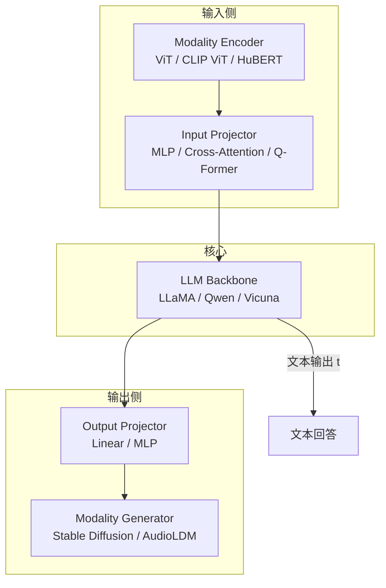

# 多模态大语言模型 (MLLM) 概述

> MLLM 利用 LLM 为多模态任务提供认知能力，核心挑战是如何将不同模态连接起来实现协同推理。

## 信息源

想往多模态方面去发展：

- [Awesome-RL-based-Reasoning-MLLMs](https://github.com/Sun-Haoyuan23/Awesome-RL-based-Reasoning-MLLMs)
- [Awesome-MLLM-Hallucination](https://github.com/showlab/Awesome-MLLM-Hallucination)
- [Paper_reading](https://github.com/JiaWang2001/Paper_reading)
- [Awesome-MLLM-Reasoning-Collection](https://github.com/lwpyh/Awesome-MLLM-Reasoning-Collection)

> 来源：Zhang et al. "MM-LLMs: Recent Advances in MultiModal Large Language Models" arXiv:2312.16602

## 现状认知

最近，多模态大模型取得重大进展。随着数据集和模型的规模不断扩大，**传统的 MM 模型从头开始训练带来了巨大的计算量**，所以一个合理的方法是利用好现成的训练好的单模态基础模型，尤其是 LLM。这样可以减少多模态训练的费用，提升训练效率。

MM-LLM 利用 LLM 为各种 MM 任务提供认知能力。LLM 具有良好的语言生成，zero-shot 和 ICL（上下文学习） 的能力。其他模态的基础模型则提供了高质量的表征。考虑到不同模态的模型是分开训练的，如何将不同模态连接起来，实现协同推理，是核心挑战。

## 发展历程

> 来源：Zhang et al. arXiv:2312.16602, Sec. 2

1. **多模态理解阶段**：最初的发展集中在多模态的内容理解和文本的生成
2. **多模态生成阶段**：同时实现多模态的输入和输出工作 MM-LMM，探索特定模态的生成
3. **Any-to-Any 阶段**：将 LLM 和外部工具集成进来，实现"any-to-any"的多模态理解和生成

## 架构

> 来源：Zhang et al. arXiv:2312.16602, Sec. 3

MLLM 的通用架构由五个核心组件构成：

### Modality Encoder

模态编码器对来自不同模态的输入进行编码：$F_X = \text{ME}_X(I_X)$

**视觉模态编码器**（参见 [[AI/CV/ViT|ViT]]）：

| 编码器 | 特点 | 代表使用 |
|--------|------|---------|
| NFNet-F6 | 无归一化 ResNet，SOTA 图像识别 | — |
| ViT | Transformer 处理 image patches | 通用 |
| CLIP ViT（arXiv:2103.00020） | 大规模文本-图像对比学习 | LLaVA, InstructBLIP |
| EVA-CLIP | 大规模 CLIP 训练稳定化 | InternVL |

> 来源：视觉编码器选型参见 CLIP (Radford et al., arXiv:2103.00020)

对于视频，可以统一采样 5 帧，进行与图像同样的处理。

**音频模态编码器**：C-Former（CIF 对齐机制）、HuBERT（自监督 BERT）、BEATs（迭代音频预训练）、Whisper

### Input Projector

输入 Projector 将其他模态的编码特征 $F_X$ 与文本特征空间 $T$ 进行对齐。对齐后的特征作为 prompts $P_X$ 联同文本特征 $F_T$ 输入到 LLM Backbone 内。

$$\mathcal{L} = -\sum_{t=1}^{T} \log P(x_t | P_X, F_T, x_{<t})$$

实现方式（参见 [[AI/MLLM/多模态 LLM 架构|多模态 LLM 架构]] 的 Projector 对比）：
- **MLP**（2 层）：最简单有效，2025 年主流选择（LLaVA-1.5+, InternVL）
- **Cross-Attention**：可学习 query 压缩特征到固定长度
- **Q-Former**（InstructBLIP, arXiv:2305.06500）：32 个可学习 queries 提取视觉表示
- **P-Former**：进一步的压缩变体

### LLM Backbone

LLM 作为核心智能体，继承 zero-shot 泛化、few-shot ICL、CoT 和指令遵循能力：

$$t, S_X = \text{LLM}(P_X, F_T)$$

其中 $t$ 是文本输出，$S_X$ 是其他模态的信号 token。常用 LLM：Flan-T5、ChatGLM、Qwen、LLaMA/LLaMA2、Vicuna 等。

PEFT 方法（Prefix-tuning、Adapter、LoRA）可以在 <0.1% 参数下实现训练。

### Output Projector & Modality Generator

输出 Projector 将 LLM 的信号 token 表征 $S_X$ 转变成特征 $H_X$，输给模态生成器 $\text{MG}_X$。

生成器使用现成的扩散模型：
- **图像**：Stable Diffusion
- **视频**：Zeroscope
- **音频**：AudioLDM-2

训练目标：最小化 $H_X$ 与 $\text{MG}_X$ 条件文本之间的距离。

## 数据集

> 来源：Zhang et al. arXiv:2312.16602, Sec. 4

常用多模态数据集涵盖 image-caption pairs（LAION-5B、CC-12M）、visual QA（VQAv2、GQA）、visual instruction tuning（LLaVA-Instruct-150K）等。

---

## 📚 推荐阅读

### 原始论文
- [Learning Transferable Visual Models From Natural Language Supervision (CLIP)](https://arxiv.org/abs/2103.00020) — Radford et al. 2021，多模态对齐的里程碑，必读
- [Visual Instruction Tuning (LLaVA)](https://arxiv.org/abs/2304.08485) — Liu et al. 2023，视觉指令微调的奠基论文
- [InstructBLIP: Towards General-purpose VLM with Instruction Tuning](https://arxiv.org/abs/2305.06500) — Dai et al. 2023，Q-Former + 指令微调
- [MM-LLMs: Recent Advances in MultiModal Large Language Models](https://arxiv.org/abs/2312.16602) — 最全面的 MLLM 综述 ⭐⭐⭐⭐⭐

### 深度解读
- [知乎 MLLM 综述解读](https://zhuanlan.zhihu.com/p/682893729) — 中文解读，适合快速理解全貌 ⭐⭐⭐⭐

### 实践资源
- [LLaVA GitHub](https://github.com/haotian-liu/LLaVA) — 最简洁的 MLLM 实现，适合学习
- [InternVL GitHub](https://github.com/OpenGVLab/InternVL) — 最强开源 MLLM 系列

## 🔧 落地应用

### 直接可用场景
- **文档理解/OCR**：MLLM 直接理解 PDF 截图、表格图片，替代传统 OCR 管线
- **多模态 RAG**：图文混合检索——用 CLIP Embedding 统一图文向量空间，或用 Vision LLM 将图片转文字描述
- **视觉问答**：基于产品图片/医疗影像/建筑图纸的智能问答

### 工程实现要点
- **Vision Encoder 选型**：中文场景用 InternViT-6B（InternVL）或 Qwen-VL 自训 ViT；英文通用用 CLIP ViT-L / SigLIP
- **Projector 选型**：2025 年主流是 2 层 MLP（简单有效），Q-Former 在细粒度任务（OCR）上有劣势
- **训练三阶段**：①冻结 ViT+LLM 只训 Projector（对齐） → ②解冻 LLM 做 Visual SFT → ③可选 RLHF/DPO 减少幻觉

### 面试高频问法
- Q: MLLM 的通用架构是什么？
  A: 五件套——Modality Encoder + Input Projector + LLM Backbone + Output Projector + Generator；核心 trade-off 在 Projector 的复杂度
- Q: 为什么不从头训练多模态模型？
  A: 计算量巨大；利用预训练好的 LLM + 预训练好的视觉编码器，只需训练轻量级 Projector 即可实现模态对齐

## 💡 启发与思考

### So What？对老板意味着什么
- MLLM 是 AI 从"只能读文字"到"能看图、听声音、理解世界"的关键跃迁
- 掌握 MLLM 架构是进入多模态 AI 领域的门票——2025-2026 大量岗位需求

### 未解问题与局限
- **视觉幻觉**：MLLM 会描述图中不存在的对象，RLHF-V 等方法缓解但未根治
- **细粒度理解**：小目标、密集文字的识别仍不稳定，需要高分辨率 + token 压缩的平衡
- **多模态推理**：跨模态的 CoT 推理（如"看图做数学"）仍是前沿难题

### 脑暴：如果往下延伸
- MLLM + [[AI/RAG/RAG-2026-技术全景|RAG]] = 多模态 RAG，是 2025-2026 的热门方向
- 结合 [[AI/MLLM/多模态 LLM 架构|多模态 LLM 架构]] 理解不同 Projector 设计的 trade-off
- 6 个月后 Any-to-Any 模型（文字→图→视频→音频的统一生成）可能进入实用阶段

## 相关

- [[AI/MLLM/多模态 LLM 架构]] — 架构细节深入，Projector 对比
- [[AI/MLLM/CLIP|CLIP]] — 多模态对齐的基石
- [[AI/MLLM/BLIP-2|BLIP-2]] — Q-Former 的原始设计
- [[AI/MLLM/Qwen-VL|Qwen-VL]] — 中文 MLLM 的代表
- [[AI/MLLM/InternVL3|InternVL3]] — 最强开源 MLLM
- [[AI/MLLM/DeepSeek-VL|DeepSeek-VL]] — DeepSeek 的多模态版本
- [[AI/CV/ViT|ViT]] — 视觉编码器基础
