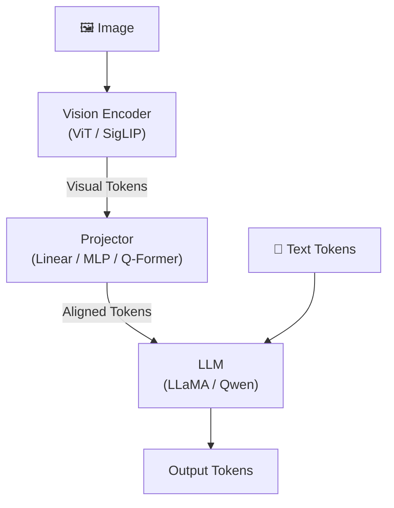

# 多模态 LLM 架构全景

> Vision-Language Model 的核心问题：如何让 LLM "看懂" 图片——Vision Encoder + Projector + LLM 的三件套

## 1. 通用架构



**三大设计选择**：
1. Vision Encoder：提取视觉特征的「眼睛」
2. Projector：对齐视觉-语言空间的「桥梁」
3. 训练策略：分阶段释放参数的「课程」

## 2. Vision Encoder 选型

### 主流选择

| Encoder | 参数量 | 分辨率 | 训练数据 | 特点 | 使用模型 |
|---------|--------|--------|---------|------|---------|
| CLIP ViT-L/14 (arXiv:2103.00020) | 304M | 224→336 | 400M image-text | 最经典，对齐好 | LLaVA-1.5 |
| SigLIP SO400M | 400M | 384 | 4B pairs | Sigmoid loss，无需负样本 | LLaVA-1.6, PaliGemma |
| InternViT-6B | 6B | 448 | 专有数据 | 最大开源 ViT | InternVL 2/2.5 |
| EVA-02-E | 4.4B | 224 | LAION | CLIP 改进版 | — |
| 自训练 ViT | 变化 | 动态 | 专有 | 与 LLM 联合训练 | Qwen-VL, Qwen2-VL |

### 分辨率策略

```
固定分辨率:
  优: 简单高效，token 数固定
  劣: 小目标/密集文本识别差
  代表: LLaVA-1.5 (336×336, 576 tokens)

动态分辨率 (AnyRes/NaViT):
  将高分辨率图片切成多个 tile，每个 tile 独立编码：

  高分辨率图片 (1344×1344)
  ┌────┬────┬────┬────┐
  │tile│tile│tile│tile│   每个 tile: 336×336
  ├────┼────┼────┼────┤   16 tiles × 576 tokens = 9216 tokens
  │tile│tile│tile│tile│
  ├────┼────┼────┼────┤   + 1 个缩略图 (全局上下文)
  │tile│tile│tile│tile│
  ├────┼────┼────┼────┤   总: ~10K visual tokens
  │tile│tile│tile│tile│
  └────┴────┴────┴────┘

  代表: LLaVA-NeXT, InternVL 2.5, Qwen2-VL

Qwen2-VL 2D RoPE:
  不切 tile，直接用 ViT 处理动态分辨率
  用 2D Rotary Position Embedding 编码 (h, w) 位置
  避免 tile 边界伪影
```

## 3. Projector 设计

### Linear Projection

```python
# LLaVA-1.0: 最简单的线性投影
class LinearProjector(nn.Module):
    def __init__(self, vision_dim, llm_dim):
        super().__init__()
        self.proj = nn.Linear(vision_dim, llm_dim)

    def forward(self, visual_features):
        return self.proj(visual_features)  # (B, N_vis, D_vis) → (B, N_vis, D_llm)
```

**优点**：参数少、训练快、不丢失信息。
**缺点**：visual token 数量不变（576-10K），占用大量 LLM 上下文。

### MLP Projector

```python
# LLaVA-1.5+, InternVL: 2 层 MLP
class MLPProjector(nn.Module):
    def __init__(self, vision_dim, llm_dim):
        super().__init__()
        self.proj = nn.Sequential(
            nn.Linear(vision_dim, llm_dim),
            nn.GELU(),
            nn.Linear(llm_dim, llm_dim),
        )

    def forward(self, visual_features):
        return self.proj(visual_features)
```

**2025 年主流选择**——简单有效，比 Linear 多一层非线性变换。

### Q-Former (BLIP-2)

参见 [[BLIP-2]]。通过一组可学习 query tokens 从 visual features 中提取固定数量的表示：

```python
class QFormer(nn.Module):
    """简化版 Q-Former"""
    def __init__(self, n_queries=32, vision_dim=1024, hidden_dim=768):
        super().__init__()
        self.queries = nn.Parameter(torch.randn(n_queries, hidden_dim))
        self.cross_attn = nn.MultiheadAttention(hidden_dim, 12)
        self.self_attn = nn.MultiheadAttention(hidden_dim, 12)
        self.proj = nn.Linear(hidden_dim, hidden_dim)

    def forward(self, visual_features):
        # queries 与 visual features 做 cross attention
        # 输出固定数量的 query tokens (与 visual token 数无关)
        queries = self.queries.unsqueeze(0).expand(visual_features.shape[0], -1, -1)
        out, _ = self.cross_attn(queries, visual_features, visual_features)
        out, _ = self.self_attn(out, out, out)
        return self.proj(out)  # (B, n_queries, D) → 固定 32 个 token
```

**优点**：大幅减少 visual token 数（576→32），节省 LLM 上下文。
**缺点**：信息压缩可能丢失细节，训练不稳定，OCR 等细粒度任务表现差。

### Perceiver Resampler (Flamingo, arXiv:2204.14198)

类似 Q-Former，但用 Perceiver 架构（Alayrac et al., 2022）：

```
可学习 latent tokens × visual features → cross attention × 6 layers
→ 输出固定长度 latent tokens → 注入 LLM 各层 (cross attention)

关键区别: Flamingo 将 visual tokens 通过 cross attention 注入 LLM 每层
         而非拼接到输入 (LLaVA 方式)
```

### Projector 对比总结

| Projector | Visual Tokens 数 | 参数量 | 细粒度能力 | 代表模型 |
|-----------|-----------------|--------|-----------|---------|
| Linear | 不变 (576+) | ~1M | ★★★★★ | LLaVA-1.0 |
| MLP (2层) | 不变 (576+) | ~10M | ★★★★★ | **LLaVA-1.5+, InternVL** |
| Q-Former | 固定 (32-64) | ~100M | ★★★☆☆ | BLIP-2 |
| Perceiver | 固定 (64-256) | ~50M | ★★★★☆ | Flamingo |
| C-Abstractor | 压缩 (144) | ~50M | ★★★★☆ | Honeybee |

**2025 趋势**：MLP + 动态分辨率 + token 压缩成为主流（InternVL 2.5 用 pixel shuffle 降低 token 数）。

## 4. 训练策略

### 三阶段训练

```
阶段 1: Pre-training (对齐)
  目标:    让 Projector 学会对齐 vision-language 空间
  数据:    大规模 image-caption pairs (~600K-5M)
  冻结:    Vision Encoder ❄️ + LLM ❄️
  训练:    只有 Projector 🔥
  时间:    数小时 (几百 GPU hours)

阶段 2: Visual Instruction Tuning (SFT)
  目标:    让模型学会多模态指令遵循
  数据:    高质量 visual QA/对话数据 (~600K-1.5M)
  冻结:    Vision Encoder ❄️ (或部分解冻)
  训练:    Projector 🔥 + LLM 🔥
  时间:    数天

阶段 3: RLHF/DPO (可选)
  目标:    对齐人类偏好，减少幻觉
  数据:    多模态偏好数据 (~10K-100K)
  训练:    全模型或 LoRA
  方法:    RLHF-V, LLaVA-RLHF, Silkie
```

### 数据构造

```python
# Visual Instruction Tuning 数据格式
{
    "image": "path/to/image.jpg",
    "conversations": [
        {"from": "human", "value": "<image>\n这张图片描述了什么？"},
        {"from": "gpt", "value": "这张图片展示了一只橘猫坐在窗台上..."},
        {"from": "human", "value": "猫的表情看起来怎样？"},
        {"from": "gpt", "value": "猫的表情看起来很放松和满足..."}
    ]
}
```

## 5. 主流模型对比

### LLaVA 系列

```
LLaVA-1.0 (2023.4):  CLIP ViT-L + Linear + Vicuna 7/13B
LLaVA-1.5 (2023.10): CLIP ViT-L + 2-layer MLP + Vicuna/LLaMA
LLaVA-NeXT (2024.1): + AnyRes 动态分辨率, 更多训练数据
LLaVA-OneVision (2024.8): + 多任务统一训练, 视频理解

优势: 简洁高效，社区生态好，易复现
劣势: 依赖外部 ViT，中文能力一般
```

### Qwen-VL 系列

参见 [[Qwen-VL]]。

```
Qwen-VL (2023.8):    自训练 ViT + Cross-Attn + Qwen 7B
Qwen2-VL (2024.10):  自训练 ViT + 2D RoPE + Naive Dynamic Resolution
                     特点: 不切 tile! 用 2D RoPE 处理任意分辨率
Qwen3-VL (2025):     MoE LLM + 改进 ViT + 235B 规模

优势: 中英双语强，OCR/文档理解领先，视频理解
劣势: 闭源训练数据，模型较大

Qwen2-VL 2D RoPE 创新:
  传统: 2D→1D flatten + 标准 RoPE → 丢失空间结构
  Qwen2-VL: 对 (h, w) 分别用独立 RoPE → 保持 2D 空间感知
```

### InternVL 系列

参见 [[InternVL3]]。

```
InternVL 1.0 (2023.12): InternViT-6B + QLLaMA
InternVL 1.5 (2024.4):  InternViT-6B + 2-layer MLP + InternLM2
InternVL 2.0 (2024.7):  + 动态分辨率, Pixel Shuffle 压缩
InternVL 2.5 (2024.12): + 改进训练策略, 多模型规模 (1-78B)
InternVL 3.0 (2025):    + 推理能力增强

架构: ViT-MLP-LLM (与 LLaVA 相同范式)
特点:
  - InternViT-6B: 最大开源视觉编码器
  - Pixel Shuffle: 4 个相邻 token 合并为 1 个 → token 减少 75%
  - 动态分辨率: 1-12 tiles × 256 tokens = 256-3072 tokens
```

### 综合对比

| 维度 | LLaVA-1.5/NeXT | Qwen2-VL | InternVL 2.5 |
|------|---------------|----------|-------------|
| Vision Encoder | CLIP ViT-L (304M) | 自训练 ViT (675M) | InternViT-6B |
| Projector | 2-layer MLP | 2-layer MLP | 2-layer MLP |
| LLM | Vicuna/LLaMA | Qwen2 | InternLM2/Qwen2.5 |
| 分辨率策略 | AnyRes tile | 2D RoPE 原生 | 动态 tile + PixelShuffle |
| Token 压缩 | 无 | 无 | PixelShuffle 4:1 |
| OCR/文档 | ★★★☆☆ | ★★★★★ | ★★★★☆ |
| 中文能力 | ★★☆☆☆ | ★★★★★ | ★★★★★ |
| 开源程度 | ★★★★★ | ★★★★☆ | ★★★★★ |

## 6. 关键技术细节

### Visual Token 压缩

高分辨率导致 visual token 暴增（10K+），压缩势在必行：

```
方法                  压缩比    质量损失
────────────────────────────────────────
Pixel Shuffle (InternVL) 4:1     极小 (空间信息合并到通道)
Average Pooling         4-16:1   中等
Token Merging (ToMe)    2-4:1    小
C-Abstractor           ~4:1      小
Perceiver Resampler    ~10:1     中等
```

### 多模态幻觉 (Hallucination)

```
常见幻觉类型:
  1. 对象存在性幻觉: 描述图中不存在的对象
  2. 属性幻觉: 颜色/位置/大小描述错误
  3. 关系幻觉: 对象间关系描述错误

缓解方法:
  - RLHF-V: 用细粒度人类反馈纠正视觉幻觉
  - 对比学习: 正确描述 vs 故意加入错误的描述
  - Grounding: 要求模型给出 bbox 坐标增强定位
  - 高分辨率: 更清晰的视觉输入 → 更少的幻觉
```

## 面试常见问题

### Q1: 多模态 LLM 的通用架构包含哪些组件？各自的作用是什么？

三大组件：(1) **Vision Encoder**（通常是 ViT/CLIP/SigLIP）——将图像转化为 visual token 序列，提取视觉语义特征；(2) **Projector**（Linear/MLP/Q-Former）——将 vision space 映射到 language space，实现模态对齐；(3) **LLM**（LLaMA/Qwen/InternLM）——在统一的 token 空间中推理。设计的核心 trade-off 是 Projector 的复杂度：简单如 MLP 保留所有信息但 token 多，复杂如 Q-Former 压缩 token 但可能丢失细节。2025 年主流选择是 **MLP + 动态分辨率 + token 压缩**。

### Q2: 为什么 2025 年大多数 VLM 用 MLP 而非 Q-Former 作为 Projector？

> 来源：Liu et al. "Improved Baselines with Visual Instruction Tuning (LLaVA-1.5)" arXiv:2310.03744

Q-Former 通过可学习 queries 将视觉 token 压缩到固定数量（如 32 个），但存在三个问题：(1) **信息丢失**——OCR、细粒度识别等任务需要保留像素级细节，32 个 token 不够；(2) **训练不稳定**——cross attention 的收敛依赖精心设计的预训练策略；(3) **工程复杂**——额外引入 ~100M 参数。MLP 直接投影保留所有 token，配合 pixel shuffle 等轻量压缩即可平衡效率和细节。LLaVA-1.5 的实验证明（arXiv:2310.03744），简单的 2 层 MLP 在几乎所有 benchmark 上优于 Q-Former。

### Q3: Qwen2-VL 的 2D RoPE 和传统 tile 切分有什么区别？

传统方法（LLaVA-NeXT、InternVL）将高分辨率图片切成多个 tile（如 336×336），每个 tile 独立编码后拼接。问题是 **tile 边界伪影**——跨 tile 的目标被切断，模型看不到完整上下文。Qwen2-VL 让 ViT 直接处理任意分辨率（dynamic resolution），用 **2D RoPE** 为每个 patch 编码 (h, w) 二维坐标——水平方向和垂直方向各用独立的 RoPE 频率，保持了完整的 2D 空间感知。代价是 ViT 需要处理变长序列，但配合 [[FlashAttention]] 可以高效实现。

### Q4: 多模态 LLM 的三阶段训练各自的作用是什么？

**阶段 1 (Pretrain)**：冻结 ViT+LLM，只训练 Projector，用大规模 image-caption 数据（~5M pairs）让 Projector 学会将视觉特征映射到 LLM 的词嵌入空间——对齐而非理解。**阶段 2 (Visual SFT)**：解冻 LLM（ViT 可选），用高质量的多模态指令数据训练——让模型学会看图回答问题、描述场景、做 OCR 等。**阶段 3 (RLHF/DPO)**：对齐人类偏好，减少视觉幻觉。关键设计：阶段 1 只训 Projector 是因为随机初始化的 Projector 会产生噪声梯度，如果同时解冻 LLM 会破坏预训练知识。

### Q5: 如何缓解多模态 LLM 的视觉幻觉问题？

视觉幻觉（描述图中不存在的对象/错误属性）是 MLLM 最大的问题之一。缓解方法：(1) **提高分辨率**——AnyRes/动态分辨率让模型看到更多细节，减少靠"猜"的情况；(2) **RLHF-V**——用细粒度人类标注（指出幻觉位置）做 DPO 训练；(3) **Grounding 训练**——要求模型给出 bbox 坐标，增强空间定位；(4) **对比训练**——构造正确描述 vs 故意加入对象的错误描述作为偏好对；(5) **推理时策略**——多次采样取共识（self-consistency），或用 vision encoder 二次验证。

---

## 📚 推荐阅读

### 原始论文
- [Learning Transferable Visual Models From Natural Language Supervision (CLIP)](https://arxiv.org/abs/2103.00020) — Radford et al. 2021，视觉-语言对齐的里程碑，必读
- [Flamingo: a Visual Language Model for Few-Shot Learning](https://arxiv.org/abs/2204.14198) — Alayrac et al. 2022，Perceiver Resampler + Cross-Attention 注入 LLM
- [Visual Instruction Tuning (LLaVA)](https://arxiv.org/abs/2304.08485) — Liu et al. 2023，简洁的 VLM 范式，Linear Projector + SFT
- [Improved Baselines with Visual Instruction Tuning (LLaVA-1.5)](https://arxiv.org/abs/2310.03744) — 证明 2 层 MLP 优于 Q-Former ⭐⭐⭐⭐⭐
- [BLIP-2: Bootstrapping Language-Image Pre-training](https://arxiv.org/abs/2301.12597) — Q-Former 的原始设计
- [InternVL: Scaling up Vision Foundation Models](https://arxiv.org/abs/2312.14238) — 最大开源 ViT (6B) + Pixel Shuffle 压缩

### 实践资源
- [LLaVA GitHub](https://github.com/haotian-liu/LLaVA) — 最简洁的 MLLM 实现
- [InternVL GitHub](https://github.com/OpenGVLab/InternVL) — 最强开源 MLLM 系列
- [Qwen-VL 系列](https://github.com/QwenLM/Qwen-VL) — 中文最强 MLLM

## 🔧 落地应用

### 直接可用场景
- **多模态 RAG**：用 Vision Encoder 将图片/表格向量化，与文本统一检索（参见 [[AI/RAG/RAG-2026-技术全景|RAG 2026 全景]] 的多模态 RAG 部分）
- **文档理解/OCR**：动态分辨率 + MLP Projector 的 VLM 可直接理解 PDF 截图，替代传统 OCR 管线
- **视觉问答与描述**：产品图片分析、医疗影像初筛、建筑图纸理解

### 工程实现要点
- **Vision Encoder 选型**：通用场景 CLIP ViT-L / SigLIP；需要最强中文能力 InternViT-6B；追求轻量 ViT-B/16
- **Projector 选型**：2025 年选 2 层 MLP 就对了——简单、有效、训练稳定
- **分辨率策略**：简单任务用固定 336×336；OCR/文档用动态分辨率（AnyRes 或 Qwen2-VL 2D RoPE）
- **Token 压缩**：Pixel Shuffle（InternVL）4:1 压缩是当前最优解，质量损失极小

### 面试高频问法
- Q: 三大组件各自的作用？
  A: Vision Encoder 提取视觉特征（眼睛）；Projector 对齐视觉-语言空间（桥梁）；LLM 做多模态推理（大脑）
- Q: 为什么训练时先冻结 ViT 和 LLM？
  A: 随机初始化的 Projector 产生噪声梯度，同时解冻 LLM 会破坏预训练知识——先让 Projector 学会对齐

## 💡 启发与思考

### So What？对老板意味着什么
- VLM 架构的核心 trade-off 是 Projector 复杂度——理解这个 trade-off 就理解了 LLaVA vs BLIP-2 vs Flamingo 的本质区别
- 动态分辨率 + Token 压缩是 2025-2026 的技术主线，掌握这个方向可以在面试中展示前沿认知

### 未解问题与局限
- **视觉幻觉未根治**：高分辨率 + RLHF-V 缓解但未解决，描述图中不存在对象的问题仍普遍
- **视频理解效率**：长视频的 visual token 暴增，当前压缩方案（Pixel Shuffle/ToMe）对视频的效果不如图像
- **统一 Any-to-Any 模型**：图文→视频→音频的统一生成仍在早期阶段

### 脑暴：如果往下延伸
- Qwen2-VL 的 2D RoPE 思路可以推广到 3D（视频的时空位置编码）——这是视频理解的潜在突破点
- 结合 [[AI/MLLM/MLLM 概述|MLLM 概述]] 的 Any-to-Any 架构，统一的 Modality Generator 可能替代当前的"外挂扩散模型"
- InternViT-6B 证明了大 ViT 的价值——6 个月后可能出现 10B+ 的视觉编码器

> 🔗 See also: [[AI/MLLM/MLLM 概述]] — MLLM 整体概述与发展历程
> 🔗 See also: [[AI/MLLM/CLIP|CLIP]] — Vision Encoder 的基石
> 🔗 See also: [[AI/MLLM/BLIP-2|BLIP-2]] — Q-Former 的原始设计
