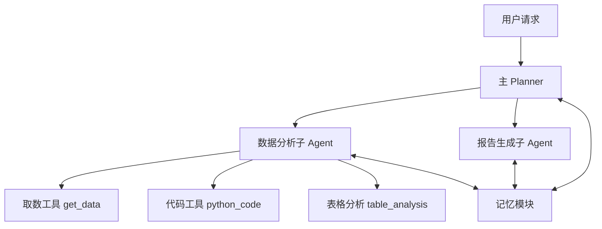
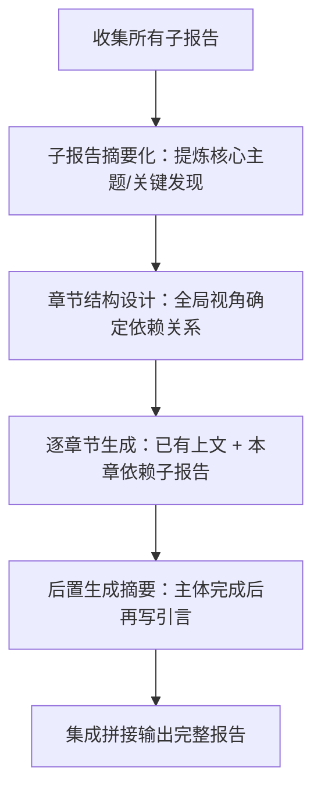

## 一、背景与目标

### 问题动机

住宿业务在"业务小助手"平台已沉淀 **730+ 工作流**，覆盖战役播报、周报月报、销售定策略及 xBR 监控分析等固化场景。工作流的核心优势是执行稳定、结果可解释；但弊端同样明显：有学习成本、依赖人工梳理 SOP、配置周期长。

对于**非固化类场景**（如节假日分析），分析思路不固定，无法通过工作流穷举分析路径。业务希望借助 LLM 的启发式能力给出建议和策略，而非千篇一律地按固有路径走。

业界已有 MetaGPT、AutoGen、LangGraph 等框架，但司内外尚无最佳实践。

### 项目目标

以**节假日场景为试点**，结合工程化手段探索模型能力边界，驱动升级框架能力，扩展工具，不断打磨效果，为未来泛化到其他分析场景铺路。

---

## 二、系统架构

### 总体分层

- **主 Planner**：接收用户请求 → 查询知识库 → 制定任务账本 → 调度子 Agent → 维护编排进展账本
- **数据分析子 Agent**：负责各专题数据查询与分析，产出子报告
- **报告生成子 Agent**：将所有子报告逐章节整合为完整分析报告
- **记忆模块**：三层共享，过滤无用信息，防止上下文污染

### 模型选型

| 角色 | 模型 | 原因 |
|------|------|------|
| 主 Planner + 分析子 Agent | Deepseek-R1（本地部署） | 规划和分析推理能力强 |
| 报告生成子 Agent | Deepseek-V3（本地部署） | 速度快，适合文档整合 |

全部使用 Friday 本地部署，保障涉密数据安全。

---

## 三、关键技术迭代

### 3.1 主 Planner 设计

Planner 扮演"大管家"角色，核心机制：

1. **准备阶段**：接收请求后查询知识库（RAG），获取指标定义、分析方法等背景知识
2. **任务账本（Task Ledger）**：结构化多步骤分析计划，明确各步骤主题和关键指标
3. **编排进展账本（Progress Ledger）**：动态记录执行历史和当前状态（是否按计划/是否有进展/是否遇阻），JSON 格式输出用于精确调度
4. **自修正**：若执行不畅，LLM 分析根因并修正任务账本或制定新执行策略

### 3.2 数据分析子 Agent 的工程挑战与解法

#### 挑战一：LLM 复述表格能力弱

- **现象**：LLM 不擅长精准复述大段表格和文本，数据幻觉风险高，对精准性要求极高的分析场景零容忍
- **解法**：将"数据解读"从分析 Agent 解耦，抽象为独立的**表格分析（table_analysis）工具**；引入**表格占位符机制**，分析过程传递占位符而非原始数据，防止 LLM 复述导致数据损失

#### 挑战二：工具调用幻觉随上下文增长显著恶化

- **现象**：输入过长后，分析 Agent 调用工具时出现大量无依据计算和幻觉
- **解法**：
  - **Prompt 消融**：多次消融实验精简 system prompt，从 **3w token → 1.5w token**，在不降效果前提下大幅降低输入长度
  - **外循环上下文清空**：节假日各章节分析相对独立，每轮新专题任务前清空历史上文，避免初始分析崩溃
  - **内循环裁剪**：随工具调用次数增多，消息不断堆叠；对历史工具调用消息（JSON、失败消息等）进行裁剪，仅保留有效的数据描述信息

#### 挑战三：分析崩溃不可恢复

- **现象**：上下文堆叠会导致"分析崩溃"，且随 ReAct 进一步恶化，提示手段和反思机制均无效
- **解法**：唯一有效方案是从根本上减少 user context 长度（见挑战二解法），防止触发崩溃阈值

### 3.3 工具体系

| 工具 | 功能 | 核心技术亮点 |
|------|------|-------------|
| **取数工具** | NL2SQL，输出 xlsx 到 S3 | ① 自动时间分区截取防大查询；② ReAct 自修复重试；③ 向量匹配高频复杂 query 模板，提升 hard 级查询准确性；④ 最小表集合召回精简上下文 |
| **代码工具** | 生成并执行 Python 分析代码 | ① AST 语法树危险代码检测 + 第三方库白名单；② 自定义进程池防机器卡死；③ ReAct 分单步执行自纠错；④ 多模态输出（文本/图片/数据表） |
| **表格分析** | 深度解读数据，产出子报告片段 | ① 先验分析思路与商分习惯对齐（人类偏好对齐）；② 返回调用次数帮助 Agent 判断是否应停止；③ 给出下钻建议辅助最优分析路径决策 |

### 3.4 报告生成 Agent 的工程化方案

> **为什么不直接用 LLM 做汇总？**
> - 长上下文信息丢失：多个子报告汇总后体量超出窗口限制，早期内容易被遗忘
> - 数据幻觉风险高：大规模高密度输入时幻觉概率显著上升
> - 输出长度不可控：实测要求输出 7K 字报告，实际只能稳定产出约 **3K 字**

**解法：分章节受控生成**

每章节生成时提供：① 已生成上文；② 本章依赖的原始子报告。借鉴人类写作习惯，**摘要后置生成**，保证精准概括全文。

---

## 四、算法 SFT 进展

### 4.1 目标

优先优化核心分析子 Agent 模块，目标：建设能够**端到端思考、工具调用、自我反思**的推理模型，内化节假日分析业务知识，减少框架 prompt 工程依赖。

### 4.2 训练版本迭代

| 版本 | 数据构造方式 | 关键结论 |
|------|------------|---------|
| **v0.1.0** | 人工完整数据（9条）+ 半合成（48条）+ 全合成（427条） | SFT 模型报告长度贴近人工 GT（是通用 baseline 的 1/5）；行文风格更自然；用词质量提升（如"节日期间'变美经济'持续升温"） |
| **v0.2.1** | ~120 session / ~1400 轮次合成 Agent 伪链路数据 | 发现 LLM 停不下来、模拟工具不好用等问题 |
| **v0.2.2** | 继承 v0.2.1 + 新增 16 session；think 中增加步骤数/重试次数记录 | 换用真实取数工具后测试稳定性大幅提升；效果略有提升但仍超步继续执行 |
| **v0.2.3** | 彻底换用真实 Agent 工程调用日志做**数据蒸馏**（442条）| 能符合逻辑执行全链路；具备 self-correct 能力；仍略停不下来 |
| **v0.2.4** | 继承 v0.2.3，修复无法正常结束 bug；训练长度从 16K → **24K** | 解决分析不终止问题；偶发提前终止/错误终止 |
| **v0.3.0** | 继承 v0.2.4 + Claude 合成 Agent 链路 ~400条 + 规则过滤 bad case + think/no-think 格式增强 | 模型鲁棒性显著提升 |

**核心迭代轨迹**：报告撰写能力 → 端到端分析推理能力 → 真实工程数据蒸馏

---

## 五、评测体系

### 5.1 综合评测框架

对标 **L6 商分能力矩阵**，题目构成：**90% 简单题 + 10% 困难题**，区分 4 大能力项：

| 能力项 | 得分 | 核心表现 |
|--------|------|---------|
| **数据准确性** | 100 分 | 基期选择和指标统计完全准确（在可接受差异范围内） |
| **分析覆盖度** | 77 分 | 核心指标召回 **85%+**；核心维度召回 **~50%**；交叉分析和维度下钻受限、输出不稳定 |
| **业务洞察力** | 33 分 | 趋势性洞察有效召回 **~50%**；贡献性洞察丰富度不足（**<20%**）；关联性洞察基本为 0 |
| **文档可读性** | 100 分 | 稳定输出分析当期和基期，按总-分结构输出报告 |

**综合得分**：春节约 **70 分**；五一各项略优于春节；清明暂未完成最新模型实验。

### 5.2 分析子 Agent 专项评测

- 自研 SFT 模型得分 **74 分**，基本持平商业模型（Deepseek-R1 约 70 分，QwQ-32B 约 76 分）
- 自研模型 vs Deepseek-V3 在 benchmark 上有一定优势（**19:15**），支持更丰富的下钻及多维分析

### 5.3 评测半自动化

借助大模型替代人工标注：
- 标注率 **90%+**，准确率 **80%+**
- 评测提效约 **40%**

---

## 六、问题与优化方向

### 框架层

| 问题 | 优化方向 |
|------|---------|
| 串行执行导致整体时间过长 | 结合 LangGraph，LLM 动态生成 DAG，实现 Agent 和工具并行调用 |
| 记忆共享靠硬编码规则，无长期记忆 | 构建记忆服务模块，支持用户偏好记录 |
| 子 Agent 间只能通过 Planner 中转，信息易损失 | 建立 Agent 间直接通信机制 |

### 模型能力层

| 问题 | 优化方向 |
|------|---------|
| 分析子 Agent 长上下文、复杂多轮工具调用能力弱 | 知识蒸馏 + 复杂合成数据 + 长上下文训练；探索端到端 RL 方案 |
| 业务知识内化不足，需依赖复杂 Prompt，泛化性差 | 配合 BA 算法合成 + 人工 review 构建场景训练数据；continue train 降低幻觉率 |
| 复杂 SQL 生成能力弱 | 针对 BA 取数特点，训练专属 SQL-LLM |

### 取数工具层

| 问题 | 优化方向 |
|------|---------|
| 元数据对 LLM 适配性弱，知识管理系统不完善 | 建设 AI 友好型元数据体系和知识库 |
| NL2SQL 尚不具备对扩展规则的解析能力 | 复用魔数指标维度仓库服务的解析能力 |
| nl2sql / nl2param / 智能答疑入口分散 | 联动"魔数"团队构建统一取数 Agent 入口 |

### 评测体系层

| 问题 | 优化方向 |
|------|---------|
| 评测体系适配当前能力阶段，关联性洞察题目偏少，未覆盖性能与体验维度 | 动态迭代评测指标体系和题目集；评分标准从召回率为主升级为准确率+召回率综合考察 |
| 人工标注人力投入大，随迭代频率难以跟上 | 进一步提升大模型标注能力；打通评测系统与分析 Agent，串行输出评测结论与优化方向，实现高效自迭代 |

---

## See Also

- [[Career/BA-Agent-节假日分析-第二期]]
