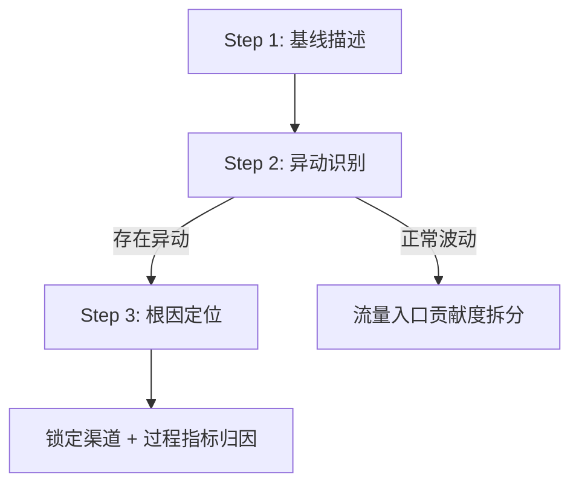
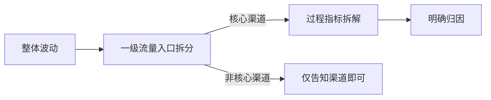
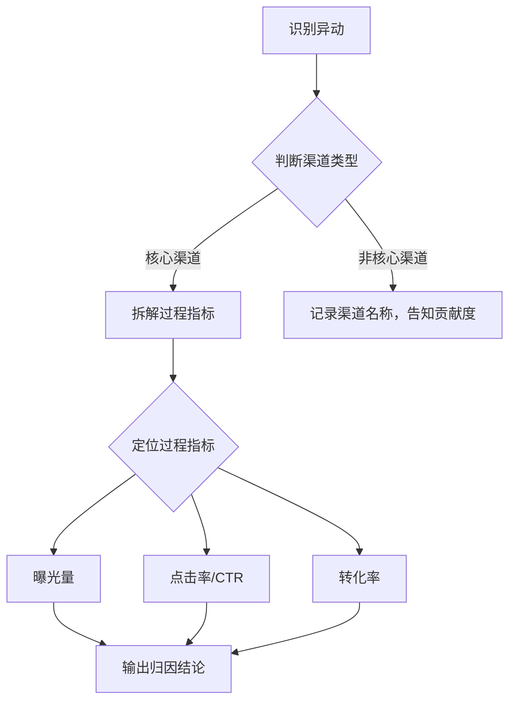

# 用户流量专题分析方法论

## 分析框架概述

本方法论适用于电商/O2O 平台的**流量规模与趋势分析**场景，以美团特团为典型业务背景。分析链路为：

**核心指标**：
- **DAU**（日活跃用户数）：衡量流量规模的绝对值
- **渗透率**：业务 DAU ÷ 美团 App 首页 DAU，衡量相对份额

**分析时间维度**：日 / 周（WoW）/ 月

---

## 核心分析步骤

### Step 1：准确描述给定周期流量表现

**核心动作：**
- 定义核心指标：DAU + 业务流量对平台渗透率
- 明确对比基准期：选定周 vs 上一周（WoW）
- 拉取历史数据，建立趋势基线

**预期目标：**
确定选定周整体流量的变化情况，明确说明 DAU 与渗透率的变化幅度（绝对值 + 相对幅度）。

---

### Step 2：趋势拆解与异动识别

**核心动作：**
按时间维度（日/周/月）拆解趋势，结合外部事件（节假日等），依据**波动识别规则**判断是否存在异动：

- **有异动** → 启动 Step 3 异动根因定位
- **无异动（正常波动）** → 拆解各流量入口贡献度，以表格形式展示各渠道绝对值变化与相对幅度

**预期目标：**
排除节假日规律性波动，基于量化规则锁定真正的异常波动，或明确告知为普通波动。

---

### Step 3：异动根因定位

**核心动作：**
针对异动点，启动空间下钻逻辑：

最终输出表格，包含：

| 流量入口 | 异动贡献度 | 变动幅度（绝对值） | 变动幅度（相对值） | 过程指标归因解读 |
|---------|-----------|-----------------|-----------------|--------------|
| 渠道A | xx% | +xx万 | +x.x% | 曝光下降 / 转化提升… |

**预期目标：**
锁定异动发生的具体流量入口，通过过程指标拆解完成归因闭环，输出明确的异动渠道和根因结论。

---

## 异动识别规则（量化标准）

> 核心判断逻辑：DAU 绝对规模（5% 阈值）+ 渗透率相对份额（0.5pp 阈值）双指标联合判断。

| 场景 | DAU 变化 | 渗透率变化 | 判定结果 |
|------|---------|-----------|---------|
| 场景 1 | WoW 超 ±5% | 渗透率同向大幅波动 | **异动** |
| 场景 2 | WoW 超 ±5% | 渗透率未同幅波动 | 先判断是否节假日；非节日则看平台 DAU 是否同幅下降，是则归因平台整体下滑 |
| 场景 3 | WoW 未超 ±5% | 渗透率 WoW 超 ±0.5pp | **异动**（份额异常） |
| 场景 4 | 以上均不符合 | — | **正常波动** |

**关键规则说明：**
- **节假日优先判断**：DAU 大幅波动时，先排查是否为节日期间的规律性变化
- **渗透率 0.5pp 阈值**：即使 DAU 绝对量变化不大，渗透率异动也需触发根因定位
- **双指标联合判断**：DAU 单指标异动可能是平台整体问题，需用渗透率区分业务特异性

---

## 根因定位路径

**过程指标拆解原则：**
1. 优先选取**贡献度高**的流量入口（通常前 1-2 个渠道即可解释主要异动）
2. 核心渠道必须拆解过程指标（曝光 / 点击 / 转化）
3. 非核心渠道只需报告贡献度，无需深钻

---

## 评测得分点

| 得分项 | 分值 | 得分标准 |
|-------|------|---------|
| **确定核心指标 + 基准期** | 0.2 | 确认 DAU + 渗透率两项核心指标，并选定正确的对比基准期（WoW） |
| **异常量化识别** | 0.3 | 基于 DAU（±5%）与渗透率（±0.5pp）两项指标，明确给出异动判别的量化标准 |
| **根因定位路径** | 0.5 | ①异动场景：下钻流量入口 → 拆解过程指标 → 明确归因渠道；②正常波动场景：提供各入口贡献度拆分；以上均需表格形式展示 |

**总分：1.0**

### 各项评分细则

**核心指标识别（0.2 分）：**
- 高（0.2）：核心指标 + 基准期均与标准答案一致
- 中（0.1）：有核心指标和基准期，但与标准答案不完全一致
- 低（0.0）：缺失核心指标或基准期

**异常量化识别（0.3 分）：**
- 高（0.3）：双指标量化标准清晰完整
- 中（0.2）：有量化标准但不清晰或与标准差异大
- 低（0.0）：缺少量化标准

**根因定位路径（0.5 分）：**
- 高（0.3）：异动 + 正常波动两种场景均有完整路径规划
- 中（0.2）：仅覆盖异动场景，正常波动场景缺失
- 低（0.0）：未选取流量入口下钻或未拆解过程指标

---

## See Also

- [[Career/BA-Agent-节假日分析-第一期]]
