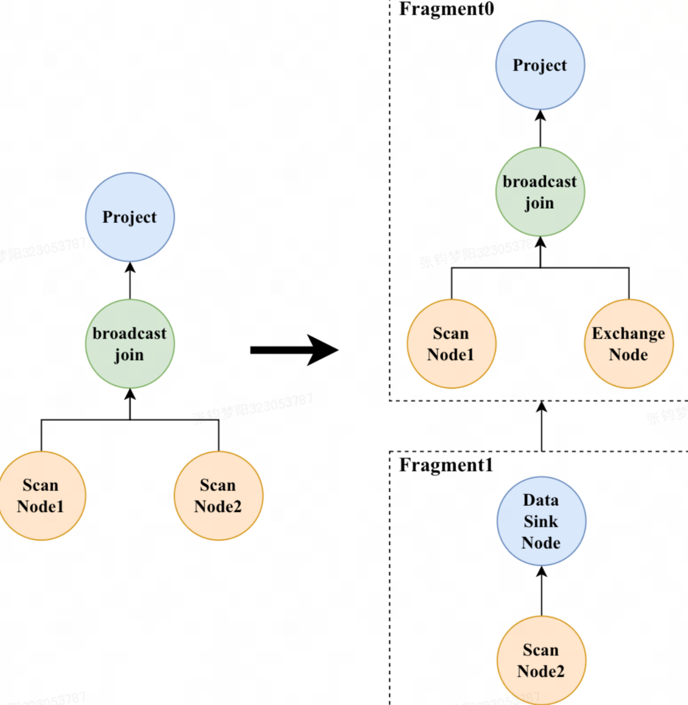
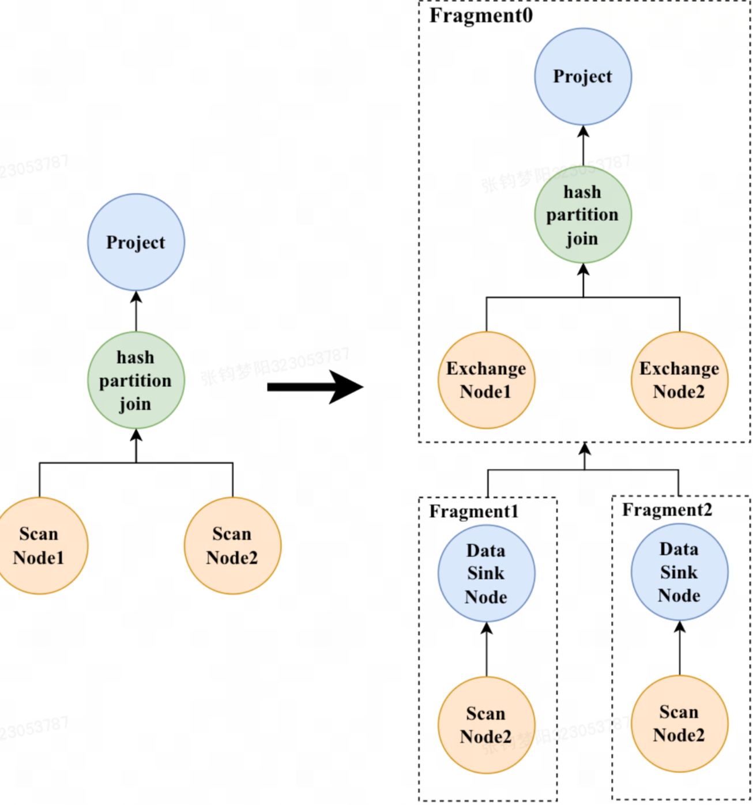
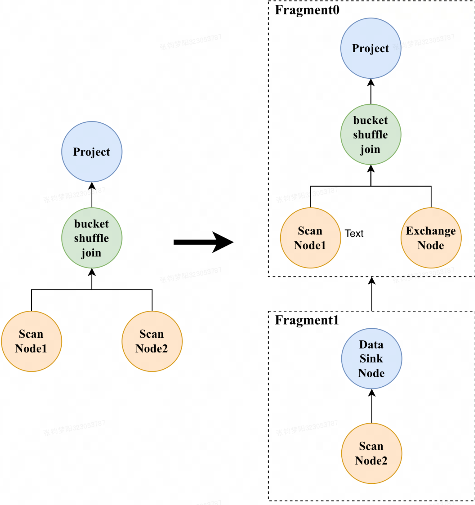

# Join

## 一、常见 Join 类型和 Join 算法

连接类型：INNER JOIN、OUTER JOIN、CROSS JOIN、SEMI JOIN、ANTI JOIN

Join 实现：Nested Loop Join、Sort Merge Join、Hash Join

Join 策略：

1. Shuffle Join：当进行Hash Join时，可以通过Join列计算对应的Hash值，并进行哈希分桶。左右表会根据Join列的哈希分布到各个机器上，网络开销为T(L) + T(R)，可以指定Join Hint为shuffle来强制执行。
1. 适用于**左右表都大**的场景
1. 如果 broadcast 大表了，可以开启参数重排
```
set enable_cost_based_join_reorder = true;
```

1. Broadcast Join：左表数据不移动，右表数据发送到左表数据的扫描节点，网络开销为T(R) * N 
1. 适用于**左表大，右表小**的场景。
1. BucketShuffleJoin：ShuffleJoin的特殊情况，如果JoinKey包含左表的分桶列，右表数据发送到左表的时候可以按分桶列Shuffe。网络开销为T(R)。 适用于左表较大，右表也不小的场景，无法指定Join Hint，需要数据的分布满足才行。
1. Colocate/Local Join：与BucketShuffleJoin类似，不过需要更严格的数据分布要求。A表和B表的分桶列和Bucket数需要保持一致。当JoinKey包含分桶列时，相同Key的左右表数据一定在同一台机器上，所以不需要Shuffle。网络开销为0。 每个节点只在本地进行 Join，能够本地进行 Join 的前提是相同 Join Key 的数据分布在相同的节点。
shuffle join 和 broadcast join 中, 参与join的两张表的数据行, 若满足join条件, 则需要将它们汇合在一台节点上, 完成join;  这两种join方式, 都无法避免节点间数据网络传输带来额外的延迟和其他开销。

Join 类型

Fragment 变化

Broadcast

**原理**

将小表发送到大表所在的每台机器，然后进行hash join操作。当一个表扫描出的数据量较少时，计算broadcast join的开销，通过计算比较hash partition join的开销，来选择开销最小的方式



**拆分方式**

需要将右表的数据发送给左表。先创建了一个ExchangeNode，设置HashJoinNode的左子节点为leftFragment的RootPlanNode，右子节点为这个ExchangeNode，与leftFragment共用一个PlanFragment，并且指定rightFragment数据发送的目的地为这个ExchangeNode

Hash shuffle

**原理**

当两张表扫描出的数据都很大时，一般采用hash partition join。它遍历表中的所有数据，计算key的哈希值，然后对集群数取模，选到哪台机器，就将数据发送到这台机器进行hash join操作



**拆分方式**

左表和右边的数据都要切分，需要将左右节点都拆分出去，分别创建left ExchangeNode, right ExchangeNode，HashJoinNode指定左右节点为left ExchangeNode和 right ExchangeNode。单独创建一个PlanFragment，指定RootPlanNode为这个HashJoinNode。最后指定leftFragment, rightFragment的数据发送目的地为left ExchangeNode, right ExchangeNode。

Colocate

**原理**

两个表在创建的时候就指定了数据分布保持一致，那么当两个表的join key与分桶的key一致时，就会采用colocate join算法。由于两个表的数据分布是一样的，那么hash join操作就相当于在本地，不涉及到数据的传输，极大提高查询性能


**拆分方式**

由于join操作都在本地，就不需要拆分。设置HashJoinNode的左子节点为leftFragment的RootPlanNode，右子节点为rightFragment的RootPlanNode，与leftFragment共用一个PlanFragment，删除掉rightFragment

Bucket shuffle

**原理**

当join key是分桶key，并且只涉及到一个分区时，就会优先采用bucket shuffle join算法。由于分桶本身就代表了数据的一种切分方式，所以可以利用这一特点，只需将右表对左表的分桶数hash取模，这样只需网络传输一份右表数据，极大减少了数据的网络传输



**拆分方式**

需要将右表的数据发送给左表。所以先创建了一个ExchangeNode，设置HashJoinNode的左子节点为leftFragment的RootPlanNode，右子节点为这个ExchangeNode，与leftFragment共用一个PlanFragment，并且指定rightFragment数据发送的目的地为这个ExchangeNode

## 二、Join 优化

### 2.1、Colocation Join

Colocation Group：一个CG中会包含多张表，拥有相同的数据分布。

Colocation Group Schema：描述一个CG中表的通用Schema，包括分桶列、分桶列类型、分桶数和副本数等。

将一组有相同CGS的表组成一个CG，从而保证不同表对应的Tablet会落在同一个BE节点上。当CG内的表进行分桶列上的Join时，可以直接进行本地数据Join，避免Shuffle。

使用方式：`"colocate_with"="group_name"`，group的名字在db内唯一。

- 可以对一个已创建的表，修改CG属性：`alter table tal set ("colocate_with"="group1")`
- 如果该表之前未指定CG，则会检查Schema，通过则加入CG，CG不存在则新建。
- 如果该表之前有指定CG，则会将该表从原有CG中移除，并加入新的CG。
- 如果CG为Unstable状态，则表示内部存在Tablet正在做迁移或修复，此时Colocate Join将退化为普通Join。
### 2.2、Bucket Shuffle Join

a Join b，如果Join关联键为分桶列，则会根据a表的数据分布信息，将b表的数据发送到a表的数据存储节点，从而降低网络和内存开销。相比Colocate Join，对表的数据分布没有侵入性。只支持Join条件为等值的场景，且需要保证右表Join列类型与左表分桶列类型一致。

使用方式：`set enable_bucket_shuffle_join=true;`，在0.14版本及以后默认为true。

### 2.3、Runtime Filter

运行时动态生成过滤条件，使用小表的过滤条件限制大表，减少扫描的数据量。

Runtime Filter类型：

- IN or Bloom Filter：根据右表行数选择使用IN Predicate还是Bloom Filter。
- IN Predicate：根据Join的key列在右表上的所有值构建IN Predicate，使用构建的IN Predicate在左表上过滤，相比Bloom Filter开销更低，右表数量少时性能更高。当右表数据行数少于1024才会下推。
- Bloom Filter：有一定误判率，但不会导致最终结果不准确。Bloom Filter开销较高，当过滤率较低，或左表数据量较少时，性能会下降。
- MinMax Filter：包含最大最小值，用于过滤小于最小值和大于最大值的数据。如果左右表最大最小值相同则没有效果；如果Join的key列为varchar等字符串时，性能会下降。
只支持等值Join，不支持将Runtime Filter下推到left join、full join的左表，不支持列传导。
