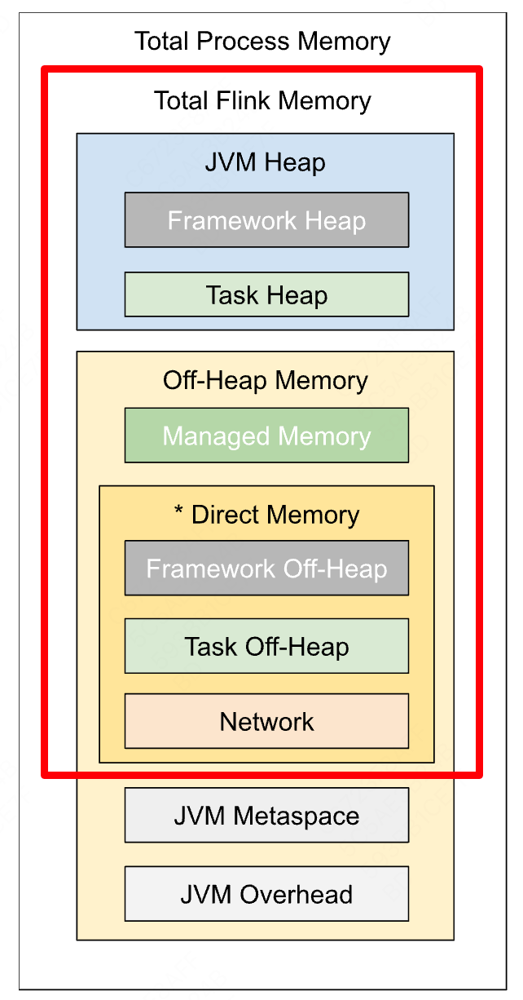
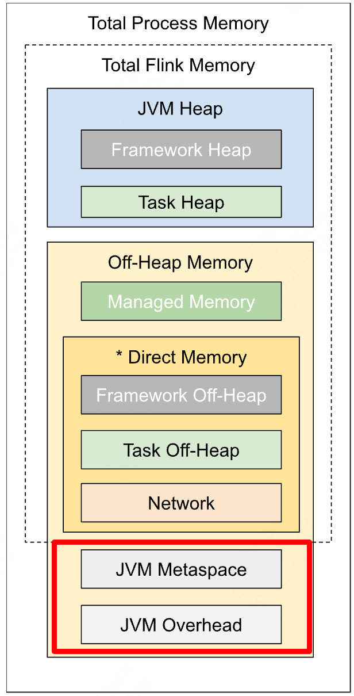
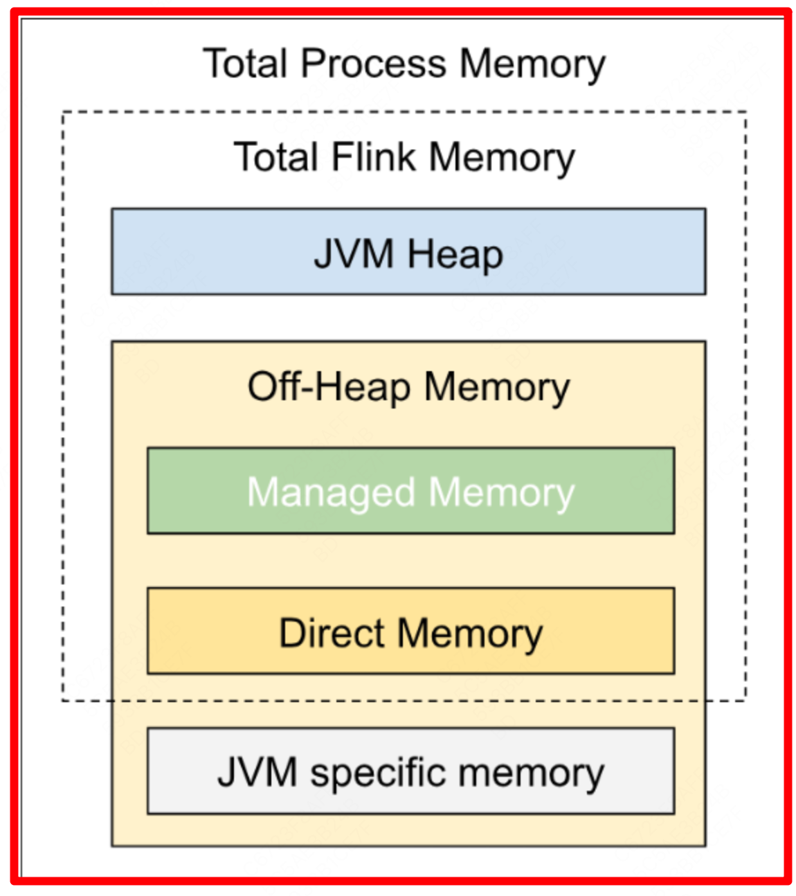
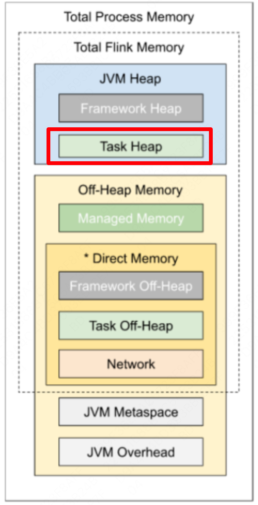

# 2. Flink 内存机制

## 一、汇总

Flink TaskManager 内存模型的所有组成部分，以及影响其大小的相关配置参数。

进程总内存（无默认值）

 Flink 总内存（无默认值）

**组成部分**

**配置参数**

**描述**

- [**独立部署模式（Standalone Deployment）**](https%3A%2F%2Fnightlies.apache.org%2Fflink%2Fflink-docs-release-1.19%2Fzh%2Fdocs%2Fdeployment%2Fresource-providers%2Fstandalone%2Foverview%2F)，如果你希望指定由 Flink 应用本身使用的内存大小，最好选择配置 *Flink 总内存*。 *Flink 总内存*会进一步划分为 *JVM 堆内存*和*堆外内存*。
- ** 容器化部署模式**（Containerized Deployment），这相当于申请的容器（Container）大小，详情请参考[如何配置容器内存](https%3A%2F%2Fnightlies.apache.org%2Fflink%2Fflink-docs-release-1.19%2Fzh%2Fdocs%2Fdeployment%2Fmemory%2Fmem_tuning%2F%23configure-memory-for-containers)（[Kubernetes](https%3A%2F%2Fnightlies.apache.org%2Fflink%2Fflink-docs-release-1.19%2Fzh%2Fdocs%2Fdeployment%2Fresource-providers%2Fstandalone%2Fkubernetes%2F) 或 [Yarn](https%3A%2F%2Fnightlies.apache.org%2Fflink%2Fflink-docs-release-1.19%2Fzh%2Fdocs%2Fdeployment%2Fresource-providers%2Fyarn%2F)）。
- **分TM / JM 配置**：还可以通过设置 *Flink 总内存*的特定内部组成部分的方式来进行内存配置。
以上三种方式中，用户需要至少选择其中一种进行配置（本地运行除外），否则 Flink 将无法启动。

[taskmanager.memory.process.size](https%3A%2F%2Fnightlies.apache.org%2Fflink%2Fflink-docs-release-1.19%2Fzh%2Fdocs%2Fdeployment%2Fconfig%2F%23taskmanager-memory-process-size)

[taskmanager.memory.flink.size](https%3A%2F%2Fnightlies.apache.org%2Fflink%2Fflink-docs-release-1.19%2Fzh%2Fdocs%2Fdeployment%2Fconfig%2F%23taskmanager-memory-flink-size)

[jobmanager.memory.flink.size](https%3A%2F%2Fnightlies.apache.org%2Fflink%2Fflink-docs-release-1.19%2Fzh%2Fdocs%2Fdeployment%2Fconfig%2F%23jobmanager-memory-flink-size)

[框架堆内存（Framework Heap Memory）](https%3A%2F%2Fnightlies.apache.org%2Fflink%2Fflink-docs-release-1.19%2Fzh%2Fdocs%2Fdeployment%2Fmemory%2Fmem_setup_tm%2F%23framework-memory)

[taskmanager.memory.framework.heap.size](https%3A%2F%2Fnightlies.apache.org%2Fflink%2Fflink-docs-release-1.19%2Fzh%2Fdocs%2Fdeployment%2Fconfig%2F%23taskmanager-memory-framework-heap-size)

用于 Flink 框架的 JVM 堆内存（进阶配置）。

[任务堆内存（Task Heap Memory）](https%3A%2F%2Fnightlies.apache.org%2Fflink%2Fflink-docs-release-1.19%2Fzh%2Fdocs%2Fdeployment%2Fmemory%2Fmem_setup_tm%2F%23task-operator-heap-memory)

[taskmanager.memory.task.heap.size](https%3A%2F%2Fnightlies.apache.org%2Fflink%2Fflink-docs-release-1.19%2Fzh%2Fdocs%2Fdeployment%2Fconfig%2F%23taskmanager-memory-task-heap-size)

用于 Flink 应用的算子及用户代码的 JVM 堆内存。

[托管内存（Managed memory）](https%3A%2F%2Fnightlies.apache.org%2Fflink%2Fflink-docs-release-1.19%2Fzh%2Fdocs%2Fdeployment%2Fmemory%2Fmem_setup_tm%2F%23managed-memory)

[taskmanager.memory.managed.size](https%3A%2F%2Fnightlies.apache.org%2Fflink%2Fflink-docs-release-1.19%2Fzh%2Fdocs%2Fdeployment%2Fconfig%2F%23taskmanager-memory-managed-size)
[taskmanager.memory.managed.fraction](https%3A%2F%2Fnightlies.apache.org%2Fflink%2Fflink-docs-release-1.19%2Fzh%2Fdocs%2Fdeployment%2Fconfig%2F%23taskmanager-memory-managed-fraction)

由 Flink 管理的用于排序、哈希表、缓存中间结果及 RocksDB State Backend 的本地内存。

[框架堆外内存（Framework Off-heap Memory）](https%3A%2F%2Fnightlies.apache.org%2Fflink%2Fflink-docs-release-1.19%2Fzh%2Fdocs%2Fdeployment%2Fmemory%2Fmem_setup_tm%2F%23framework-memory)

[taskmanager.memory.framework.off-heap.size](https%3A%2F%2Fnightlies.apache.org%2Fflink%2Fflink-docs-release-1.19%2Fzh%2Fdocs%2Fdeployment%2Fconfig%2F%23taskmanager-memory-framework-off-heap-size)

用于 Flink 框架的[堆外内存（直接内存或本地内存）](https%3A%2F%2Fnightlies.apache.org%2Fflink%2Fflink-docs-release-1.19%2Fzh%2Fdocs%2Fdeployment%2Fmemory%2Fmem_setup_tm%2F%23configure-off-heap-memory-direct-or-native)（进阶配置）。

[任务堆外内存（Task Off-heap Memory）](https%3A%2F%2Fnightlies.apache.org%2Fflink%2Fflink-docs-release-1.19%2Fzh%2Fdocs%2Fdeployment%2Fmemory%2Fmem_setup_tm%2F%23configure-off-heap-memory-direct-or-native)

[taskmanager.memory.task.off-heap.size](https%3A%2F%2Fnightlies.apache.org%2Fflink%2Fflink-docs-release-1.19%2Fzh%2Fdocs%2Fdeployment%2Fconfig%2F%23taskmanager-memory-task-off-heap-size)

用于 Flink 应用的算子及用户代码的[堆外内存（直接内存或本地内存）](https%3A%2F%2Fnightlies.apache.org%2Fflink%2Fflink-docs-release-1.19%2Fzh%2Fdocs%2Fdeployment%2Fmemory%2Fmem_setup_tm%2F%23configure-off-heap-memory-direct-or-native)。

网络内存（Network Memory）

**等比内存：**

优先级：

1. **如果没有设置其他部分内存大小**
1. 如果按照比例算出来在最大最小区间内，就按比例计算
1. 如果不在区间内，比如100MB在 （128,256）区间外，则取128MB
1. **如果配置了其他部分内存大小**
1. 先按照1中的计算方式算出来需要取的值，但是实际上取得还是真正剩余的内存
1. 如果剩余的甚至小于最小值，那就启动失败了
[taskmanager.memory.network.min](https%3A%2F%2Fnightlies.apache.org%2Fflink%2Fflink-docs-release-1.19%2Fzh%2Fdocs%2Fdeployment%2Fconfig%2F%23taskmanager-memory-network-min)
[taskmanager.memory.network.max](https%3A%2F%2Fnightlies.apache.org%2Fflink%2Fflink-docs-release-1.19%2Fzh%2Fdocs%2Fdeployment%2Fconfig%2F%23taskmanager-memory-network-max)
[taskmanager.memory.network.fraction](https%3A%2F%2Fnightlies.apache.org%2Fflink%2Fflink-docs-release-1.19%2Fzh%2Fdocs%2Fdeployment%2Fconfig%2F%23taskmanager-memory-network-fraction)

用于任务之间数据传输的直接内存（例如网络传输缓冲）。该内存部分为基于 [Flink 总内存](https%3A%2F%2Fnightlies.apache.org%2Fflink%2Fflink-docs-release-1.19%2Fzh%2Fdocs%2Fdeployment%2Fmemory%2Fmem_setup%2F%23configure-total-memory)的[受限的等比内存部分](https%3A%2F%2Fnightlies.apache.org%2Fflink%2Fflink-docs-release-1.19%2Fzh%2Fdocs%2Fdeployment%2Fmemory%2Fmem_setup%2F%23capped-fractionated-components)。这块内存被用于分配[网络缓冲](https%3A%2F%2Fnightlies.apache.org%2Fflink%2Fflink-docs-release-1.19%2Fzh%2Fdocs%2Fdeployment%2Fmemory%2Fnetwork_mem_tuning%2F)

[JVM Metaspace](https%3A%2F%2Fnightlies.apache.org%2Fflink%2Fflink-docs-release-1.19%2Fzh%2Fdocs%2Fdeployment%2Fmemory%2Fmem_setup%2F%23jvm-parameters)

[taskmanager.memory.jvm-metaspace.size](https%3A%2F%2Fnightlies.apache.org%2Fflink%2Fflink-docs-release-1.19%2Fzh%2Fdocs%2Fdeployment%2Fconfig%2F%23taskmanager-memory-jvm-metaspace-size)

Flink JVM 进程的 Metaspace。

JVM 开销

**等比内存：**

优先级：

1. **如果没有设置其他部分内存大小**
1. 如果按照比例算出来在最大最小区间内，就按比例计算
1. 如果不在区间内，比如100MB在 （128,256）区间外，则取128MB
1. **如果配置了其他部分内存大小**
1. 先按照1中的计算方式算出来需要取的值，但是实际上取得还是真正剩余的内存
1. 如果剩余的甚至小于最小值，那就启动失败了
[taskmanager.memory.jvm-overhead.min](https%3A%2F%2Fnightlies.apache.org%2Fflink%2Fflink-docs-release-1.19%2Fzh%2Fdocs%2Fdeployment%2Fconfig%2F%23taskmanager-memory-jvm-overhead-min)
[taskmanager.memory.jvm-overhead.max](https%3A%2F%2Fnightlies.apache.org%2Fflink%2Fflink-docs-release-1.19%2Fzh%2Fdocs%2Fdeployment%2Fconfig%2F%23taskmanager-memory-jvm-overhead-max)
[taskmanager.memory.jvm-overhead.fraction](https%3A%2F%2Fnightlies.apache.org%2Fflink%2Fflink-docs-release-1.19%2Fzh%2Fdocs%2Fdeployment%2Fconfig%2F%23taskmanager-memory-jvm-overhead-fraction)

用于其他 JVM 开销的本地内存，例如栈空间、垃圾回收空间等。该内存部分为基于[进程总内存](https%3A%2F%2Fnightlies.apache.org%2Fflink%2Fflink-docs-release-1.19%2Fzh%2Fdocs%2Fdeployment%2Fmemory%2Fmem_setup%2F%23configure-total-memory)的[受限的等比内存部分](https%3A%2F%2Fnightlies.apache.org%2Fflink%2Fflink-docs-release-1.19%2Fzh%2Fdocs%2Fdeployment%2Fmemory%2Fmem_setup%2F%23capped-fractionated-components)。

JVM Heap堆内存：

- Framework Heap Memory：Flink框架本身使用内存，不计入slot资源。
- `taskmanager.memory.framework.heap.size=128MB`，默认128MB。
- Task Heap Memory：Task执行用户代码时使用的内存。
- `taskmanager.memory.task.heap.size`
Off-Heap Memory堆外内存：

- DirectMemory JVM直接内存：
- Framework Off-Heap Memory：Flink框架本身使用内存，不计入slot资源。
- `taskmanager.memory.framework.off-heap.size=128MB`，默认128MB。
- Task Off-Heap Memory：Task执行用户代码时使用的内存。
- `taskmanager.memory.task.off-heap.size=0`，默认是0。
- Network Memory：网络数据传输使用的内存。
- `taskmanager.memory.network.fraction=0.1`
- `taskmanager.memory.network.min=64MB`
- `taskmanager.memory.network.max=1GB`
- Flink使用内存*0.1，如果小于min，则使用min，如果大于max，则使用max。
- Managed Memory：Flink管理的堆外内存，用于排序、哈希表、缓存中间结果及RocksDB StateBackend本地内存。
- `taskmanager.memory.managed.fraction=0.4`，Flink使用内存*0.4。
JVM specific memory JVM本身使用内存：

- JVM metaspace：元空间，存储JVM加载的类的元数据，加载的类越多，需要的空间越大。
- `taskmanager.memory.jvm-metaspace.size=256MB`，默认256MB。
- JVM overhead：执行开销，包括线程堆栈、IO、编译缓存等所使用的内存。
- `taskmanager.memory.jvm-overhead.fraction=0.1`，总进程内存*0.1。
- `taskmanager.memory.jvm-overhead.min=192MB`
- `taskmanager.memory.jvm-overhead.max=1GB`
其他资料：[cloud.tencent.com](https%3A%2F%2Fcloud.tencent.com%2Fdeveloper%2Farticle%2F2024181)

## 二、内存结构

TM 和 JM 内存结构差不多，注意点：

1. 实际生产中一般只针对 TM 进行调优，调整 JM 较少
1. JM 除了管理内存以外，在某些特殊算子比如 **broadcast 过程中也依赖 JM**

## 三、配置 Flink 进程内存 SOP

### 2.1、【必须】总内存

用户需要从以下无默认值的配置参数（或参数组合）中选择一个给出明确的配置：

**注意**：三者只建议配置其一，否则可能配置冲突

**TaskManager:**

**JobManager:**

对应内存

[taskmanager.memory.flink.size](https%3A%2F%2Fnightlies.apache.org%2Fflink%2Fflink-docs-release-1.19%2Fzh%2Fdocs%2Fdeployment%2Fconfig%2F%23taskmanager-memory-flink-size)

[jobmanager.memory.flink.size](https%3A%2F%2Fnightlies.apache.org%2Fflink%2Fflink-docs-release-1.19%2Fzh%2Fdocs%2Fdeployment%2Fconfig%2F%23jobmanager-memory-flink-size)

[taskmanager.memory.process.size](https%3A%2F%2Fnightlies.apache.org%2Fflink%2Fflink-docs-release-1.19%2Fzh%2Fdocs%2Fdeployment%2Fconfig%2F%23taskmanager-memory-process-size)

[jobmanager.memory.process.size](https%3A%2F%2Fnightlies.apache.org%2Fflink%2Fflink-docs-release-1.19%2Fzh%2Fdocs%2Fdeployment%2Fconfig%2F%23jobmanager-memory-process-size)

[taskmanager.memory.task.heap.size](https%3A%2F%2Fnightlies.apache.org%2Fflink%2Fflink-docs-release-1.19%2Fzh%2Fdocs%2Fdeployment%2Fconfig%2F%23taskmanager-memory-task-heap-size) 和 [taskmanager.memory.managed.size](https%3A%2F%2Fnightlies.apache.org%2Fflink%2Fflink-docs-release-1.19%2Fzh%2Fdocs%2Fdeployment%2Fconfig%2F%23taskmanager-memory-managed-size)

[jobmanager.memory.heap.size](https%3A%2F%2Fnightlies.apache.org%2Fflink%2Fflink-docs-release-1.19%2Fzh%2Fdocs%2Fdeployment%2Fconfig%2F%23jobmanager-memory-heap-size)

Tips：不建议同时设置 *进程总内存 *和 *Flink 总内存*。 这可能会造成内存配置冲突，从而导致部署失败。 额外配置其他内存部分时，同样需要注意可能产生的配置冲突。

### 2.2、【建议】配置 TM 内存

#### 2.2.1、任务堆内存（算子内存）

[`taskmanager.memory.task.heap.size`](https%3A%2F%2Fnightlies.apache.org%2Fflink%2Fflink-docs-release-1.19%2Fzh%2Fdocs%2Fdeployment%2Fconfig%2F%23taskmanager-memory-task-heap-size)：指定的内存将被包含在总的 JVM 堆空间中，专门用于 **Flink 算子及用户代码的执行。**

除了直接配置总内存，另一种配置 Flink 内存的方式是同时设置[任务堆内存](https%3A%2F%2Fnightlies.apache.org%2Fflink%2Fflink-docs-release-1.19%2Fzh%2Fdocs%2Fdeployment%2Fmemory%2Fmem_setup_tm%2F%23task-operator-heap-memory)和[托管内存](https%3A%2F%2Fnightlies.apache.org%2Fflink%2Fflink-docs-release-1.19%2Fzh%2Fdocs%2Fdeployment%2Fmemory%2Fmem_setup_tm%2F%23managed-memory)。 通过这种方式，用户可以更好地掌控用于 Flink 任务的 JVM 堆内存及 Flink 的[托管内存](https%3A%2F%2Fnightlies.apache.org%2Fflink%2Fflink-docs-release-1.19%2Fzh%2Fdocs%2Fdeployment%2Fmemory%2Fmem_setup_tm%2F%23managed-memory)大小。

如果已经明确设置了任务堆内存和托管内存，建议不要再设置*进程总内存*或 *Flink 总内存*，否则可能会造成内存配置冲突。

#### 2.2.2、托管内存

- [`taskmanager.memory.managed.size`](https%3A%2F%2Fnightlies.apache.org%2Fflink%2Fflink-docs-release-1.19%2Fzh%2Fdocs%2Fdeployment%2Fconfig%2F%23taskmanager-memory-managed-size) ：明确指定托管内存大小。
- [`taskmanager.memory.managed.fraction`](https%3A%2F%2Fnightlies.apache.org%2Fflink%2Fflink-docs-release-1.19%2Fzh%2Fdocs%2Fdeployment%2Fconfig%2F%23taskmanager-memory-managed-fraction)： 指定在*Flink 总内存 *中的占比。
当同时指定二者时，会优先采用指定的大小（Size）。 若二者均未指定，会根据[默认占比](https%3A%2F%2Fnightlies.apache.org%2Fflink%2Fflink-docs-release-1.19%2Fzh%2Fdocs%2Fdeployment%2Fconfig%2F%23taskmanager-memory-managed-fraction) 0.4 进行计算。

托管内存还可以配置 [消费者权重](https%3A%2F%2Fnightlies.apache.org%2Fflink%2Fflink-docs-release-1.19%2Fzh%2Fdocs%2Fdeployment%2Fmemory%2Fmem_setup_tm%2F%23%25e6%25b6%2588%25e8%25b4%25b9%25e8%2580%2585%25e6%259d%2583%25e9%2587%258d)，用于不同消费者的使用比例（太精细了，没用过）

作用：

- 流处理作业中用于 [RocksDB State Backend](https%3A%2F%2Fnightlies.apache.org%2Fflink%2Fflink-docs-release-1.19%2Fzh%2Fdocs%2Fops%2Fstate%2Fstate_backends%2F%23the-rocksdbstatebackend)。
- 流处理和批处理作业中用于排序、哈希表及缓存中间结果。
- 流处理和批处理作业中用于[在 Python 进程中执行用户自定义函数](https%3A%2F%2Fnightlies.apache.org%2Fflink%2Fflink-docs-release-1.19%2Fzh%2Fdocs%2Fdev%2Fpython%2Ftable%2Fudfs%2Fpython_udfs%2F)。
#### 2.2.3、堆外内存

用户代码中分配的堆外内存被归为*任务堆外内存（Task Off-heap Memory）*，可以通过 [`taskmanager.memory.task.off-heap.size`](https%3A%2F%2Fnightlies.apache.org%2Fflink%2Fflink-docs-release-1.19%2Fzh%2Fdocs%2Fdeployment%2Fconfig%2F%23taskmanager-memory-task-off-heap-size) 指定。

- 你也可以调整[框架堆外内存（Framework Off-heap Memory）](https%3A%2F%2Fnightlies.apache.org%2Fflink%2Fflink-docs-release-1.19%2Fzh%2Fdocs%2Fdeployment%2Fmemory%2Fmem_setup_tm%2F%23framework-memory)。 这是一个进阶配置，建议仅在确定 Flink 框架需要更多的内存时调整该配置。
- 本地内存（非直接内存）也可以被归在*框架堆外内存*或*任务堆外内存*中，在这种情况下 JVM 的*直接内存*限制可能会高于实际需求。
- *网络内存（Network Memory）同样被计算在 JVM 直接内存中。 Flink 会负责管理网络内存，保证其实际用量不会超过配置大小。 因此，调整网络内存*的大小不会对其他堆外内存有实质上的影响。
#### 2.2.4、JVM

TM 和 JM 稍微有一些区别，主要在于 **JVM 参数配置的 JVM 内存对 TM 来说范围更广，会包含 Flink 框架内存**，具体如下：

**JVM Arguments**

**Value for TaskManager**

**Value for JobManager**

-Xmx and -Xms

Framework + Task Heap Memory

JVM Heap Memory

-XX:MaxDirectMemorySize
(always added only for TaskManager, see note for JobManager)

Framework + Task Off-heap + Network Memory

Off-heap Memory

*-XX:MaxMetaspaceSize*

JVM Metaspace

JVM Metaspace

#### 2.2.5、等比内存配置

以下两种内存不仅受到内存配置限制，还会受到比例限制：

- *JVM 开销*：可以配置占用*进程总内存*的固定比例
- *网络内存*：可以配置占用 *Flink 总内存*的固定比例（仅针对 TaskManager）
优先级：

1. **如果没有设置其他部分内存大小**
1. 如果按照比例算出来在最大最小区间内，就按比例计算
1. 如果不在区间内，比如100MB在 （128,256）区间外，则取128MB
1. **如果配置了其他部分内存大小**
1. 先按照1中的计算方式算出来需要取的值，但是实际上取得还是真正剩余的内存
1. 如果剩余的甚至小于最小值，那就启动失败了
### 2.3、【可选】JM 内存

JM 大致调一下够用就行，因为 JM 只有一个就算大点也没关系，不用太精细

配置方法：配置 JobManager 内存最简单的方法就是进程的配置总内存

组成部分

参数

描述

[JVM 堆内存](https%3A%2F%2Fnightlies.apache.org%2Fflink%2Fflink-docs-release-1.19%2Fzh%2Fdocs%2Fdeployment%2Fmemory%2Fmem_setup_jobmanager%2F%23configure-jvm-heap)

[jobmanager.memory.heap.size](https%3A%2F%2Fnightlies.apache.org%2Fflink%2Fflink-docs-release-1.19%2Fzh%2Fdocs%2Fdeployment%2Fconfig%2F%23jobmanager-memory-heap-size)

JobManager 的 JVM 堆内存。

[堆外内存](https%3A%2F%2Fnightlies.apache.org%2Fflink%2Fflink-docs-release-1.19%2Fzh%2Fdocs%2Fdeployment%2Fmemory%2Fmem_setup_jobmanager%2F%23configure-off-heap-memory)

[jobmanager.memory.off-heap.size](https%3A%2F%2Fnightlies.apache.org%2Fflink%2Fflink-docs-release-1.19%2Fzh%2Fdocs%2Fdeployment%2Fconfig%2F%23jobmanager-memory-off-heap-size)

JobManager 的堆外内存（直接内存或本地内存）。

可以通过配置参数 [`jobmanager.memory.enable-jvm-direct-memory-limit`](https%3A%2F%2Fnightlies.apache.org%2Fflink%2Fflink-docs-release-1.19%2Fzh%2Fdocs%2Fdeployment%2Fconfig%2F%23jobmanager-memory-enable-jvm-direct-memory-limit) 设置是否启用 *JVM 直接内存限制*。 如果该配置项设置为 `true`，Flink 会根据配置的*堆外内存*大小设置 JVM 参数 *-XX:MaxDirectMemorySize*。

可以通过配置参数 [`jobmanager.memory.off-heap.size`](https%3A%2F%2Fnightlies.apache.org%2Fflink%2Fflink-docs-release-1.19%2Fzh%2Fdocs%2Fdeployment%2Fconfig%2F%23jobmanager-memory-off-heap-size) 设置堆外内存的大小。 如果遇到 JobManager 进程抛出 “OutOfMemoryError: Direct buffer memory” 的异常，可以尝试调大这项配置。 

[JVM Metaspace](https%3A%2F%2Fnightlies.apache.org%2Fflink%2Fflink-docs-release-1.19%2Fzh%2Fdocs%2Fdeployment%2Fmemory%2Fmem_setup%2F%23jvm-parameters)

[jobmanager.memory.jvm-metaspace.size](https%3A%2F%2Fnightlies.apache.org%2Fflink%2Fflink-docs-release-1.19%2Fzh%2Fdocs%2Fdeployment%2Fconfig%2F%23jobmanager-memory-jvm-metaspace-size)

Flink JVM 进程的 Metaspace。

JVM 开销

[jobmanager.memory.jvm-overhead.min](https%3A%2F%2Fnightlies.apache.org%2Fflink%2Fflink-docs-release-1.19%2Fzh%2Fdocs%2Fdeployment%2Fconfig%2F%23jobmanager-memory-jvm-overhead-min)
[jobmanager.memory.jvm-overhead.max](https%3A%2F%2Fnightlies.apache.org%2Fflink%2Fflink-docs-release-1.19%2Fzh%2Fdocs%2Fdeployment%2Fconfig%2F%23jobmanager-memory-jvm-overhead-max)
[jobmanager.memory.jvm-overhead.fraction](https%3A%2F%2Fnightlies.apache.org%2Fflink%2Fflink-docs-release-1.19%2Fzh%2Fdocs%2Fdeployment%2Fconfig%2F%23jobmanager-memory-jvm-overhead-fraction)

用于其他 JVM 开销的本地内存，例如栈空间、垃圾回收空间等。该内存部分为基于[进程总内存](https%3A%2F%2Fnightlies.apache.org%2Fflink%2Fflink-docs-release-1.19%2Fzh%2Fdocs%2Fdeployment%2Fmemory%2Fmem_setup%2F%23configure-total-memory)的[受限的等比内存部分](https%3A%2F%2Fnightlies.apache.org%2Fflink%2Fflink-docs-release-1.19%2Fzh%2Fdocs%2Fdeployment%2Fmemory%2Fmem_setup%2F%23capped-fractionated-components)。

JMV 堆内存 **作用**

- Flink 框架
- 在作业提交时（例如一些特殊的批处理 Source）及 Checkpoint 完成的回调函数中执行的用户代码
很大程度上取决于**运行的作业数量**、**作业的结构**及**上述用户代码的需求。**
