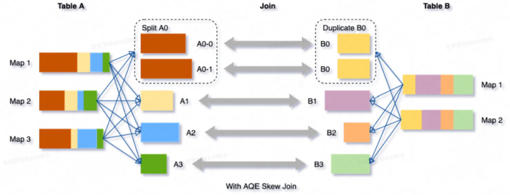
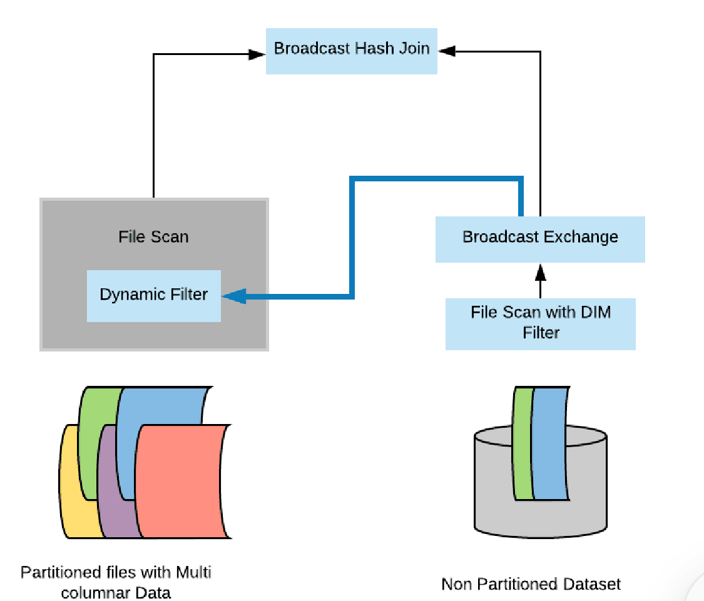

# 4. Spark AQE + DDP

目前，距离 Spark 3.0 版本的发布已经将近一年的时间了，这次版本升级添加了自适应查询执行（AQE）、动态分区剪裁（DPP）和扩展的 Join Hints 等新特性。

## 一、RBO & CBO

在 2.0 版本之前，Spark SQL 仅仅支持启发式、静态的优化过程。

启发式的优化又叫 RBO（Rule Based Optimization，基于规则的优化），它往往基于一些规则和策略实现，如谓词下推、列剪枝，这些规则和策略来源于数据库领域已有的应用经验。也就是说，启发式的优化实际上算是一种经验主义。

**RBO 问题**

经验主义的弊端就是不分青红皂白、胡子眉毛一把抓，对待相似的问题和场景都使用同一类套路。Spark 社区正是因为意识到了 RBO 的局限性，因此在 2.2 版本中推出了 CBO（Cost Based Optimization，基于成本的优化）。

CBO 的特点是“实事求是”，基于数据表的统计信息（如表大小、数据列分布）来选择优化策略。CBO 支持的统计信息很丰富，比如数据表的行数、每列的基数（Cardinality）、空值数、最大值、最小值和直方图等等。因为有统计数据做支持，所以 CBO 选择的优化策略往往优于 RBO 选择的优化规则。

**CBO 问题**

CBO 也面临三个方面的窘境：“窄、慢、静”。窄指的是适用面太窄，CBO 仅支持注册到 Hive Metastore 的数据表，但在大量的应用场景中，数据源往往是存储在分布式文件系统的各类文件，如 Parquet、ORC、CSV 等等。

慢指的是统计信息的搜集效率比较低。对于注册到 Hive Metastore 的数据表，开发者需要调用 ANALYZE TABLE COMPUTE STATISTICS 语句收集统计信息，而各类信息的收集会消耗大量时间。

静指的是静态优化，这一点与 RBO 一样。CBO 结合各类统计信息制定执行计划，一旦执行计划交付运行，CBO 的使命就算完成了。换句话说，如果在运行时数据分布发生动态变化，CBO 先前制定的执行计划并不会跟着调整、适配。

## 二、AQE

### 2.1、AQE 原理

考虑到 RBO 和 CBO 的种种限制，Spark 在 3.0 版本推出了 AQE（Adaptive Query Execution，自适应查询执行）。如果用一句话来概括：

AQE 是 Spark SQL 的一种动态优化机制，在运行时，每当 Shuffle Map 阶段执行完毕，AQE 都会结合这个阶段的统计信息，基于既定的规则动态地调整、修正尚未执行的逻辑计划和物理计划，来完成对原始查询语句的运行时优化。

从定义中，我们不难发现，AQE 优化机制触发的时机是 Shuffle Map 阶段执行完毕。也就是说，AQE 优化的频次与执行计划中 Shuffle 的次数一致。

反过来说，如果你的查询语句不会引入 Shuffle 操作，那么 Spark SQL 是不会触发 AQE 的。对于这样的查询，无论你怎么调整 AQE 相关的配置项，AQE 也都爱莫能助。

首先，AQE 赖以优化的统计信息与 CBO 不同，这些统计信息并不是关于某张表或是哪个列，而是 Shuffle Map 阶段输出的中间文件。学习过 Shuffle 的工作原理之后，我们知道，每个 Map Task 都会输出以 data 为后缀的数据文件，还有以 index 为结尾的索引文件，这些文件统称为中间文件。

**每个 data 文件的大小**、**空文件数量与占比**、**每个 Reduce Task 对应的分区大小**，所有这些基于中间文件的统计值构成了 AQE 进行优化的信息来源。

其次，结合 Spark SQL 端到端优化流程图我们可以看到，AQE 从运行时获取统计信息，在条件允许的情况下，优化决策会分别作用到逻辑计划和物理计划。

AQE 既定的规则和策略主要有 4 个，分为 1 个逻辑优化规则和 3 个物理优化策略：

那么，AQE 是如何根据 Map 阶段的统计信息以及这 4 个规则与策略，来动态地调整和修正尚未执行的逻辑计划和物理计划的呢？这就要提到 AQE 的三大特性，也就是 Join 策略调整、自动分区合并，以及自动倾斜处理，我们需要借助它们去分析 AQE 动态优化的过程。

- **Join 策略调整**：如果某张表在过滤之后，尺寸小于广播变量阈值，这张表参与的数据关联就会从 Shuffle Sort Merge Join 降级（Demote）为执行效率更高的 Broadcast Hash Join。
- **自动分区合并**：在 Shuffle 过后，Reduce Task 数据分布参差不齐，AQE 将自动合并过小的数据分区。
- **自动倾斜处理**：结合配置项，AQE 自动拆分 Reduce 阶段过大的数据分区，降低单个 Reduce Task 的工作负载。
接下来，我们就一起来分析这 3 个特性的动态优化过程。

### 2.2、Join 策略调整

这个特性涉及了一个逻辑规则和一个物理策略，它们分别是 

- DemoteBroadcastHashJoin
- OptimizeLocalShuffleReader。
**DemoteBroadcastHashJoin 规则的作用**

把 Shuffle Joins 降级为 Broadcast Joins。需要注意的是，这个规则仅适用于 Shuffle Sort Merge Join 这种关联机制，其他机制如 Shuffle Hash Join、Shuffle Nested Loop Join 都不支持。对于参与 Join 的两张表来说，在它们分别完成 Shuffle Map 阶段的计算之后，DemoteBroadcastHashJoin 会判断中间文件是否满足如下条件：

1. 中间文件尺寸总和小于广播阈值 spark.sql.autoBroadcastJoinThreshold
1. 空文件占比小于配置项 spark.sql.adaptive.nonEmptyPartitionRatioForBroadcastJoin
只要有任意一张表的统计信息满足这两个条件，Shuffle Sort Merge Join 就会降级为 Broadcast Hash Join。说到这儿，你可能会问：“既然 DemoteBroadcastHashJoin 逻辑规则可以把 Sort Merge Join 转换为 Broadcast Join，那同样用来调整 Join 策略的 OptimizeLocalShuffleReader 规则又是干什么用的呢？看上去有些多余啊！”

不知道你注意到没有，我一直强调，AQE 依赖的统计信息来自于 Shuffle Map 阶段生成的中间文件。这意味什么呢？这就意味着 AQE 在开始优化之前，Shuffle 操作已经执行过半了！

我们来举个例子，现在有两张表：事实表 Order 和维度表 User，它们的查询语句和初始的执行计划如下。

```
select sum(order.price * order.volume), user.id
from order inner join user
on order.userId = user.id
where user.type = ‘Head Users’
group by user.id
```

由于两张表大都到超过了广播阈值，因此 Spark SQL 在最初的执行计划中选择了 Sort Merge Join。AQE 需要同时结合两个分支中的 Shuffle（Exchange）输出，才能判断是否可以降级为 Broadcast Join，以及用哪张表降级。这就意味着，不论大表还是小表都要完成 Shuffle Map 阶段的计算，并且把中间文件落盘，AQE 才能做出决策。

你可能会说：“根本不需要大表做 Shuffle 呀，AQE 只需要去判断小表 Shuffle 的中间文件就好啦”。可问题是，AQE 可分不清哪张是大表、哪张是小表。在 Shuffle Map 阶段结束之前，数据表的尺寸大小对于 AQE 来说是“透明的”。因此，AQE 必须等待两张表都完成 Shuffle Map 的计算，然后统计中间文件，才能判断降级条件是否成立，以及用哪张表做广播变量。

在常规的 Shuffle 计算流程中，Reduce 阶段的计算需要跨节点访问中间文件拉取数据分片。如果遵循常规步骤，即便 AQE 在运行时把 Shuffle Sort Merge Join 降级为 Broadcast Join，大表的中间文件还是需要通过网络进行分发。这个时候，AQE 的动态 Join 策略调整也就失去了实用价值。原因很简单，负载最重的大表 Shuffle 计算已经完成，再去决定切换到 Broadcast Join 已经没有任何意义。

在这样的背景下，OptimizeLocalShuffleReader 物理策略就非常重要了。既然大表已经完成 Shuffle Map 阶段的计算，这些计算可不能白白浪费掉。采取 OptimizeLocalShuffleReader 策略可以省去 Shuffle 常规步骤中的网络分发，Reduce Task 可以就地读取本地节点（Local）的中间文件，完成与广播小表的关联操作。

不过，需要我们特别注意的是，OptimizeLocalShuffleReader 物理策略的生效与否由一个配置项决定。这个配置项是 spark.sql.adaptive.localShuffleReader.enabled，尽管它的默认值是 True，但是你千万不要把它的值改为 False。否则，就像我们刚才说的，AQE 的 Join 策略调整就变成了形同虚设。

**Shuffle 计算都已经过半，AQE 的 Join 策略调整有些鸡肋？**

确实，Shuffle Map 阶段的计算开销是半点没省。但是，OptimizeLocalShuffleReader 策略避免了 Reduce 阶段数据在网络中的全量分发，仅凭这一点，大多数的应用都能获益匪浅。因此，对于 AQE 的 Join 策略调整，我们可以用一个成语来形容：“亡羊补牢、犹未为晚”。

### 2.3、自动分区合并

接下来，我们再来说说自动分区合并。分区合并的原理比较简单，在 Reduce 阶段，当 Reduce Task 从全网把数据分片拉回，AQE 按照分区编号的顺序，依次把小于目标尺寸的分区合并在一起。目标分区尺寸由以下两个参数共同决定。

spark.sql.adaptive.advisoryPartitionSizeInBytes，由开发者指定分区合并后的推荐尺寸。

spark.sql.adaptive.coalescePartitions.minPartitionNum，分区合并后，分区数不能低于该值。

除此之外，我们还要注意，在 Shuffle Map 阶段完成之后，AQE 优化机制被触发，CoalesceShufflePartitions 策略“无条件”地被添加到新的物理计划中。读取配置项、计算目标分区大小、依序合并相邻分区这些计算逻辑，在 Tungsten WSCG 的作用下融合进“手写代码”于 Reduce 阶段执行。

### 2.4、自动倾斜处理

拆分前：


拆分后：



与自动分区合并相反，自动倾斜处理的操作是“拆”。在 Reduce 阶段，当 Reduce Task 所需处理的分区尺寸大于一定阈值时，利用 OptimizeSkewedJoin 策略，AQE 会把大分区拆成多个小分区。倾斜分区和拆分粒度由以下这些配置项决定。

spark.sql.adaptive.skewJoin.skewedPartitionFactor，判定倾斜的膨胀系数

spark.sql.adaptive.skewJoin.skewedPartitionThresholdInBytes，判定倾斜的最低阈值

spark.sql.adaptive.advisoryPartitionSizeInBytes，以字节为单位，定义拆分粒度

自动倾斜处理的拆分操作也是在 Reduce 阶段执行的。在同一个 Executor 内部，本该由一个 Task 去处理的大分区，被 AQE 拆成多个小分区并交由多个 Task 去计算。这样一来，Task 之间的计算负载就可以得到平衡。但是，这并不能解决不同 Executors 之间的负载均衡问题。

我们来举个例子，假设有个 Shuffle 操作，它的 Map 阶段有 3 个分区，Reduce 阶段有 4 个分区。4 个分区中的两个都是倾斜的大分区，而且这两个倾斜的大分区刚好都分发到了 Executor 0。通过下图，我们能够直观地看到，尽管两个大分区被拆分，但横向来看，整个作业的主要负载还是落在了 Executor 0 的身上。Executor 0 的计算能力依然是整个作业的瓶颈，这一点并没有因为分区拆分而得到实质性的缓解。

另外，在数据关联的场景中，对于参与 Join 的两张表，我们暂且把它们记做数据表 1 和数据表 2，如果表 1 存在数据倾斜，表 2 不倾斜，那在关联的过程中，AQE 除了对表 1 做拆分之外，还需要对表 2 对应的数据分区做复制，来保证关联关系不被破坏。

在这样的运行机制下，如果两张表都存在数据倾斜怎么办？这个时候，事情就开始变得逐渐复杂起来了。对于上图中的表 1 和表 2，我们假设表 1 还是拆出来两个分区，表 2 因为倾斜也拆出来两个分区。这个时候，为了不破坏逻辑上的关联关系，表 1、表 2 拆分出来的分区还要各自复制出一份，如下图所示。

如果现在问题变得更复杂了，左表拆出 M 个分区，右表拆出 N 各分区，那么每张表最终都需要保持 M x N 份分区数据，才能保证关联逻辑的一致性。当 M 和 N 逐渐变大时，AQE 处理数据倾斜所需的计算开销将会面临失控的风险。

总的来说，当应用场景中的数据倾斜比较简单，比如虽然有倾斜但数据分布相对均匀，或是关联计算中只有一边倾斜，我们完全可以依赖 AQE 的自动倾斜处理机制。但是，当我们的场景中数据倾斜变得复杂，比如数据中不同 Key 的分布悬殊，或是参与关联的两表都存在大量的倾斜，我们就需要衡量 AQE 的自动化机制与手工处理倾斜之间的利害得失。

## 三、DPP

所谓的动态分区裁剪就是基于运行时（run time）推断出来的信息来进一步进行分区裁剪，从而减少事实表中数据的扫描量、降低 I/O 开销，提升执行性能。

我们在进行事实表和维度表的Join过程中，把事实表中的无效数据进行过滤，例如：

```
SELECT * FROM dim 
JOIN fact 
ON (dim.col = fact.col) 
WHERE dim.col = 'dummy'
```

当SQL满足DPP的要求后，会根据关联关系dim.col = fact.col,通过维度表的列传导到事实表的col字段，只扫描事实表中满足条件的部分数据，就可以做到减少数据扫描量，提升I/O效率。

但是使用DPP的前提条件比较苛刻，需要满足以下条件： 

- 事实表必须是分区表
- 只支持等值Join
维度表过滤之后的数据必须小于广播阈值：spark.sql.autoBroadcastJoinThreshold

### 3.1、**静态分区裁剪**

在标准数据库术语中，裁剪意味着优化器将避免读取不包含我们正在查找的数据的文件。

在静态分区裁剪技术中，我们的表首先是分区的，分区过滤下推的思想和过滤下推一致。因为在这种情况下，如果我们的查询有一个针对分区列的过滤，那么在实际的查询中可以跳过很多不必要的分区，从而大大减少数据的扫描，减少磁盘I/O，从而提升计算的性能。

但是在复杂多表关联场景下，静态裁剪难以有效进行谓词下推，比如 A join B where A.datekey = 20240901，不会下推，动态分区裁剪就是解决这个问题的。

### 3.2、**动态分区裁剪**

Spark 将这个查询转化为一种易于理解的形式，我们称它为查询的逻辑计划（logical plan）。在此阶段，Spark 通过应用一组基于规则（rule based）的转换（如列修剪、常量折叠、算子下推）来优化逻辑计划。然后，它才会进入查询的实际物理计划（physical planning）。在物理规划阶段 Spark 生成一个可执行的计划（executable plan），该计划将计算分布在集群中。本文我将解释如何在逻辑计划阶段实现动态分区修剪。然后，我们将研究如何在物理计划阶段中进一步优化它。

#### 3.2.1、**逻辑计划阶段优化**

假设我们有一个具有多个分区的事实表（fact table），为了方便说明，我们用不同颜色代表不同的分区。另外，我们还有一个比较小的维度表（dimension table），我们的维度表不是分区表。然后我们在这些数据集上进行典型的扫描操作。在我们的例子里面，假设我们只读取维度表里面的两行数据，而这两行数据其实对于另外一张表的两个分区。所以最后执行 Join 操作时，带有分区的事实表只需要读取两个分区的数据就可以。

简单来说，就是用小表去过滤大表，**这点上跟 Doris 思路是一致的。（RunTimeFilter）**

因此，我们不需要实际扫描整个事实表。为了做到这种优化，一种简单的方法是通过维度表构造出一个过滤子查询（比如上面例子为 select subject from iteblog.DailyRoutine where subject = 'English'），然后在扫描事实表之前加上这个过滤子查询。

通过这种方式，我们在逻辑计划阶段就知道事实表需要扫描哪些分区。


但是，上面的物理计划执行起来还是比较低效。因为里面有重复的子查询，我们需要找出一种方法来消除这个重复的子查询。为了做到这一点，Spark 在物理计划阶段做了一些优化。

#### 3.2.2、物理计划阶段优化

如果维度表很小，那么 Spark 很可能会以** broadcast hash join **的形式执行这个 Join。Broadcast Hash Join 的实现是将小表的数据广播（broadcast）到 Spark 所有的 Executor 端，这个广播过程和我们自己去广播数据没什么区别，先利用 collect 算子将小表的数据从 Executor 端拉到 Driver 端，然后在 Driver 端调用 sparkContext.broadcast 广播到所有 Executor 端；另一方面，大表也会构建** hash table**（称为 build relation），之后在 Executor 端这个广播出去的数据会和大表的对应的分区进行 Join 操作，这种 Join 策略避免了 Shuffle 操作。具体如下：


**动态分区裁剪优化就是在 broadcast hash join 中大表进行 build relation 的时候拿到维度表的广播结果（broadcast results），然后在 build relation 的时候（Scan 前）进行动态过滤，从而达到避免扫描无用的数据效果。**具体如下：



启用动态分区裁剪必须满足以下几个条件：

- spark.sql.optimizer.dynamicPartitionPruning.enabled 参数必须设置为 true，不过这个值默认就是启用的；
- 需要裁减的表必须是分区表，而且分区字段必须在 join 的 on 条件里面；
- Join 类型必须是 INNER, LEFT SEMI （左表是分区表）, LEFT OUTER （右表是分区表）, or RIGHT OUTER （左表是分区表）。
- 满足上面的条件也不一定会触发动态分区裁减，还必须判断动态分区裁减是否有益的值，满足了才会进行动态分区裁减，影响因素：
- spark.sql.optimizer.dynamicPartitionPruning.useStats
- spark.sql.optimizer.dynamicPartitionPruning.fallbackFilterRatio 