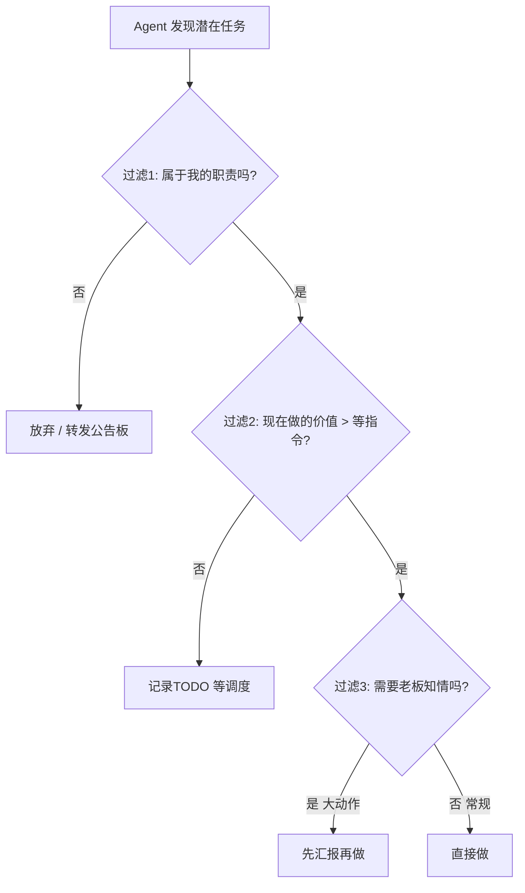

# 实验 007：自主任务生成

> Agent 能不能自己发现该做的事，而不是等总管分配？

## 问题定义

当前军团是星型调度——总管（贾维斯）分配任务，子 Agent 执行。自主任务生成要回答：

1. Agent 能否**主动发现**有价值的工作？
2. 主动发现的工作**方向是否正确**（不越界、不做别人的活）？
3. 自主程度的**边界在哪**？

## 反面教训（2/28 活案例）

贾维斯凌晨做了 6 轮 AI 前沿扫描——这就是"自主任务生成"的失败案例：
- ✅ 主动发现了工作（扫前沿、写笔记、推项目）
- ❌ 方向错误（扫新闻是哨兵的活）
- ❌ 没有边界意识（重复做了 6 轮，每轮 15 分钟间隔）

**根因**：缺少"这件事属于谁"的判断机制。主动性没问题，判断力不够。

## 理论框架

### 自主任务的三层过滤



### 职责边界定义（基于 MEMORY.md 军团档案）

| Agent | 可自主发起的任务类型 | 绝对不碰 |
|-------|-------------------|---------|
| 贾维斯 | Agent 进化实验、记忆维护、军团调度、人生精算 | 扫新闻、写 Vault 深度笔记、炼化 |
| 哨兵 | 信源扫描、突发推送、Newsloom 日报 | 写论文笔记、炼化 |
| 学者 | 论文精读、Vault 新笔记、研究方向拓展 | 实时情报、炼化 |
| 馆长 | 断链修复、结构审计、交叉链接 | 写新内容、扫新闻 |

### 判断力公式

```
自主任务价值 = 紧迫度 × 专属度 × (1 - 重复度)
```

- **紧迫度**：不做会损失什么？（突发事件高，日常维护低）
- **专属度**：只有我能做吗？（Agent 进化=1.0，扫新闻=0.0）
- **重复度**：这件事最近做过吗？（6 轮扫描=重复度极高）

## 实施路径

### Phase 1：职责边界文档化（可立即做 ✅）
- 上面的职责边界表就是产物
- 写入各 Agent 的 HEARTBEAT.md 作为"不做清单"

### Phase 2：公告板自发布机制（中期）
- Agent 发现属于别人的任务 → 自动发布到公告板而非自己做
- 需要公告板格式规范支持（v2 已有）

### Phase 3：自主度调节器（远期）
- 根据老板在线/离线状态调节自主度
  - 老板在线：低自主（等指令）
  - 老板睡觉/外出：高自主（主动推进自己的课题）
  - 紧急事件：无论如何都主动

## 与其他实验的关系

- **004 记忆代谢**：规则库 S 级「不越俎代庖」就是 007 的判断基线
- **006 角色漂移**：越俎代庖本身就是一种角色漂移（行为偏离职责基线）
- **002 横向信息流**：公告板是"发现属于别人的任务→转发"的基础设施

## 风险

- 过度约束自主性会让 Agent 退化为"等指令才动"的工具
- 自主任务与被分配任务的优先级冲突：老板临时派活时，自主任务该不该让路？（答案：永远让路）

---

*设计文档。Phase 1 职责边界表已完成。*
