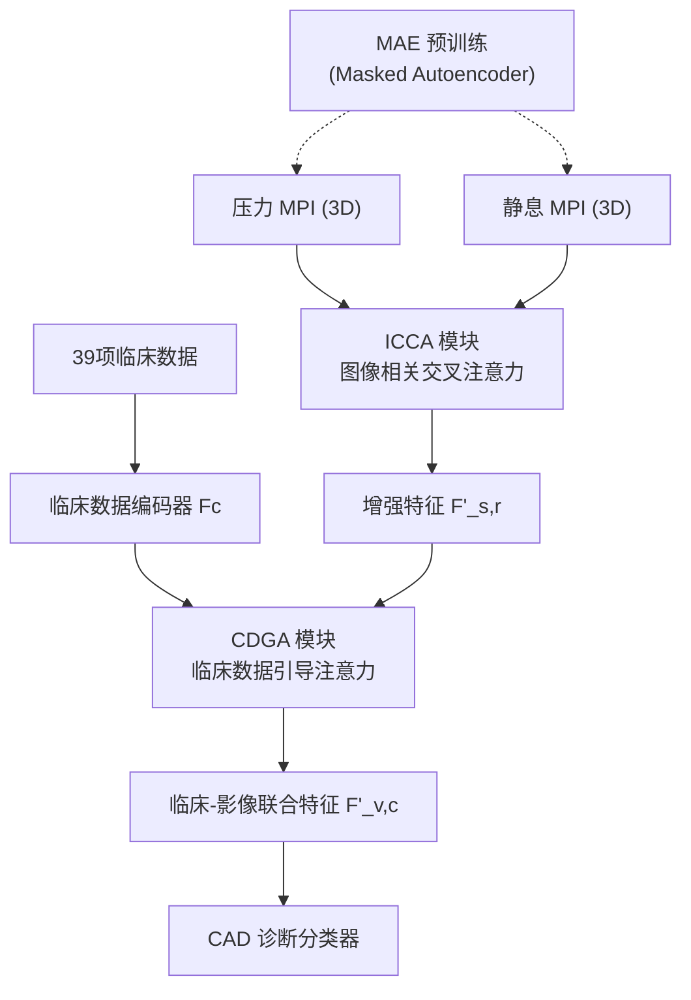

# MMAN：多模态注意力网络用于心肌灌注成像冠心病评估

## 核心问题

心肌灌注成像（MPI）是诊断冠心病（CAD）的重要工具，但存在两大挑战：

1. **单模态局限**：现有深度学习方法多用单模态数据，未融合压力/静息 MPI 的互补信息
2. **缺乏临床数据**：临床诊断依赖年龄、病史、ECG 等 39 类非影像数据，传统方法忽视这些信息

## 方法：MMAN（Multi-Modality Attention Network）

### A. 模型预训练：MAE

- 使用 Masked Autoencoder (MAE) 对未标注 MPI 数据自监督预训练
- 编码器：Vision Transformer (ViT)，12层 Transformer Block
- 随机 mask ~75% 图像 patch，重建训练
- 预训练权重作为 checkpoint 迁移至下游 CAD 诊断任务

### B. ICCA（Image-Correlated Cross-Attention）

三步交叉注意力：

1. 以压力 MPI 为 Query，静息 MPI 为 Key/Value → 增强压力特征
2. 以静息 MPI 为 Query，压力 MPI 为 Key/Value → 增强静息特征
3. 增强压力 MPI ↔ 增强静息 MPI 再次交叉注意力

关键公式：

$$A_{s,r} = F_s(Q_{s,r} K_{r,s}^T / \sqrt{C})$$

$$Q_{s,r} = F_{s,r} W^q_{s,r},\quad K_{r,s} = F_{r,s} W^k_{r,s},\quad V_{r,s} = F_{r,s} W^v_{r,s}$$

### C. CDGA（Clinical Data-Guided Attention）

- 临床数据：39 类（分类/数值）
  - 分类型：用 1/0/-1 表示"是/否/未知"
  - 数值型：归一化到 [0,1]
- 临床编码器 Fc：两层线性映射 + 单层 Transformer（2个注意力头）
- 将 $F_c \in \mathbb{R}^{M \times C}$（M=39）与图像特征 $F'_{s,r}$ 拼接后引导注意力

## 实验结果

### 主要性能对比（Table III & V）

| 方法 | 输入 | AUC | Acc@Spe0.9 | Sen@0.9 | F1@0.9 |
|------|------|-----|------------|---------|--------|
| Baseline (ViT) | Rest | 0.7537 | 0.7500 | 0.4247 | 0.5167 |
| Baseline (ViT) | Stress | 0.8261 | 0.7888 | 0.5479 | 0.6202 |
| +ICCA | S+R | 0.8583 | 0.8233 | 0.6575 | 0.7007 |
| **MMAN** | **S+R+C** | **0.8790** | **0.8362** | **0.6987** | **0.7285** |

### 消融实验要点

- MAE 预训练提升 AUC ~2.4%（0.8552→0.8790）
- ViT 比 ResNet101 AUC 高约 1.4~4.3%
- ICCA 比 SI-fusion/Cross-attention/MultiCo-attention 高 1.8~2.8%
- CDGA 引入临床数据后 AUC 显著提升（+3.5%~+5.0%）

## 落地应用

- **医疗影像 AI 诊断**：SPECT/心肌灌注成像自动分析流程
- **多模态融合范式**：ICCA 模块可迁移至其他需要融合两个相关模态的任务
- **临床数据嵌入**：CDGA 框架适用于任何需要非图像特征增强的医学图像分析

## 启发思考

1. **跨模态注意力的三步策略**：单次交叉注意力可能不充分——先增强各模态再进行二次跨注意力是有效改进
2. **临床数据编码设计**：1/0/-1 表示 yes/no/unknown 是处理缺失值的简洁方案，优于简单 one-hot
3. **医疗场景的 MAE**：小数据集上自监督预训练有效缓解标注数据稀缺问题
4. **非对称信息价值**：压力 MPI 比静息 MPI 信息量更大（AUC 0.83 vs 0.75）

## 推荐阅读

- Transformer架构深度解析-2026技术全景 — ViT 架构基础
- [[AI/3-LLM/MLLM/MLLM 概述]] — 多模态融合相关方法
- [[AI/2-Agent/Multi-Agent/Multi-Agent 概述]] — 医疗 AI Agent 方向延伸

## 元信息

- **老板角色**：第二作者（实习于 A*STAR I²R，NUS 在读时）
- **伦理批准**：SingHealth CIRB (2017/2131)，A*STAR IRB (2022-015)
- **数据集**：新加坡国立心脏中心真实临床患者 MPI 数据

---

> 这是老板在 A*STAR 实习期间的代表性工作。跨模态医疗影像 + 临床数据融合的完整方法论。
