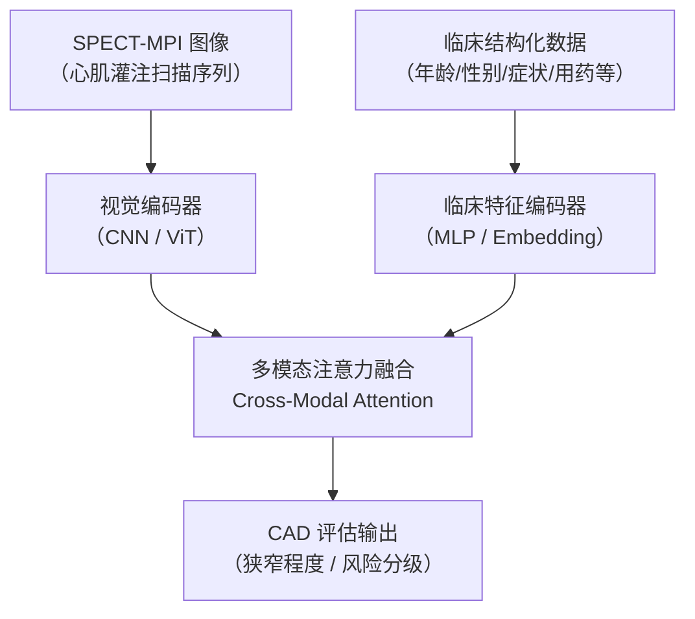

# CAD 冠心病多模态注意力网络

> **论文**：A Multi-Modality Attention Network for Coronary Artery Disease Evaluation From Routine Myocardial Perfusion Imaging and Clinical Data
> **期刊**：IEEE Journal of Biomedical and Health Informatics (JBHI)
> **链接**：<https://ieeexplore.ieee.org/document/10817502/>
> **作者**：Junmengyang Zhang et al.

---

## 1. 问题背景

**冠心病（CAD）** 是全球心血管死亡的首要原因。**心肌灌注成像（MPI）**（通常是 SPECT 核素扫描）是诊断 CAD 的标准工具，但：

- 诊断流程繁琐：涉及多步骤图像处理 + 专科医生目视解读
- 纯图像信息不足：CAD 诊断依赖**图像 + 临床数据**（年龄、性别、症状、病史等）的综合判断
- 主观性强：不同医生解读结果存在差异

**核心问题**：如何让 AI 同时理解 MPI 图像（视觉模态）和临床结构化数据（表格模态），给出准确的 CAD 评估？

---

## 2. 方法概述

### 整体架构

### 核心创新点

**多模态注意力机制**：
- 视觉分支处理 MPI 图像序列（静息态 + 负荷态对比）
- 临床分支处理结构化特征（连续变量 + 类别变量 embedding）
- Cross-Modal Attention：让临床信息指导图像特征的权重分配——"知道这个病人是糖尿病老年男性后，重点关注哪些心肌区域"

**常规数据即可运行**：
- 不依赖特殊硬件或侵入性检查
- 输入是日常核医学科的标准 SPECT-MPI 流程产出

---

## 3. 技术原理拓展

> 本项目用到的核心 CV / AI 技术背景：

### 视觉特征提取
- [[Projects/MA-RLHF/lc6/CLIP-ViT-LLaVA-手撕实操|ViT（Vision Transformer）]] — 将心肌图像分割为 patch 序列，用 Transformer 的全局注意力捕捉心肌灌注的空间分布模式（比 CNN 更适合捕捉跨区域的相对关系）
- MAE（Masked Autoencoder） — ViT 的自监督预训练范式，医疗图像标注稀缺场景下特别有用（少量标注 + 大量无标注 MPI 做预训练）

### 多模态融合
- [[AI/CV/计算机视觉基础与前沿-2026技术全景|计算机视觉基础与前沿]] — 目标检测/分割/多模态的完整 CV 知识图谱，理解图像编码器的选型空间
- [[AI/3-LLM/MLLM/非文本的模态对齐|非文本模态对齐]] — 图像/文本/结构化数据的跨模态对齐方法论，直接对应本项目的图像 ↔ 临床数据融合设计
- [[Projects/MA-RLHF/lc6/CLIP-ViT-LLaVA-手撕实操|CLIP]] — 视觉-文本对齐的基础范式，Cross-Modal Attention 的设计思想来源

### 注意力机制
- [[AI/3-LLM/Architecture/Attention 变体综述|Attention 变体综述]] — Self-Attention / Cross-Attention / Multi-Head 的完整原理，理解 Cross-Modal Attention 的数学基础

---

## 4. 数据与实验

- **数据**：常规 SPECT-MPI 扫描 + 对应的临床记录（来自医院核医学科日常流程）
- **标签**：冠脉造影（ICA）结果作为 ground truth（金标准）
- **评估指标**：AUC、敏感性、特异性（CAD 诊断的标准评估体系）

---

## 5. So What？

**对老板的意义**：

1. **跨域迁移价值**：多模态注意力融合（图像 + 结构化数据）的架构，与 AI+量化（K线图像 + 因子数据）场景高度同构——同一套设计原则
2. **面试武器**：亲自发表的 IEEE JBHI 论文，是医疗 AI 方向、多模态融合方向面试的一手素材
3. **方法论积累**：Cross-Modal Attention 解决"不同模态互相指导权重"的问题，是多模态 LLM 的基础设计模式

---

## 6. 关联知识

- → 多模态模型：
- → 医疗 AI 最新进展：[[AI/Frontiers/_MOC|AI Frontiers]]
- → 项目目录：

---

## 7. 待补充

- [ ] 补充完整作者列表和机构信息
- [ ] 补充实验结果数字（AUC、与 baseline 对比）
- [ ] 补充论文 PDF 本地路径（如有）
- [ ] 与量化交易多模态场景的方法论对比笔记
