# 如何从 0 到 1 搭建数据库知识助手

## 2023

Embedding：向量嵌入依赖 **text2vec-large-chinese，分词器 **用的是 **zh_core_web_sm**

1. wbr 指标分析（异动分析场景pipline串联）：chat db 返回的结果作为下一轮 ask anything的部分输入
1. 模型输出反馈：
大模型给出的答案会有错误或者偏差，这些我们希望能够收集起来作为后续模型的训练数据，具体设想如下：

- 当用户选中模型给出的答案时，会有打分按钮，对应问答中的大拇指图标，用户评分过后，后台能够记录这是哪类问答(行研，wbr这些得分开保存）中的数据和评分，归类处理后，随着用户的使用，就可以积累很多对应场景的QA数据集，用于模型的训练更新
- 举例：用户在选定行研问答后，问了某个问题，发现大模型给出的回答非常差，这时候对其打分，那么后台就会将这条数据保存在行研问答类别下，然后保存形式为：question, answer, score,参考文档
1. 基座模型切换
1. prompt 录入
1. 知识库
整体更偏向知识库问答，还没有到 Agent 的定位，只是针对行研等报告做出解读，能够实现模型切换，权限管控，知识库等基本功能

### 难点

1. **数据清洗难题**：初期格式内容杂乱，导致数据质量低下，向量相似性效果差。依赖将数据处理的代码固化到项目里，通用的数据格式化问题自动处理。
1）文档自动翻译，英文-> 中文（简体），中文（繁体）-> 中文（简体）；2）重复内容删除；待支持的能力：1）页眉页脚删除；2）去除乱码；3）去除网页标识符；4）去除广告等。

1. **异动分析效果差**：
1. 重度依赖 Prompt，CoT会变得很重要，需要核心关注。
1. 原数据质量差：好的输出同样重度依赖于数据库表的 schema 信息的维护（建表规范，表、字段注释，表名、字段名用英文单词，易懂等）（主要是 wbr 场景，很多表字段名还是中文名..或者直接注释当做字段名）
1. 输入数据质量：BA同学使用Excel2SQL插入语句，数据格式不规范，Excel的字段和数据类型需要约束起来
1. 根因：本地 LLM 能力弱，很多行为都需要 CoT 进行引导（成本高、死板）
Chain-of-Thought(CoT)是一种改进的Prompt技术，目的在于提升大模型LLMs在复杂推理任务上的表现，对于复杂问题尤其是复杂的数学题大模型很难直接给出正确答案。如算术推理（arithmetic reasoning）、常识推理（commonsense reasoning）、符号推理（symbolic reasoning）。COT通过要求模型在输出最终答案之前，显式输出中间逐步的推理步骤这一方法来增强大模型的算数、常识和推理能力。简单，但有效。

2022 年，在 Google 发布的论文《[Chain-of-Thought Prompting Elicits Reasoning in Large Language Models](https%3A%2F%2Farxiv.org%2Fpdf%2F2201.11903)》中首次提出思维链（Chain of Thought），思维链就是一系列中间的推理步骤(a series of intermediate reasoning steps)。通过让大模型逐步参与将一个复杂问题分解为一步一步的子问题并依次进行求解的过程可以显著提升大模型的性能。

论文解读：[一文读懂「Chain of Thought，CoT」思维链-CSDN博客](https%3A%2F%2Fblog.csdn.net%2FJulialove102123%2Farticle%2Fdetails%2F135499567)

思维链的神级应用：[mp.weixin.qq.com](https%3A%2F%2Fmp.weixin.qq.com%2Fs%2FIAKD0FfcYehs5FsDkLbTJQ)

1. **指标答疑和 SQL 生成效果不好**：
1. 大模型输出内容具备随机性，同时对于领域外的知识可能存在**大模型幻觉**
微调 vs **RAG**

1. SQL自动生成的主要服务对象是BA和PM，不会写SQL的人占多数，同时他们也不关注到底有哪些库表，表里的指标code是什么。这种情况下，直接使用大模型的text2sql能力，准确性会很差。
1. 需要利用模型能力去匹配自然语言中的指标、维度、过滤条件去匹配知识库中的查询字段，生成正确的 SQL
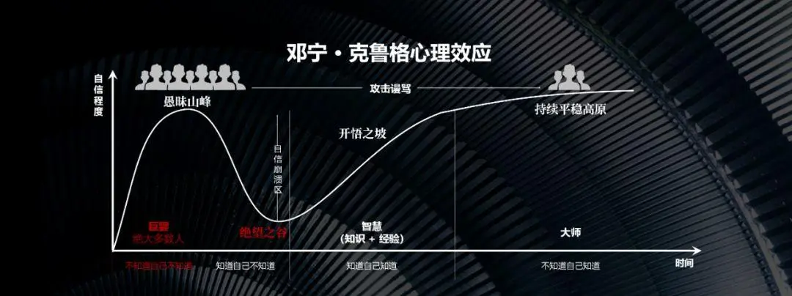

## 2024

目前业界基于LLM落地应用的主要有两大方向：问答和GBI。

知识库是业务沉淀的知识，一般是私密数据，不允许公开，所以通用大模型的训练数据不包含这部分内容，无法学习到企业内的知识。但是这部分知识往往是企业应用最为关注的，所以大模型外挂知识库是业界首推的解决方案，既可以低成本集成私域知识，又可以保证数据安全。落地产品形式一般为答疑小助手。

GBI是基于公司内已有的结构化库表或者接口，允许用户以自然语言的方式问答，给用户成图成表，极大地提效。

暴露出的问题依然是上述提到的 使用成本高：

1. 由于编排的步骤过长，执行时间过长，推广成本大。***解法：持续优化增强高阶算子的能力，逐步缩减步骤。***
1. 前端交互不友好，用户改动模版需要阅读大量无用的prompt，并且容易发生漏改的情况，另外用户无法自由地终止掉整个流程。***解法：抽取简单prompt暴露给用户，允许用户自由地终止流程。***
**核心突破**

- 支持库表和 API 取数的场景
- 对于标准化资产：大模型抽取自然语言的指标维度，RAG 相似度匹配召回指标维度，调用 API
- 非标资产：直接 nl2sql


- **模型**：开源模型能力不足，业界比较流行的架构是两层模型架构（基座模型 + 垂域模型），开源的基座模型提供基础问答服务，然后再在基座模型的基础上微调一个垂域的模型。结合之下，在专业领域的能力是可以达到 GPT-4 的水平的
- **本地部署**：**本地部署另一个需要关注的点是大模型的推理框架。**我们目前使用的推理框架是**vllm**，相较于很多开源项目默认使用的HF Transformers，vllm的推理速度平均提升5倍。 [GitHub - vllm-project/vllm: A high-throughput and memory-efficient inference and serving engine for ](https%3A%2F%2Fgithub.com%2Fvllm-project%2Fvllm)


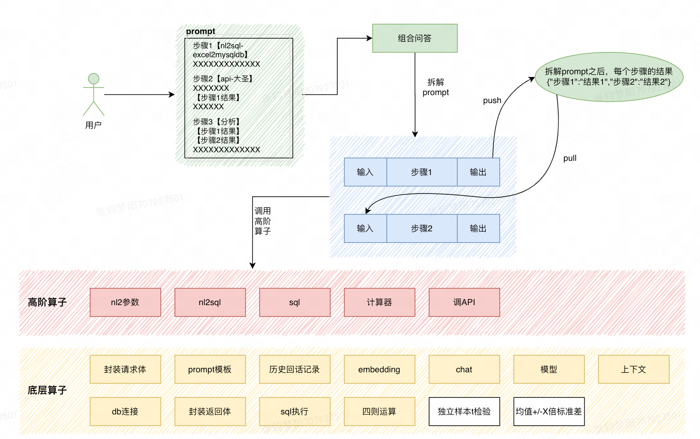

## 2024 H1

这个阶段已经确定了产品的核心定位，开始对标内外的同类产品 https://km.sankuai.com/collabpage/2193583110

- **外部信息获取** -> 数据采集与知识的可信加工（异构数据源的清洗：word、excel、wiki、群聊等）**工程化封装**
- **行研分析** -> 私域/垂域内容的检索增强生成（商分敏感数据时效性和内容获取丰富度Retrieval Augmented Generation，简称RAG）**工程化封装+大模型总结摘要**
- **数据分析** -> 取数、统计计算、异动识别、拆解归因和成表成图（Generative BusinessIntelligence，简称GBI）**工程化封装+大模型意图识别**
- **分析结论撰写** -> 基于分析结果做摘要总结 **大模型总结摘要**
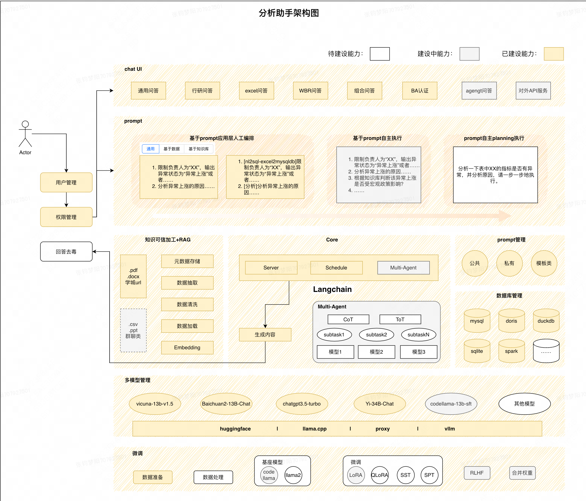

这个阶段，已经有比较好的落地了，**主要就是三大块：数据、模型 和 应用**

- 数据：
- API / 数据库
- 可信知识加工 / RAG：vector、graph、full text
- prompt
- 模型：
- 基座模型：包括变更、训练、微调，模型的调用又支持 proxy 和 local 两种方式
- embedding
- 应用：
- Agent / 算子：通过 **AWEL工作流 **进行定义，将常用的步骤，封装成支持调用的 算子 和 agent
- 应用：agent 的集合，一系列的 agent 完成一个复杂业务场景，也称为 Multi-Agent
存在问题：

- **问题一：大模型计算不准，数学能力弱**
- 引入计算器插件，目前计算器中已实现的函数有：计算平均值和标准差、比较大小、排序、平均值+/-x倍标准差、调用API计算增幅和增值、计算t检验等。
- **问题二：大模型自主拆解planning能力弱，复杂场景下效果不理想**
- 引入工作流模式，允许用户对复杂步骤按照自己的思维进行步骤拆解。工作流模式的架构十分灵活，用户既可以使用基础算子进行编排，又可以使用封装好的高级算子进行编排，同样也可以将agent（多个算子组成的工作流）编排进去。
- **问题三：编排的步骤过多，编排效率低**，对新手用户，从0-1编排一个完整的case需要1PD（*8-10小时*）
- 首先，用户没有更高级的算子可用，只能自己一步步实现统计方法（比如，Z分数，连环替代法），另外用户调工具来计算时，需要将输入整理成工具能识别的入参格式，出错率高。
## 一、前置工作

### 1.1、API 申请

测试使用的是 [质谱 AI](https%3A%2F%2Fopen.bigmodel.cn%2F)、[Moonshot](https%3A%2F%2Fplatform.moonshot.cn%2Fconsole%2Flimits)

可选实践：https://colab.research.google.com/drive/1PcJcgWZ-B5AQUZ2FsRYd6inQ42_NqnUr?usp=sharing#scrollTo=n7ry0UJubQhI

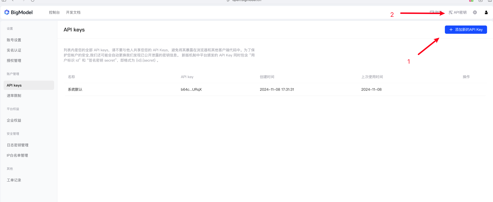

可以选择其他的主流大模型，框架原生支持的大模型，

- Open-source Models
- [Vicuna](https%3A%2F%2Fhuggingface.co%2FTribbiani%2Fvicuna-13b)
- [vicuna-13b-v1.5](https%3A%2F%2Fhuggingface.co%2Flmsys%2Fvicuna-13b-v1.5)
- [LLama2](https%3A%2F%2Fhuggingface.co%2Fmeta-llama%2FLlama-2-7b-chat-hf)
- [baichuan2-13b](https%3A%2F%2Fhuggingface.co%2Fbaichuan-inc%2FBaichuan2-13B-Chat)
- [baichuan2-7b](https%3A%2F%2Fhuggingface.co%2Fbaichuan-inc%2FBaichuan2-7B-Chat)
- [chatglm-6b](https%3A%2F%2Fhuggingface.co%2FTHUDM%2Fchatglm-6b)
- [chatglm2-6b](https%3A%2F%2Fhuggingface.co%2FTHUDM%2Fchatglm2-6b)
- [chatglm3-6b](https%3A%2F%2Fhuggingface.co%2FTHUDM%2Fchatglm3-6b)
- [falcon-40b](https%3A%2F%2Fhuggingface.co%2Ftiiuae%2Ffalcon-40b)
- [internlm-chat-7b](https%3A%2F%2Fhuggingface.co%2Finternlm%2Finternlm-chat-7b)
- [internlm-chat-20b](https%3A%2F%2Fhuggingface.co%2Finternlm%2Finternlm-chat-20b)
- [qwen-7b-chat](https%3A%2F%2Fhuggingface.co%2FQwen%2FQwen-7B-Chat)
- [qwen-14b-chat](https%3A%2F%2Fhuggingface.co%2FQwen%2FQwen-14B-Chat)
- [wizardlm-13b](https%3A%2F%2Fhuggingface.co%2FWizardLM%2FWizardLM-13B-V1.2)
- [orca-2-7b](https%3A%2F%2Fhuggingface.co%2Fmicrosoft%2FOrca-2-7b)
- [orca-2-13b](https%3A%2F%2Fhuggingface.co%2Fmicrosoft%2FOrca-2-13b)
- [openchat_3.5](https%3A%2F%2Fhuggingface.co%2Fopenchat%2Fopenchat_3.5)
- [zephyr-7b-alpha](https%3A%2F%2Fhuggingface.co%2FHuggingFaceH4%2Fzephyr-7b-alpha)
- [mistral-7b-instruct-v0.1](https%3A%2F%2Fhuggingface.co%2Fmistralai%2FMistral-7B-Instruct-v0.1)
- [Yi-34B-Chat](https%3A%2F%2Fhuggingface.co%2F01-ai%2FYi-34B-Chat)
- Proxy Models
- [OpenAI·ChatGPT](https%3A%2F%2Fapi.openai.com%2F)
- [百川·Baichuan](https%3A%2F%2Fplatform.baichuan-ai.com%2F)
- [Alibaba·通义](https%3A%2F%2Fwww.aliyun.com%2Fproduct%2Fdashscope)
- [Google·Bard](https%3A%2F%2Fbard.google.com%2F)
- [Baidu·文心](https%3A%2F%2Fcloud.baidu.com%2Fproduct%2Fwenxinworkshop%3Ftrack%3Ddingbutonglan)
- [智谱·ChatGLM](http%3A%2F%2Fopen.bigmodel.cn%2F)
- [讯飞·星火](https%3A%2F%2Fxinghuo.xfyun.cn%2F)
可以自行添加各种 llm 以及 embedding 模型

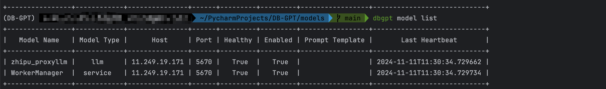


1. APP 应用
1. AWEL Flow 智能体工作流
1. Models 模型管理
1. Database 数据库
1. Knowledge 知识库
### 1.2、如何本地快速跑起来？

想要使用 LLM 有两种方式

1. 基于 proxy：会将数据发送给 API 对应的模型，会有数据外发，企业不会使用
1. 基于 local 部署：对硬件有要求，下载模型预训练好的权重，根据场景选择微调或者 RAG
**操作步骤：**

1. bash 运行脚本，自动安装 conda 本地环境，创建 Python 3.10 版本新环境，安装依赖后即可运行项目
```
conda create -n dbgpt_env python=3.10
conda activate dbgpt_env
pip install -e ".[default]"
cp .env.template  .env
brew install git-lfs
mkdir models
cd models
git clone https://huggingface.co/GanymedeNil/text2vec-large-chinese
```

1. 运行 `python dbgpt/app/dbgpt_server.py`，默认 `5670 端口`


**常用链接**：

- 测试环境直接参考源码部署：[Source Code Deployment | DB-GPT](http%3A%2F%2Fdocs.dbgpt.cn%2Fdocs%2Finstallation%2Fsourcecode)
- docker 部署：[Cluster Deployment | DB-GPT](http%3A%2F%2Fdocs.dbgpt.cn%2Fdocs%2Finstallation%2Fmodel_service%2Fcluster)
- vLLM 服务：[GitHub - vllm-project/vllm: A high-throughput and memory-efficient inference and serving engine for ](https%3A%2F%2Fgithub.com%2Fvllm-project%2Fvllm)
## 二、核心原理

### 2.1、AWEL

Agentic Workflow Expression Language（AWEL）是一套专为大型模型应用开发而设计的 **智能代理工作流表达语言**。它提供了强大的功能和灵活性。通过AWEL API，您可以专注于LLMs应用程序的业务逻辑开发，而无需关注繁琐的模型和环境细节。

AWEL在设计上分为三个层次，即**算子层**、**AgentFream**层和**DSL**层。

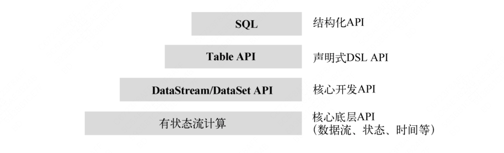

整体思想都是 算子 ---> 中层 API ---> 结构化语言

Flink

AWEL

**算子层**

**核心底层 API **

核心底层 API 提供了 Flink 的最底层的分布式计算构建块的操作 API，包含了 ProcessFunction、状态、时间和窗口等操作的 API。

ProcessFunction 提供对时间和状态的细粒度控制能力，它可以处理事件时间和处理时间两种时间概念，在时间上定义、修改触发回调函数的触发器。因此，ProcessFunction 可以实现许多有状态计算中的复杂业务逻辑。

**算子层**

算子层是指LLM应用程序开发过程中最基本的操作原子，例如开发RAG应用程序时。检索、向量化、模型交互、提示处理等都是基本算子。在后续的发展中，该框架将进一步抽象和规范算子的设计。基于标准API可快速实现一组算子

**核心开发 API**

DataStream/DataSet 使用 Fluent 风格 API，提供了常见数据处理的 API 接口，如用户指定的各种转换形式，包括连接（Join）、聚合（Aggregation）、窗口（Window）、状态（State）等。在这些 API 中处理的数据类型以各自的编程语言定义为 Class 类（Java 类或者 Scala 类）。 

链式计算表达式

**DSL层 API**

DSL层提供了一套标准的结构化表示语言，可以通过编写DSL语句来完成AgentFream和算子的操作，使得围绕数据编写大型模型应用更具确定性，避免了自然语言编写的不确定性，并且使围绕数据编写变得更容易。使用大型模型的应用程序编程变成了确定性应用程序编程。

**AgentFream层**

AgentFream层进一步封装了算子，可以基于算子进行链式计算。这一层链计算还支持分布式，支持filter、join、map、reduce等一套链计算操作，未来会支持更多的计算逻辑。

**声明式领域专用语言（Domain Specified Language，DSL）**

**结构化 API**

SQL 是 Flink 的结构化 API，是最高层次的计算 API，与 Table API 基本等价，区别在于使用的方式。SQL 与 Table API 可以混合使用，SQL 可以操作 Table API 定义的表，Table API 也能操作 SQL 定义的表和中间结果。

**结构化 API（DSL层 API）**

DSL层提供了一套标准的结构化表示语言，可以通过编写DSL语句来完成AgentFream和算子的操作，使得围绕数据编写大型模型应用更具确定性，避免了自然语言编写的不确定性，并且使围绕数据编写变得更容易。使用大型模型的应用程序编程变成了确定性应用程序编程。

#### （1）**算子层**

举个例子 examples/awel/simple_nl_schema_sql_chart_example.py

```
with DAG("simple_nl_schema_sql_chart_example") as dag:
    trigger = HttpTrigger(
        "/examples/rag/schema_linking", methods="POST", request_body=TriggerReqBody
    )
    request_handle_task = RequestHandleOperator()
    query_operator = MapOperator(lambda request: request["query"])
    llm = OpenAILLMClient()
    model_name = "gpt-3.5-turbo"
    retriever_task = SchemaLinkingOperator(
        connector=_create_temporary_connection(), llm=llm, model_name=model_name
    )
    prompt_join_operator = JoinOperator(combine_function=_prompt_join_fn)
    sql_gen_operator = SqlGenOperator(llm=llm, model_name=model_name)
    sql_exec_operator = SqlExecOperator(connector=_create_temporary_connection())
    draw_chart_operator = ChartDrawOperator(connector=_create_temporary_connection())
    trigger >> request_handle_task >> query_operator >> prompt_join_operator
    (
        trigger
        >> request_handle_task
        >> query_operator
        >> retriever_task
        >> prompt_join_operator
    )
    prompt_join_operator >> sql_gen_operator >> sql_exec_operator >> draw_chart_operator
```

这是用于 text2sql 的 AWEL 的可行设计，那实际上就是在告诉 LLM，你需要执行以下的事情：

通过这种清晰的工作流，就可以准确描述流程

#### （2）**AgentFream**

```
af = AgentFream(HttpSource("/examples/run_code", method = "post"))
result = (
    af
    .text2vec(model="text2vec")
    .filter(vstore, store = "chromadb", db="default")
    .llm(model="vicuna-13b", temperature=0.7)
    .map(code_parse_func)
    .map(run_sql_func)
    .reduce(lambda a, b: a + b)
)
result.write_to_sink(type='source_slink')
```

#### （3）**DSL**

```
CREATE WORKFLOW RAG AS
BEGIN
    DATA requestData = RECEIVE REQUEST FROM 
                    http_source("/examples/rags", method = "post");
        
    DATA processedData = TRANSFORM requestData USING embedding(model = "text2vec");
    DATA retrievedData = RETRIEVE DATA 
                    FROM vstore(database = "chromadb", key = processedData)
                    ON ERROR FAIL;
        
    DATA modelResult = APPLY LLM "vicuna-13b" 
                    WITH DATA retrievedData AND PARAMETERS (temperature = 0.7)
                    ON ERROR RETRY 2 TIMES;
        
    RESPOND TO http_source WITH modelResult
                    ON ERROR LOG "Failed to respond to request";
END;
```

更详细的 AWEL 编程使用方法可以参照

- 快速入门： [Get Started | DB-GPT](http%3A%2F%2Fdocs.dbgpt.cn%2Fdocs%2Fawel%2Fget_started)
- 如何使用 AWEL 库与LLM创建多轮聊天： [QuickStart Basic AWEL Workflow | DB-GPT](http%3A%2F%2Fdocs.dbgpt.cn%2Fdocs%2Fawel%2Fcookbook%2Fquickstart_basic_awel_workflow)
- 如何使用 AWEL 库创建 RAG 程序： [RAG With AWEL | DB-GPT](http%3A%2F%2Fdocs.dbgpt.cn%2Fdocs%2Fawel%2Fcookbook%2Ffirst_rag_with_awel)
- 使用教程：[AWEL Tutorial | DB-GPT](http%3A%2F%2Fdocs.dbgpt.cn%2Fdocs%2Fawel%2Ftutorial)
### 2.2、数据源

前端页面直接添加连接

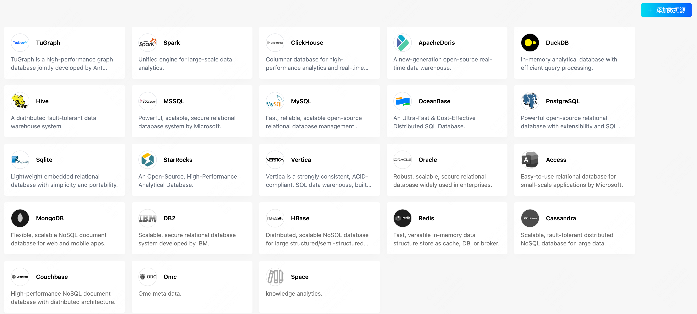

### 2.3、可信知识加工

[LLM外挂知识库 | 李乾坤的博客](https%3A%2F%2Fqiankunli.github.io%2F2023%2F09%2F25%2Fllm_retrieval.html)

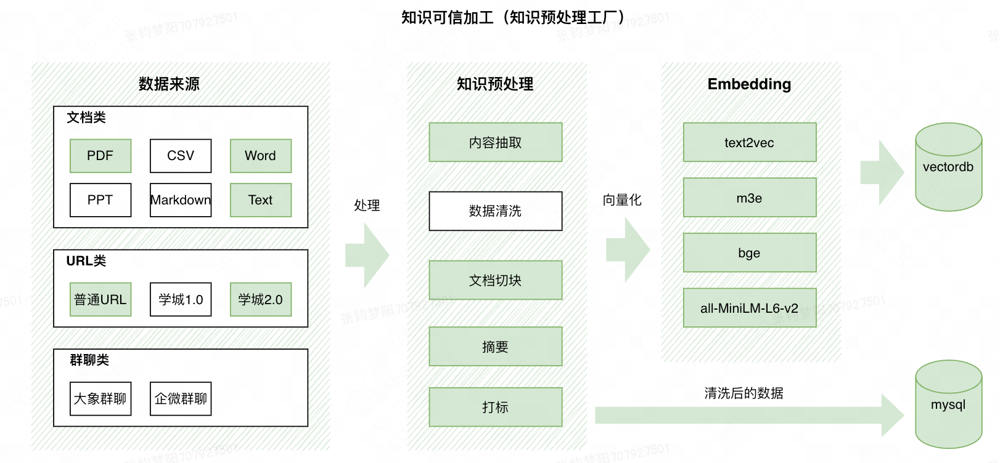

**知识可信加工**：旨在自动化处理用户上传的数据噪声，url网页的广告等，保障入知识库的数据、知识的质量在可控范围内。**目前线上的预处理能力主要有**：文档的自动翻译（英文->中文简体，中文繁体->中文简体）、删除重复内容、删除广告水印、删除表情以及乱码（不同的unicode空格如u2008转成规范空格）

**知识库构建和问答流程：**

1. 数据工程即**知识可信加工**环节，也是知识库构建过程中最核心的环节，低质量的知识，即使后面做的工作再多，也很难有令人满意的问答效果。经过我们大量的实践，将很多有效的经验完成了线上化，沉淀出了**知识可信加工**模块。在上传之后，会经过数据工程对文档的知识进行可信加工，保障知识库的基本质量符合标准。
1. 根据用户前端的参数设定 chunk_size 和 chunk_overlap 对文档进行切割。
1. 切割之后的 chunk 经过 Embedding 之后，存储到向量库中。
1. 用户输入的问题同样做 Embedding 之后，去向量库里做相似度匹配，检索出 TopK 个 chunks。
1. 将用户的问题内容 + chunks 内容 + Prompt 内容 一起传给大模型，大模型给出回答。
### 2.3、模型微调

微调可以使用 DB-GPT 的子项目 DB-GPT-Hub进行微调，其中脚本和 pipeline 都比较完善，可以参考 [Fine-Tuning use dbgpt_hub | DB-GPT](http%3A%2F%2Fdocs.dbgpt.cn%2Fdocs%2Fapplication%2Ffine_tuning_manual%2Fdbgpt_hub)

Text2SQL pipline主要包含以下流程：

- 准备数据
- 以`Spider`数据集为例：`Spider`数据集被业界公认为最难的大规模跨域评估列表。它包含 10,181 个自然语言问题和 5,693 个 SQL 语句，涉及 138 个不同领域的 200 多个数据库。
- 采用信息匹配生成方式进行数据准备，即`SQL + Repository`结合表信息的生成方式。这种方法结合数据表信息，可以更好地理解数据表的结构和关系，更好地生成满足需求的SQL。
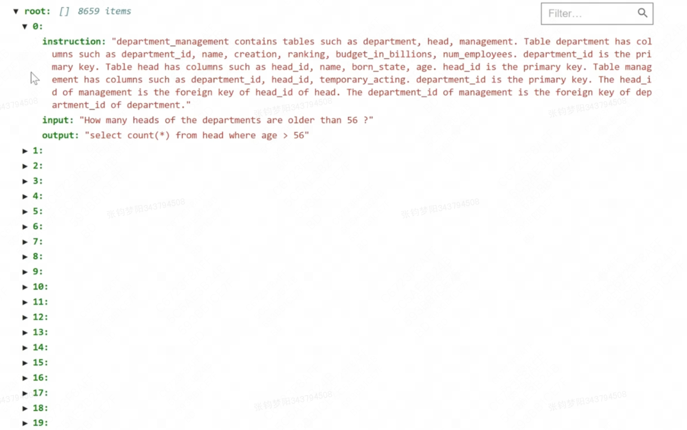

- 微调：
- `model_name_or_path` : Path to the LLM model used.
- `dataset`: The value is the configuration name of the training data set, corresponding to the outer key value in `dbgpt_hub/data/dataset_info.json`, such as `example_text2sql`.
- `max_source_length`: Enter the text length of the model. The effect parameter of this tutorial is `2048`, which is the optimal length after multiple experiments and analysis.
- `max_target_length`: The SQL content length of the output model, set to `512`.
- `template`: The lora part of different model fine-tuning in the project settings. For the Llama2 series models, it is set to `llama2`.
- `lora_target`: The network parameter changing part during LoRA fine-tuning.
- `finetuning_type`: Finetuning type, the value is `[ptuning, lora, freeze, full]`, etc.
- `lora_rank`: Rank size in LoRA fine-tuning.
- `lora_alpha`: scaling factor in LoRA fine-tuning.
- `output_dir`: The path output by the Peft module during SFT fine-tuning. The default setting is under the `dbgpt_hub/output/adapter/` path.
- `per_device_train_batch_size`: The batch of training samples on each GPU. If the computing resources support it, it can be set to larger. The default is `1`.
- `gradient_accumulation_steps`: The accumulated steps value of gradient update.
- `lr_scheduler_type`: learning rate type.
- `logging_steps`: steps interval for log saving.
- `save_steps`: The steps size value of ckpt saved by the model.
- `num_train_epochs`: The number of epochs of training data.
- `learning_rate`: learning rate, the recommended learning rate is `2e-4`.
- 评估
- 大型模型生成的结果具有一定的随机性，因为它们与`temperature`等参数密切相关（可以在`GeneratingArguments`中调整） `/dbgpt_hub/configs/model_args.py` ）。默认情况下，我们多次评估的执行精度为`0.789`及以上。
### 2.4、RAG


Embedding 模型可以参照：[FlagEmbedding/Tutorials at master · FlagOpen/FlagEmbedding](https%3A%2F%2Fgithub.com%2FFlagOpen%2FFlagEmbedding%2Ftree%2Fmaster%2FTutorials)

中文支持比较好的是 bge-large-zh（我们用的就是这个模型），中英文都能支持的可以看 text2vec 的或者 m3e-large

#### （1）Keyword + BM25

使用传统的全文检索来实现RAG可以在一定程度上缓解矢量数据库检索带来的不确定性和可解释性问题。

关键词匹配使用的场景：

- 寻找非常具体的内容并且已经了解该主题
- 研究范围狭窄，目标明确
- 查询包含独特的专有名词，例如品牌名称
- 需求需要快速的结果，而不是详尽的相关性 对于精确或时间敏感的查询，关键字搜索将有效地定位确切的术语。向量搜索可能会因不必要的语义扩展而变得曲折。
搜索方法应符合用户的意图和特殊需求。矢量搜索用于探索（粗排），关键字搜索用于精确（精排）。两者都可用，用户就可以两全其美。

（推测）BM25 召回我们的实现方式应该是直接通过 LlamaIndex：[大模型RAG实战|混合检索:BM25检索+向量检索的LlamaIndex实现 - 大模型知识库|大模型训练|开箱即用的企业大模型应用平台|智能体开发|53AI](https%3A%2F%2F53ai.com%2Fnews%2FRAG%2F2024080632561.html)


#### （2）Vector

目前大多数的嵌入都是用的 vector 进行嵌入的，但是有很大局限性

Vector Retrieve 存在的问题：

1. **计算密集型：**为整个文档语料库生成向量并基于向量相似性进行查询需要比关键字索引和匹配更多的处理能力。如果系统没有适当优化，延迟可能会成为一个问题。
1. **垂直领域应用需要海量训练数据：**BERT 等模型建立的语义连接依赖于长期对海量、多样化的数据集进行训练。这些数据可能不容易用于专门的语料库，从而限制了向量的质量。
1. **对于精确关键字查询效果较差** - 当查询包含清晰、精确的关键字和意图时，矢量搜索几乎没有什么好处。搜索“苹果水果”可能会返回比“苹果”更差的结果，因为向量更注重整体含义而不是关键字。
向量检索 vs 关键词检索

Early stage research when query intent is **vague or broad** Need to grasp concepts and subject matter more than keywords Exploring a topic with loose information needs User search queries are **more conversational** **The semantic capabilities** of vector search allow it to shine for these use cases. It can point users in the right direction even with **limited keywords or understanding of a topic**.

example A: 住宿的 xxx 指标应该怎么计算，帮我计算

example B: xxx 指标应该怎么计算，间夜数是 xxx，帮我计算

分别适合用什么模型呢？

参数列表参考：

`Embedding Arguments`

- `topk:the top k vectors based on similarity score.`
- `recall_score:set a similarity threshold score for the retrieval of similar vectors. between 0 and 1. default 0.3.`
- `recall_type: recall type. now only support topk by vector similarity.`
- `model: A model used to create vector representations of text or other data.`
- `chunk_size:The size of the data chunks used in processing.default 500.`
- `chunk_overlap: The amount of overlap between adjacent data chunks.default 50.`
#### （3）Graph

推荐阅读：[微软 GraphRAG ：原理、本地部署与数据可视化揭秘——提升问答效率的图谱增强策略](https%3A%2F%2Fjuejin.cn%2Fpost%2F7392115478561325083)

2024 年 4 月，微软发表了一篇论文[《From Local to Global: A Graph RAG Approach to Query-Focused Summarization》](https%3A%2F%2Flink.juejin.cn%3Ftarget%3Dhttps%253A%252F%252Farxiv.org%252Fabs%252F2404.16130)。在这篇论文中，微软的研究人员提出了一种从文本构建并增强知识图的方法，来解决 Baseline RAG 系统在全局理解上的缺陷，例如：

- Baseline RAG 系统在面对需要从多源信息中抽取并综合分析的情况时，会遭遇显著的障碍。具体来说，当回答一个复杂问题涉及到通过识别和利用不同信息片段之间的共享属性，来构建新的、综合性见解时，Baseline RAG 无法有效连接这些“点”，导致信息整合上的不足。
- 在要求 Baseline RAG 对大规模的数据集合或是单篇幅巨大的文档进行全面而深入的理解时，它的表现会显得较为逊色。这通常是因为它在处理大量数据时，难以有效地捕捉和理解那些被浓缩于其中的关键语义概念，从而影响了整体的理解质量。
RAG 中的术语含义如下：

- **检索**：从知识库/特定私有数据集*检索*相关信息/文档的过程。
- **增强：将检索到的信息***添加*到输入上下文的过程。
- **生成**：LLM根据原始查询和增强上下文*生成*响应的过程。
尽管 RAG 非常有用，但它忽略了文本信息中的拓扑关系，有时很难根据共享属性连接信息，Graph 就是为了解决这个问题。

Graph 配置，可以参照 [Graph RAG User Manual | DB-GPT](http%3A%2F%2Fdocs.dbgpt.cn%2Fdocs%2Fcookbook%2Frag%2Fgraph_rag_app_develop%2F)

```
pip install "dbgpt[graph_rag]>=0.6.1"

GRAPH_STORE_TYPE=TuGraph
TUGRAPH_HOST=127.0.0.1
TUGRAPH_PORT=7687
TUGRAPH_USERNAME=admin
TUGRAPH_PASSWORD=73@TuGraph
GRAPH_COMMUNITY_SUMMARY_ENABLED=True  # enable the graph community summary
TRIPLET_GRAPH_ENABLED=True  # enable the graph search for the triplets
DOCUMENT_GRAPH_ENABLED=True  # enable the graph search for documents and chunks
KNOWLEDGE_GRAPH_CHUNK_SEARCH_TOP_SIZE=5  # the number of the searched triplets in a retrieval
```

当文档被解析为 graph 以后，会构建如下这种三元关系：


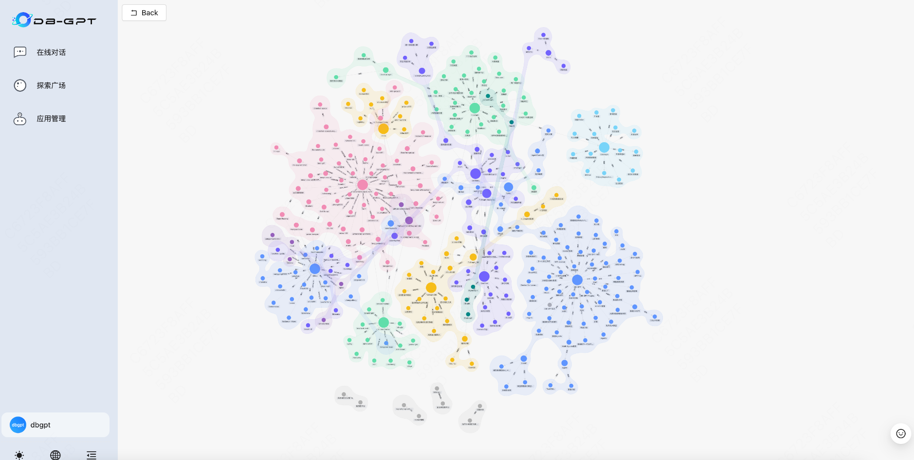

然后就可以根据图数据库的知识进行对话问答：

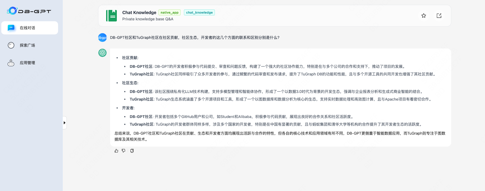

总结：

- Graph rag：用图，三元组来表示实体和关系的信息，提供结构化的检索方法，缺少**复杂的召回能力**
- Vector rag：相似性检索很好，但是缺失上下文信息
- **未来趋势：知识图 + 向量检索——Hybrid rag**
### 2.6、memory

短期记忆包含有关智能体当前情况的上下文信息，而长期记忆则存储智能体过去的行为和想法，可以根据当前事件进行检索。

长期记忆类似于外部向量存储，代理可以根据需要快速查询和检索。

http://docs.dbgpt.cn/docs/agents/modules/memory/long_term_memory

```
import os
from dbgpt.rag.embedding import DefaultEmbeddingFactory

api_url = os.getenv("OPENAI_API_BASE", "https://api.openai.com/v1") + "/embeddings"
api_key = os.getenv("OPENAI_API_KEY")
embeddings = DefaultEmbeddingFactory.openai(api_url=api_url, api_key=api_key)

import shutil
from dbgpt.storage.vector_store.chroma_store import ChromaVectorConfig, ChromaStore

*# Delete old vector store directory(/tmp/tmp_ltm_vector_stor)*
shutil.rmtree("/tmp/tmp_ltm_vector_store", ignore_errors=True)
vector_store = ChromaStore(
    ChromaVectorConfig(
        embedding_fn=embeddings,
        vector_store_config=ChromaVectorConfig(
            name="ltm_vector_store",
            persist_path="/tmp/tmp_ltm_vector_store",
        ),
    )
)

from concurrent.futures import ThreadPoolExecutor
from dbgpt.agent import AgentMemory, LongTermMemory

*# Create an agent memory, which contains a long-term memory*
memory = LongTermMemory(
    executor=ThreadPoolExecutor(), vector_store=vector_store, _default_importance=0.5
)
agent_memory: AgentMemory = AgentMemory(memory=memory)
```

### Function call

## 三、演示实践

[Write Your Own Chat Data With AWEL | DB-GPT](http%3A%2F%2Fdocs.dbgpt.cn%2Fdocs%2Fawel%2Fcookbook%2Fwrite_your_chat_database)

[Data Driven Multi-Agents | DB-GPT](http%3A%2F%2Fdocs.dbgpt.cn%2Fdocs%2Fagents%2Fintroduction%2F)

[Tool Use | DB-GPT](http%3A%2F%2Fdocs.dbgpt.cn%2Fdocs%2Fagents%2Fintroduction%2Ftools)

[Agents With Database | DB-GPT](http%3A%2F%2Fdocs.dbgpt.cn%2Fdocs%2Fagents%2Fintroduction%2Fdatabase)

[Data App Develop Guide | DB-GPT](http%3A%2F%2Fdocs.dbgpt.cn%2Fdocs%2Fcookbook%2Fapp%2Fdata_analysis_app_develop)

M3E 微调：https://huggingface.co/moka-ai/m3e-base

llamaindex：https://docs.llamaindex.ai/en/stable/use_cases/ 

langchain：是大模型以及向量数据库的封装

LangChain将大型语言模型（LLM）的强大能力与外部知识库相结合，通过检索增强生成（RAG）提升这些模型的能力。这种整合使得参数化的语言模型和来自外部来源的非参数化数据之间的信息流动变得无缝。

本质上，LangChain充当传统语言模型和庞大外部知识库之间的桥梁。通过利用这种连接，LangChain丰富了语言模型运作的上下文，从而产生更准确和与上下文相关的输出。LangChain的发展为自然语言处理中的更高级范式铺平了道路，实现了各个领域的定制化和改进性能。

LangChain在当今技术领域的重要性是相当大的。随着我们对基于人工智能的技术的依赖程度增加，对复杂语言理解的需求变得至关重要。LangChain通过增强语言模型的能力来满足这种需求，促进其融入各种应用程序。这种扩展使得在基于文本的应用范围内实现更动态和多功能的人工智能交互成为可能。

## 

## See Also

- [[AI/RAG/_MOC|RAG MOC]] — 检索增强生成知识域全索引
- [[Projects/RAG-System/企业 RAG 系统|企业 RAG 系统]] — 同项目系统设计笔记
- [[AI/RAG/Advanced RAG|Advanced RAG]] — 进阶检索技术参考
- [[AI/RAG/向量数据库选型|向量数据库选型]] — 数据库知识助手的核心组件
- [[AI/LLM/目录|LLM MOC]] — LLM 技术基础
