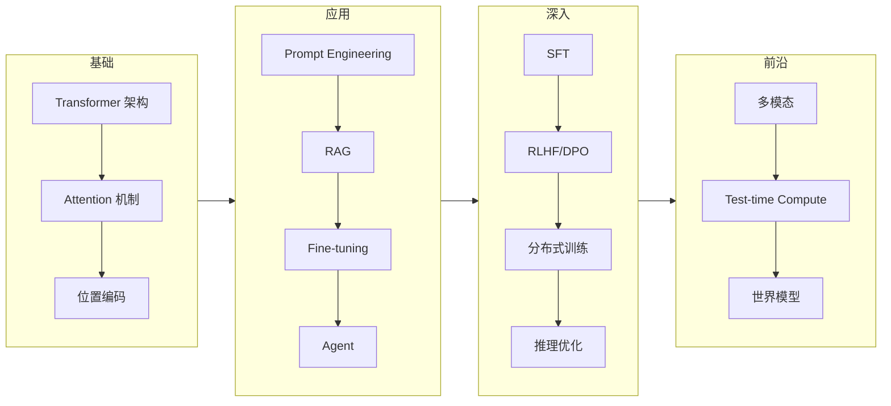

# AI 综合

> 推荐阅读：https://muhammadsajwani.medium.com/changer-is-the-only-constant-dca1e0d95982

这篇笔记记录 AI 领域的宏观认知和跨子领域的思考，不深入技术细节。

## AI 的三波浪潮

回顾过去十年，AI 经历了三个明显的阶段：

**第一波：CNN 与感知智能（2012-2017）**
- AlexNet → ResNet → 目标检测、人脸识别落地
- 特点：**感知**能力突破，但认知能力有限
- 商业化：安防、自动驾驶感知层

**第二波：Transformer 与语言智能（2017-2022）**
- Attention Is All You Need → BERT → GPT-3
- 特点：语言理解和生成质变，但仍是"工具"定位
- 商业化：搜索、翻译、客服

**第三波：LLM + Agent + 多模态（2022-）**
- ChatGPT → GPT-4 → Claude → 开源模型爆发
- 特点：从工具变为**协作者**，Agent 范式涌现
- 商业化：Copilot、代码生成、内容创作、科研辅助

## 当前格局的关键判断

### Scaling Law 还能走多远？

2024 年底的共识是：纯粹靠堆预训练 compute 的 scaling law 遇到了拐点。但新的 scaling dimension 正在涌现：
- **Test-time compute**：o1/o3 证明推理时多花 compute 同样有效
- **Post-training scaling**：SFT + RLHF + 合成数据的 scaling 还有很大空间
- **数据质量 scaling**：Phi 系列证明精选数据以小博大

### 开源 vs 闭源

2025 年的局面：开源模型在大多数基准上已经追平甚至超越闭源模型。DeepSeek-R1、Qwen 2.5 系列、Llama 3 的表现都证明了这一点。

但闭源仍然在**产品体验**和**多模态**上领先。Claude 的代码理解、GPT-4o 的多模态交互，目前开源还差一截。

### Agent 是下一个战场

2025 年最热的方向。从 function calling 到 computer use，模型正在获得操作真实世界的能力。但目前的 Agent 仍然脆弱——长链条任务的可靠性是核心瓶颈。

## 工程师视角的 AI 学习路径

对于数据工程师转 AI：最快的路径是从 **Prompt Engineering + RAG** 入手，然后深入 **Fine-tuning**，再看 **RL 对齐**。不需要从头学深度学习理论——直接从应用层切入，需要什么补什么。

## 相关

- [[AI 思考|AI 思考]]
- [[关于 AI 学习提效思考|关于 AI 学习提效思考]]
- [[AI/LLM/目录|LLM MOC]]
- [[AI/MLLM/目录|MLLM MOC]]
- [[AI/Agent/Multi-Agent/零碎的点|Multi-Agent 思考]]
