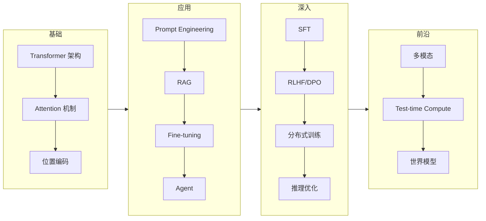

# AI 综合

> 推荐阅读：https://muhammadsajwani.medium.com/changer-is-the-only-constant-dca1e0d95982

这篇笔记记录 AI 领域的宏观认知和跨子领域的思考，不深入技术细节。

## AI 的三波浪潮

回顾过去十年，AI 经历了三个明显的阶段：

**第一波：CNN 与感知智能（2012-2017）**
- AlexNet → ResNet → 目标检测、人脸识别落地
- 特点：**感知**能力突破，但认知能力有限
- 商业化：安防、自动驾驶感知层

**第二波：Transformer 与语言智能（2017-2022）**
- Attention Is All You Need → BERT → GPT-3
- 特点：语言理解和生成质变，但仍是"工具"定位
- 商业化：搜索、翻译、客服

**第三波：LLM + Agent + 多模态（2022-）**
- ChatGPT → GPT-4 → Claude → 开源模型爆发
- 特点：从工具变为**协作者**，Agent 范式涌现
- 商业化：Copilot、代码生成、内容创作、科研辅助

## 当前格局的关键判断

### Scaling Law 还能走多远？

2024 年底的共识是：纯粹靠堆预训练 compute 的 scaling law 遇到了拐点。但新的 scaling dimension 正在涌现：
- **Test-time compute**：o1/o3 证明推理时多花 compute 同样有效
- **Post-training scaling**：SFT + RLHF + 合成数据的 scaling 还有很大空间
- **数据质量 scaling**：Phi 系列证明精选数据以小博大

### 开源 vs 闭源

2025 年的局面：开源模型在大多数基准上已经追平甚至超越闭源模型。DeepSeek-R1、Qwen 2.5 系列、Llama 3 的表现都证明了这一点。

但闭源仍然在**产品体验**和**多模态**上领先。Claude 的代码理解、GPT-4o 的多模态交互，目前开源还差一截。

### Agent 是下一个战场

2025 年最热的方向。从 function calling 到 computer use，模型正在获得操作真实世界的能力。但目前的 Agent 仍然脆弱——长链条任务的可靠性是核心瓶颈。

## 工程师视角的 AI 学习路径

对于数据工程师转 AI：最快的路径是从 **Prompt Engineering + RAG** 入手，然后深入 **Fine-tuning**，再看 **RL 对齐**。不需要从头学深度学习理论——直接从应用层切入，需要什么补什么。

## 相关

- [[思考/AI 思考|AI 思考]]
- [[思考/AI 学习提效|关于 AI 学习提效思考]]
- 
- [[思考/Multi-Agent 零碎的点|Multi-Agent 思考]]

---

## AI 时代的散点思考

# AI 思考

> 资源：
> - https://github.com/Shubhamsaboo/awesome-llm-apps
> - https://github.com/liguodongiot/llm-action

这篇记录我对 AI 领域的一些非技术性思考。

## AI 对工程师意味着什么

最直接的影响：**编程正在从"手写"变成"指导"**。

2024 年的我还在一行行敲代码，2025 年的我大部分时间在写 prompt 和 review AI 生成的代码。这不是说编程能力不重要了——恰恰相反，你需要更强的系统设计能力和代码审查能力，因为 AI 写的代码可能看起来对但逻辑上有隐患。

一个有意思的观察：**AI 正在消灭中间层**。初级工程师的日常工作（CRUD、写简单 SQL、搬运 API）正在被 AI 取代。但资深工程师的核心价值（系统设计、故障排查、技术决策）AI 暂时做不了。

## 关于 AI 焦虑

每隔一段时间就会有人问："AI 会不会取代程序员？"

我的看法：
- **短期（1-3年）**：AI 不会取代程序员，但会取代不会用 AI 的程序员
- **中期（3-5年）**：初级开发岗位大幅缩减，人机协作成为标配
- **长期（5-10年）**：不确定，但我相信"提出好问题"的能力永远有价值

与其焦虑，不如拥抱。当年 IDE 和 Stack Overflow 出现时也有人担心"不用手写代码了还算程序员吗"。工具变了，核心能力没变。

## AI 时代的学习策略

**「T 型学习」**：广泛了解各子领域（LLM、多模态、Agent、安全），然后在一个方向深耕。

**「构建 > 阅读」**：看 10 篇论文不如自己跑一次 fine-tuning。hands-on 的理解深度是看论文无法替代的。

**「跟着开源走」**：开源社区是最好的老师。看 DeepSeek、Qwen 的代码和技术报告，比看任何课程都有效。

## 一些零散的观点

- LLM 不是搜索引擎的替代品，是**推理引擎**。搜索引擎擅长"查找"，LLM 擅长"理解和生成"
- 不要迷信 benchmark。模型在 MMLU 上差 2 分不代表什么，但在你的实际任务上差 10% 是真实的
- **数据是护城河**。模型架构会趋同，但高质量的领域数据不会
- Agent 最终会像 SaaS 一样普及，但目前还在"拨号上网"阶段
- 多模态不是"能看图"那么简单——它是 AI 理解物理世界的关键一步

## 推荐的学习资源

| 资源 | 适合 | 特点 |
|------|------|------|
| awesome-llm-apps | 应用开发者 | 大量实战项目 |
| llm-action | 全栈 AI 工程师 | 从训练到部署全覆盖 |
| Hugging Face Course | 入门者 | 系统性好 |
| 各大模型技术报告 | 进阶者 | 最前沿的一手信息 |

## 相关

- [[思考/AI 综合|AI 综合]]
- [[思考/AI 学习提效|关于 AI 学习提效思考]]
- AI 时代的业务思考