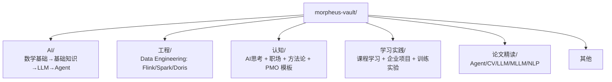
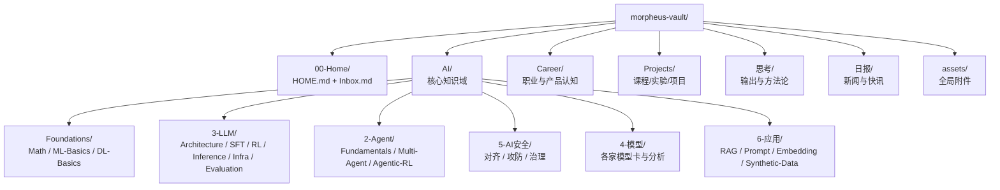
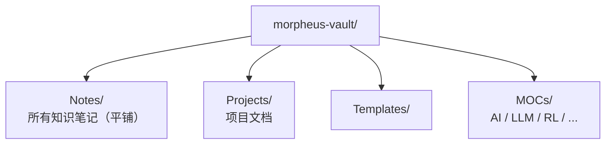
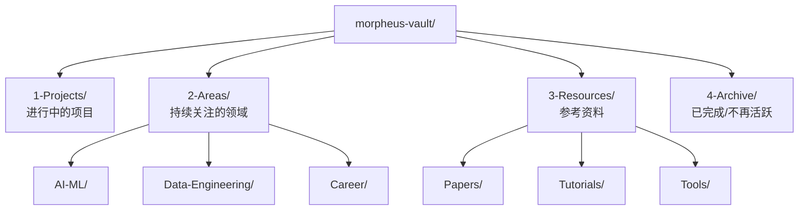

# Obsidian Vault 知识体系架构设计方案

> [!NOTE] 历史文档
> 本文是 2026-02-13 的重构方案草稿。**Vault 实际重构已于 2026-02-26 完成**，结构比本方案更进一步（编号目录、中文域名、知识唯一性原则等）。本文作为决策日志保留，理解当时设计意图时参考。


> 基于 morpheus-vault 342 篇文档的现状分析 + Obsidian 知识管理最佳实践

---

## 一、现状分析

### 1.1 当前结构



### 1.2 现有问题诊断

| 问题 | 具体表现 | 影响 |
|------|---------|------|
| **按内容类型而非知识主题组织** | 同一个 GRPO 主题，理论在 `1.AI/3、LLM/RL/`，框架实践在 `1.AI/3、LLM/强化微调框架/trl/GRPO` 和 `unsloth/训练示例/GRPO`，论文在 `7.论文精读/LLM/`，课程学习在 `4.学习实践/` | 知识碎片化，检索困难 |
| **论文孤岛** | 论文单独放在 `7.论文精读/`，与对应知识领域割裂 | DeepSeek-R1 论文和 DeepSeek 相关训练/实践不在一起 |
| **"学习实践"定位模糊** | 混合了课程笔记、企业项目、个人实验，与 `1.AI` 大量重叠 | `4.学习实践/Hugging Face 学习/RL + LLM 学习/` 和 `1.AI/3、LLM/RL/` 讲的是同一个主题 |
| **"认知"是个万能筐** | 包含 AI 思考、职业规划、PMO 模板、推荐系统、MCP 科普 | 性质完全不同的内容混在一起 |
| **标签扁平无层级** | 152 个标签全部是平面的，没有嵌套 | `LLM` 出现 147 次，几乎没有区分度 |
| **编号系统** | `1. AI` / `2. 工程` / `3. 认知` / `4. 学习实践` / `7. 论文精读`（缺5/6） | 从飞书迁移的遗留，编号断裂 |
| **重复文件** | 同名文件出现在不同位置（如多个 `PPO.md`、`GRPO.md`、`DPO.md`） | 不知道哪个是权威版本 |

### 1.3 标签分布洞察

Top 标签揭示了核心知识领域：
- **LLM生态** (147): 绝对核心
- **微调** (56) + **训练** (19) + **GRPO** (19) + **PPO** (12): Post-Training 是重点
- **Agent** (53) + **Multi-Agent** (21): 第二大主题
- **数据工程** (Spark 30 + Flink 30 + Doris 27 + SQL 35): 工程背景
- **论文** (25): 论文阅读习惯
- **认知/产品方法论**: 职场相关

---

## 二、Obsidian 组织方法论研究结论

### 2.1 四种组织方式的对比

| 方式 | 优势 | 劣势 | 适用场景 |
|------|------|------|---------|
| **文件夹** | 直观层级、文件系统兼容、便于批量操作 | 一个文件只能属于一个文件夹；层级过深不好导航 | 明确的顶层分类 |
| **标签（嵌套）** | 一个文件可有多个标签；嵌套标签可建层级；搜索方便 | 无法直接看到标签下的内容列表（需搜索）；容易标签爆炸 | 跨分类维度（内容类型、状态、来源等） |
| **双链 [[]]** | 灵活关联任意两个概念；形成知识网络；Graph View 可视化 | 关系无结构，大量链接后难以管理 | 概念间的语义关联 |
| **MOC（Map of Content）** | 兼具文件夹的组织性 + 链接的灵活性；可手动排序和注释；一个笔记可被多个 MOC 引用 | 需要手动维护 | 主题级索引和导航 |

### 2.2 最佳实践共识

经研究多个大规模 Obsidian vault 案例，核心共识：

1. **文件夹做粗粒度分类**（≤2-3 层），不要把文件夹当标签用
2. **嵌套标签做多维度标注**（内容类型、状态、方法论等），一个笔记通常 2-5 个标签
3. **MOC 做主题索引**，放在对应文件夹内或专门的 MOC 文件夹中
4. **双链做语义关联**，在行文中自然引用相关概念
5. **Frontmatter 做结构化元数据**（type、status、date 等），便于 Dataview 查询

### 2.3 关键决策：按知识主题组织，而非按内容类型

传统做法（❌）：
```
论文/          ← 按类型
  GRPO论文.md
教程/          ← 按类型
  GRPO教程.md
理论/          ← 按类型
  GRPO原理.md
```

推荐做法（✅）：
```
AI/LLM/强化学习/GRPO/
  GRPO 原理.md          (type: concept)
  GRPO-DeepSeek论文.md   (type: paper)
  GRPO-TRL实践.md        (type: project)
  GRPO-demo.md           (type: project)
```

---

## 三、架构方案对比

### 方案 A：混合层级制（推荐 ✅）

**核心思路**：文件夹按知识域分 2-3 层 + 嵌套标签做跨域维度 + MOC 做导航



### 方案 B：极简扁平制

**核心思路**：只用 2 个顶层文件夹（Notes + Projects），完全依赖标签和 MOC



### 方案 C：PARA 改良制

**核心思路**：按 PARA（Projects/Areas/Resources/Archive）+ 领域细分



### 三方案对比

| 维度 | 方案 A（混合层级） | 方案 B（极简扁平） | 方案 C（PARA） |
|------|-------------------|-------------------|---------------|
| **检索效率** | ⭐⭐⭐⭐⭐ 文件夹浏览 + 标签搜索 | ⭐⭐⭐ 完全依赖搜索/MOC | ⭐⭐⭐⭐ 按行动力分类 |
| **新内容归类速度** | ⭐⭐⭐⭐ 按主题找文件夹 | ⭐⭐⭐⭐⭐ 丢进 Notes/ 就行 | ⭐⭐⭐ 需判断是 P/A/R/A |
| **知识关联性** | ⭐⭐⭐⭐⭐ 同主题内容物理聚合 | ⭐⭐⭐ 只有逻辑关联 | ⭐⭐⭐ 按行动力而非主题组织 |
| **可扩展性** | ⭐⭐⭐⭐⭐ 新领域加文件夹即可 | ⭐⭐⭐⭐ 加标签和 MOC | ⭐⭐⭐⭐ 但 Areas 会膨胀 |
| **维护成本** | ⭐⭐⭐ 文件夹 + 标签 + MOC 都要维护 | ⭐⭐⭐⭐ 只维护标签和 MOC | ⭐⭐⭐ 项目状态需要定期归档 |
| **适合 342+ 篇规模** | ✅ 最适合 | ❌ 超过 200 篇会混乱 | ⭐⭐⭐ 适合项目驱动型 |
| **适合技术知识体系** | ✅ 完美匹配 | ❌ 缺乏层级感 | ❌ AI 知识不是"项目" |

**推荐方案 A（混合层级制）**。理由：
1. AI 知识天然有层级（数学 → ML → DL → LLM → RL → GRPO），文件夹层级可以体现
2. 342 篇文档需要物理分组，纯扁平会迷失
3. 文件夹 + MOC + 标签三管齐下，兼顾浏览、搜索、关联三种检索模式
4. 新领域（具身智能、AI 安全等）加个文件夹就行，零成本扩展

---

## 四、标签体系设计

### 4.1 嵌套标签方案

Obsidian 支持嵌套标签（`#parent/child/grandchild`），用于多维度标注。

**维度一：知识领域标签（对应文件夹结构，用于跨文件夹查询）**

```yaml
# 领域标签 — 与文件夹大致对应，但更灵活
#ai/foundations/math
#ai/foundations/ml
#ai/foundations/dl
#ai/foundations/transformer

#ai/llm/architecture
#ai/llm/prompt-engineering
#ai/llm/sft
#ai/llm/rl/ppo
#ai/llm/rl/grpo
#ai/llm/rl/dpo
#ai/llm/rl/dapo
#ai/llm/inference
#ai/llm/infra
#ai/llm/data-synthesis

#ai/mllm
#ai/agent/single
#ai/agent/multi
#ai/agent/mcp
#ai/agent/agentic-rl
#ai/cv
#ai/safety
#ai/embodied
#ai/world-model

#engineering/flink
#engineering/spark
#engineering/doris

#career/review        # 述职
#career/promotion     # 晋升
#career/methodology   # 方法论
```

**维度二：内容类型标签**

```yaml
#type/concept          # 概念/理论知识
#type/paper            # 论文精读
#type/project          # 项目实践
#type/tutorial         # 教程/课程笔记
#type/news             # 新闻/资讯
#type/tool             # 工具/框架使用
#type/thought          # 思考/认知
#type/reference        # 参考/速查
```

**维度三：状态标签**

```yaml
#status/seed           # 种子（刚收集，待整理）
#status/growing        # 生长中（正在完善）
#status/evergreen      # 常青（成熟笔记）
#status/archive        # 归档
```

**维度四：来源标签**

```yaml
#source/paper          # 论文
#source/course         # 课程（HF Course, KP课程等）
#source/work           # 工作实战
#source/self           # 自学/探索
```

### 4.2 Frontmatter 模板

每篇笔记的 frontmatter 标准化：

```yaml
---
title: "GRPO 原理详解"
type: concept                    # concept | paper | project | tutorial | news | thought | tool | reference
domain: ai/llm/rl/grpo          # 知识域路径
status: evergreen                # seed | growing | evergreen | archive
created: 2025-06-15
updated: 2025-12-01
aliases: [Group Relative Policy Optimization]
tags:
  - ai/llm/rl/grpo
  - type/concept
---
```

**论文专用 frontmatter 扩展：**

```yaml
---
title: "DeepSeek-R1"
type: paper
domain: ai/llm/rl
status: evergreen
paper_title: "DeepSeek-R1: Incentivizing Reasoning Capability in LLMs via Reinforcement Learning"
paper_year: 2025
paper_venue: arXiv
paper_url: https://arxiv.org/abs/...
tags:
  - ai/llm/rl/grpo
  - type/paper
  - source/paper
---
```

### 4.3 标签使用规则

1. **每篇笔记 2-4 个标签**：1个领域标签 + 1个类型标签 + 0-2个补充标签
2. **领域标签取最细粒度**：用 `#ai/llm/rl/grpo` 而不是 `#ai/llm`（Obsidian 搜索 `#ai/llm` 会自动包含所有子标签）
3. **类型标签必填**：`#type/concept` 等
4. **状态标签可选**：主要给不成熟的笔记用，evergreen 可以省略
5. **不再使用扁平标签**：`#LLM` → `#ai/llm`，`#论文` → `#type/paper`

---

## 五、MOC 策略

### 5.1 MOC 层级

```
HOME.md（全局入口）
  ├── AI/_MOC.md（AI 总览）
  │   ├── AI/Foundations/_MOC.md
  │   ├── AI/LLM/_MOC.md
  │   │   └── AI/LLM/RL/_MOC.md      ← 重点领域可以有子 MOC
  │   ├── AI/MLLM/_MOC.md
  │   ├── AI/Agent/_MOC.md
  │   └── AI/CV/_MOC.md
  ├── Engineering/_MOC.md
  ├── Projects/_MOC.md
  └── Career/_MOC.md
```

### 5.2 MOC 内容规范

每个 MOC 包含：

```markdown
---
title: "强化学习 for LLM"
type: moc
---

# 强化学习 for LLM

> 一句话描述本领域的定位和重要性

## 知识地图
<!-- 按学习路径排列，而非字母序 -->

### 基础理论
- [[AI/3-LLM/RL/Fundamentals/马尔科夫]] — MDP 基础
- [[AI/3-LLM/RL/Fundamentals/贝尔曼方程]] — 价值函数
- [[AI/3-LLM/RL/Fundamentals/策略梯度方法]] — PG 族算法基础
- [[AI/3-LLM/RL/Fundamentals/KL散度]] — 正则化核心概念

### 核心算法
- [[AI/3-LLM/RL/算法/PPO 原理]] — 最经典的 RLHF 算法
- GRPO 原理 — DeepSeek 的创新，无需 Critic
- DPO 原理 — 直接偏好优化
- [[AI/3-LLM/RL/实践/DAPO-verl实践]] / [[Projects/MA-RLHF/lc8-KTO/lc8-04-KTO-手撕实操]] / [[AI/3-LLM/RL/实践/RLOO-TRL实践]] / [[AI/3-LLM/RL/实践/SPIN-verl实践]] — 其他变体

### 论文精读
- [[AI/4-模型/DeepSeek/DeepSeek-R1]] — #type/paper GRPO 的实际效果
- [[AI/3-LLM/RL/算法/DeepSeek-Math]] — #type/paper 数学推理
- [[AI/3-LLM/RL/算法/DCPO]] — #type/paper 动态 Clipping

### 框架与实践
- [[AI/3-LLM/RL/实践/GRPO-TRL实践]] — HuggingFace TRL
- [[AI/3-LLM/RL/实践/GRPO-verl实践]] — 字节 verl 框架
- [[AI/3-LLM/RL/实践/GRPO-Unsloth实践]] — 低资源方案

### 前沿动态
- [[AI/2-Agent/Agentic-RL/Agentic-RL-Training-verl]] — Agent + RL 融合趋势

## 相关 MOC
- ← 上级：[[AI/3-LLM/Pretraining/预训练原理|3-LLM 入口（预训练原理）]]
- → 相关：[[AI/2-Agent/Multi-Agent/Multi-Agent 概述|2-Agent 入口]]（Agentic RL 交叉领域）
```

### 5.3 MOC 维护策略

- **触发时机**：每次在某个主题下新增笔记时，检查对应 MOC 是否需要更新
- **MOC 放在对应文件夹内**：命名为 `_MOC.md`（下划线前缀保证排在最前）
- **MOC 之间要互链**：建立"上级 MOC"和"相关 MOC"关系

---

## 六、内容类型处理方式

### 6.1 五种内容类型

| 类型 | frontmatter type | 标签 | 文件命名建议 | 归属 |
|------|-----------------|------|-------------|------|
| **概念** | concept | `#type/concept` | `{概念名}.md` | 按知识主题放入对应文件夹 |
| **论文** | paper | `#type/paper` | `{论文短名}.md` | 按主题归入对应知识域，**不单独建论文文件夹** |
| **项目** | project | `#type/project` | `{项目名}.md` | 企业项目放 `Projects/`，个人实验按主题放 `AI/...` |
| **教程** | tutorial | `#type/tutorial` | `{教程名}.md` | 按知识主题放入对应文件夹 |
| **思考** | thought | `#type/thought` | `{标题}.md` | 职业相关放 `Career/`，技术思考放对应 AI 子目录 |

### 6.2 论文的具体处理

**原则：论文跟着知识主题走，不跟着"论文"这个类型走。**

| 原位置 | 新位置 | 原因 |
|--------|--------|------|
| `7.论文精读/LLM/DeepSeek-R1.md` | `AI/LLM/Architecture/DeepSeek-R1.md` | DeepSeek-R1 是架构级论文 |
| `7.论文精读/LLM/Lora.md` | `AI/LLM/SFT/LoRA.md` | LoRA 是 SFT 技术 |
| `7.论文精读/Agent/WebPilot.md` | `AI/Agent/Agentic-RL/WebPilot.md` | Agent RL 方向 |
| `7.论文精读/CV/CLIP.md` | `AI/MLLM/CLIP.md` | CLIP 是多模态桥梁 |
| `7.论文精读/NLP/BERT.md` | `AI/LLM/Architecture/BERT.md` | 经典 LLM 架构 |

**论文待学习列表** → `Resources/论文待学习列表.md`（保留为资源索引）

**如果想快速查所有论文**：
- 用 Dataview 查询：`TABLE FROM #type/paper SORT updated DESC`
- 或在 HOME.md 放一个论文汇总视图

### 6.3 课程/教程的处理

| 原位置 | 新位置 |
|--------|--------|
| `4.学习实践/HF学习/RL+LLM学习/3.GRPO深度理解.md` | `AI/LLM/RL/GRPO/GRPO 深度理解.md` (type: tutorial) |
| `4.学习实践/HF学习/Agent Course.md` | `AI/Agent/HF Agent Course.md` (type: tutorial) |
| `4.学习实践/HF学习/Deep RL Course.md` | `AI/LLM/RL/HF Deep RL Course.md` (type: tutorial) |
| `4.学习实践/HF学习/MCP Course.md` | `AI/Agent/MCP/HF MCP Course.md` (type: tutorial) |
| `4.学习实践/强化学习的数学原理.md` | `AI/LLM/RL/Fundamentals/强化学习的数学原理.md` (type: tutorial) |

---

## 七、每日增量工作流

### 7.1 新内容收集流程

```
新信息进来（论文/新闻/教程/想法）
    │
    ▼
 放入 Inbox.md（或直接在对应文件夹新建）
    │
    ▼
 应用 Template（concept/paper/project/tutorial）
    │
    ▼
 填写 frontmatter（type, domain, tags）
    │
    ▼
 放入对应文件夹
    │
    ▼
 在 MOC 中添加链接（如果是该领域的重要内容）
    │
    ▼
 在正文中双链相关概念
```

### 7.2 快速归类决策树

```
这个内容主要讲什么？
├── AI 相关 → 进 AI/
│   ├── 基础知识/数学 → AI/Foundations/
│   ├── LLM 相关 → AI/LLM/
│   │   ├── 训练/微调 → AI/LLM/SFT/ 或 AI/LLM/RL/
│   │   ├── 推理部署 → AI/LLM/Inference/
│   │   └── 基础设施 → AI/LLM/Infra/
│   ├── 多模态 → AI/MLLM/
│   ├── Agent → AI/Agent/
│   ├── CV → AI/CV/
│   └── 新方向 → AI/Frontiers/{新文件夹}/
├── 数据工程 → Engineering/
├── 职业/管理 → Career/
├── 企业项目实战 → Projects/
└── 不确定 → Inbox.md（稍后整理）
```

---

## 八、迁移计划

### 8.1 迁移优先级

| 优先级 | 迁移内容 | 工作量 | 原因 |
|--------|---------|--------|------|
| P0 | 合并重复文件（多个 PPO/GRPO/DPO/SFT.md） | 小 | 不合并后续迁移会出问题 |
| P1 | `1.AI/` 内部重组 | 大 | 核心知识库，133 篇 |
| P1 | `7.论文精读/` 按主题打散迁入 `AI/` | 中 | 36 篇全部迁入 |
| P1 | `4.学习实践/` AI 相关部分迁入 `AI/` | 中 | ~35 篇 |
| P2 | `3.认知/` 拆分为 AI 部分 + Career 部分 | 中 | 45 篇 |
| P2 | `4.学习实践/企业级项目/` → `Projects/` | 小 | 直接移动 |
| P3 | `2.工程/` → `Engineering/` | 小 | 结构基本不变，只改名 |
| P3 | 标签批量重写 | 大 | 152 个扁平标签 → 嵌套标签 |
| P3 | 补充所有 frontmatter | 大 | 342 篇都需要 |

### 8.2 重复文件处理建议

以下文件需要合并（在不同位置有同名/同主题文件）：

| 主题 | 存在位置 | 建议 |
|------|---------|------|
| PPO | `1.AI/2、基础知识/PPO.md` + `1.AI/3、LLM/强化微调框架/trl/PPO.md` + `verl/算法/PPO.md` | 理论部分合并为 `PPO 原理.md`，框架部分保留为 `PPO-TRL实践.md` / `PPO-verl实践.md` |
| GRPO | `trl/GRPO.md` + `verl/算法/GRPO.md` + `unsloth/训练示例/GRPO.md` + `4.学习实践/.../GRPO深度理解.md` + `GRPO-demo.md` | 同上模式 |
| DPO | `trl/DPO.md` + `unsloth/训练示例/DPO.md` | 同上 |
| SFT | `1.AI/3、LLM/SFT.md` + `trl/SFT.md` | 合并或明确区分 |
| 机器学习 | `1.AI/2、基础知识/机器学习.md` + `知识点/机器学习.md` | 合并 |
| DeepSeek-OCR | `1.AI/3、LLM/MLLM/DeepSeek-OCR.md` + `unsloth/训练示例/DeepSeek-OCR.md` | 理论 vs 实践，分别归类 |

### 8.3 `3.认知/` 拆分方案

| 原文件 | 目标位置 | 类型 |
|--------|---------|------|
| AI 思考.md | `AI/` 根目录 (type: thought) | 技术思考 |
| AI 伦理和治理.md | `AI/Safety/` | 概念 |
| AI 安全及隐私保护.md | `AI/Safety/` | 概念 |
| Agent or Workflow？.md | `AI/Agent/Fundamentals/` | 思考 |
| Agent vs MAS.md | `AI/Agent/Multi-Agent/` | 思考 |
| 如何给人深度科普 MCP.md | `AI/Agent/MCP/` | 思考 |
| AI 应用工程师职业路径.md | `Career/` | 职业规划 |
| 晋升注意点.md | `Career/述职-晋升/` | 职场 |
| 述职_晋升/*.md | `Career/述职-晋升/` | 职场 |
| pmo 模版/*.md | `Career/PMO/` | 模板 |
| 产品方法论整理.md | `Career/产品方法论/` | 方法论 |
| LLM 如何落地推荐系统？/ | `Projects/LLM-Recommendation/` | 项目 |
| 战役保障 自动化_智能化/ | `Projects/` 或 `Engineering/` | 项目 |

### 8.4 迁移工具建议

1. **先备份**：`cp -r morpheus-vault morpheus-vault-backup`
2. **用脚本批量修改 frontmatter**：可以写 Python 脚本给所有文件加 `type` 和 `domain`
3. **逐步迁移**：先做 P0（合并重复），再 P1（AI 重组），验证后再做 P2/P3
4. **Obsidian 自动更新链接**：在 Obsidian 内移动文件，它会自动更新所有双链引用

---

## 九、Dataview 查询示例

迁移完成后，可以在 HOME.md 或 MOC 中使用 Dataview 插件：

```dataview
// 查看所有论文，按更新时间排序
TABLE domain, updated
FROM #type/paper
SORT updated DESC
```

```dataview
// 查看某个领域的所有内容
TABLE type, status
FROM "AI/LLM/RL"
SORT file.name ASC
```

```dataview
// 查看所有种子状态的笔记（待完善）
TABLE domain, created
FROM #status/seed
SORT created DESC
```

---

## 十、总结

### 核心变化

| 维度 | 现在 | 迁移后 |
|------|------|--------|
| 组织原则 | 按内容类型（理论/实践/论文） | 按知识主题（GRPO 的一切在一起） |
| 文件夹 | 5 个顶层 + 编号 | 6 个顶层，语义化命名 |
| 标签 | 152 个扁平标签 | 嵌套层级标签（~50 个叶子标签） |
| 论文 | 单独文件夹 | 按主题散入对应知识域 |
| 学习实践 | 单独文件夹 | 按主题散入 AI/ 或 Projects/ |
| 认知 | 万能筐 | 拆分为 AI 技术思考 + Career |
| MOC | 有但简单 | 规范化，带学习路径和注释 |
| Frontmatter | 无标准 | 统一 type/domain/status |

### 这套架构的核心优势

1. **找东西快**：想了解 GRPO，去 `AI/LLM/RL/GRPO/`，理论/论文/实践全在那
2. **加东西快**：新论文来了，看主题是什么，丢进对应文件夹，加标签
3. **扩展零成本**：具身智能火了？在 `AI/Frontiers/Embodied-AI/` 加个文件夹
4. **多维检索**：按文件夹浏览、按标签过滤、按双链发现、按 Dataview 查询
5. **不怕规模增长**：500 篇、1000 篇都不慌，因为层级清晰

---

*方案 v1.0 | 2026-02-13 | 待老板审批后执行迁移*

---

## See Also

- [[思考/AI 学习提效|AI 学习提效]] — 学习方法论与知识管理的实践角度，与本文的结构化设计互补
- [[思考/AI 综合|AI 综合]] — Vault 知识图谱的内容积累视角（本文是结构设计，AI综合是内容生长）
