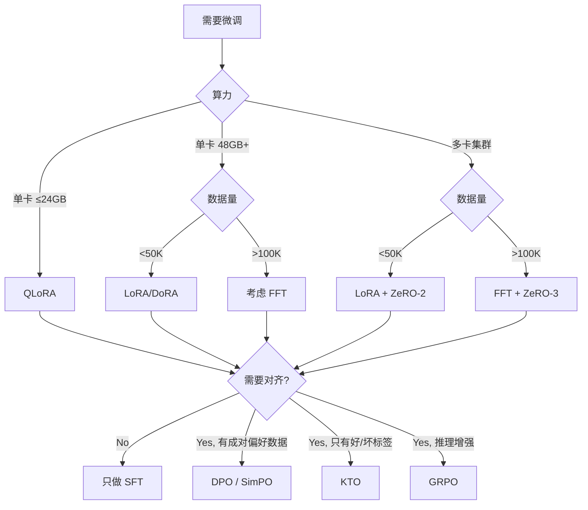

# 微调选型决策框架

> 微调不是目的，是手段。选错方法比不微调更危险——你可能花了 3 天训练，最终得到一个比原模型更差的东西。

## 一、先回答一个前置问题：你真的需要微调吗？

很多时候不需要。

| 你的需求 | 该用什么 | 不该用微调的原因 |
|---------|---------|---------------|
| 让模型遵循特定输出格式 | System Prompt + Structured Output API | Prompt 就够了，微调是杀鸡用牛刀 |
| 注入实时/私有知识 | RAG | 微调不擅长记忆事实，会幻觉 |
| 提升特定推理能力 | Prompt Engineering (CoT/Few-Shot) | 先试 prompt，不行再考虑微调 |
| 教模型新领域专业术语 + 行为模式 | **SFT** | ← 这才是微调的 sweet spot |
| 让模型输出更安全/更符合偏好 | **DPO/RLHF** | ← 对齐是微调的另一核心场景 |
| 大模型能力蒸馏到小模型 | **Fine-tune 小模型** | ← 成本驱动的微调，完全合理 |

## 二、选型决策树



## 三、Full Fine-tune vs LoRA vs QLoRA：真实权衡

### 显存与成本

以 7B 模型为锚点（这是最常见的生产场景）：

| 方案 | 显存需求 | 最低硬件 | 效果天花板 | 训练速度 |
|------|---------|---------|-----------|---------|
| **FFT** (BF16+AdamW) | ~56 GB | 8×A100 | 100%（上界） | 基线 |
| **LoRA** (r=16, all layers) | ~14 GB | 1×A100-40GB | 95%+ of FFT | 基线×0.9 |
| **QLoRA** (NF4+LoRA) | ~4 GB | 1×RTX 4090 | 93-95% of FFT | 基线×0.7 |

### 我的判断

**2026 年的默认选择是 LoRA/DoRA，不是 FFT，也不是 QLoRA。**

理由：
1. **FFT 的边际收益不值得成本**。LoRA(r=16) 在绝大多数 NLP 任务上达到 FFT 95%+ 的效果，但成本只有 1/4。除非你在做预训练级别的领域迁移（英文→阿拉伯文），FFT 的那 5% 不值得 4 倍的算力。

2. **QLoRA 是妥协方案，不是最优方案**。4-bit 量化的训练速度下降 20-30%，效果也有微小损失。它的价值在于让消费级 GPU 也能跑，但如果你有 A100，没理由用 QLoRA。

3. **DoRA + LoRA+ 是免费升级**。DoRA 解耦方向和大小，LoRA+ 给 A/B 矩阵不同学习率，两者零额外成本，稳定提升 1-3%。2026 年新项目没理由不用。

### LoRA 核心参数速查

| 参数 | 推荐值 | 调参逻辑 |
|------|-------|---------|
| **rank (r)** | 16（起点） | 复杂/跨域→32-64；简单分类→8 |
| **alpha (α)** | 2r | 有效缩放=2；改r时同步调 |
| **target_modules** | 所有线性层（Q/K/V/O + MLP） | 只加 Q/V 是老黄历了 |
| **dropout** | 0.05 | 数据少→0.1；数据多→0 |
| **学习率** | 1e-4 ~ 3e-4 | FFT 用 1e-5~5e-6 |

## 四、数据量：多少才值得微调

这是最被低估的问题。

### LIMA 定律的工程启示

> 1000 条精心标注的高质量数据 > 100K 条低质量数据

| 场景 | 推荐数据量 | Epoch | 备注 |
|------|-----------|-------|------|
| 简单任务适配（分类/NER） | 1K-5K | 3-5 | LoRA r=8-16 |
| 通用 Chat 能力 | 10K-50K | 1-3 | 混合通用数据 |
| 领域专家（医疗/法律） | 50K-200K | 1-2 | 数据质量是命门 |
| 多能力模型 | 100K-1M | 1 | 一般只有大厂干 |

**数据质量 > 数据量，这不是口号，是硬数据支撑的结论。** 质量过滤后的 6K 条数据效果超越未过滤的 52K 条（AlpaGasus 实验）。

### 数据构建的关键工序

```
种子标注 500-1K条 → LLM 扩展 → Reward Model 打分过滤 → 语义去重 → 多样性采样 → 格式标准化
```

最容易犯的 3 个错误：
1. **Chat Template 用错**——这比任何超参调优都重要。7B 模型 loss 不收敛，50% 的概率是 template 问题。
2. **没有 mask instruction**——在 instruction 部分也计算 loss，模型学会复述问题而不是回答。
3. **忘加 EOS token**——模型不知道何时停止，推理时无限生成。

## 五、微调会不会破坏通用能力？

**会。但有工程解法。**

这叫"灾难性遗忘"（Catastrophic Forgetting）和"对齐税"（Alignment Tax）。表现为：微调后目标任务变好了，但数学、编码、通用知识退化。

### 防遗忘方案排序

| 方案 | 有效性 | 实现成本 | 推荐度 |
|------|--------|---------|--------|
| **LoRA 本身** | ★★★★★ | 零 | 首选——冻结基座就是最好的防遗忘 |
| **数据混合 Replay** | ★★★★★ | 低 | 混入 10-30% 预训练/通用数据，工业界标配 |
| **学习率控制** | ★★★★ | 低 | 小 lr + cosine schedule + 少 epoch |
| **NEFTune** | ★★★ | 极低 | 输入嵌入加噪声，一行代码 |
| **EWC 正则化** | ★★★ | 高 | 计算 Fisher 矩阵成本大，通常不需要 |

**我的判断**：LoRA + 数据混合，覆盖 95% 的遗忘场景。如果这还不够，说明你的数据分布偏差太大，应该回去检查数据，而不是加更复杂的正则化。

### 监控策略

维护一组多维评估基准，不只看目标任务。**任一通用基准下降 >3% 立即排查。**

## 六、SFT 和 RLHF/DPO 的接力关系

```
预训练 → SFT → 偏好对齐
文本补全器 → 指令遵循者 → 安全/有用/符合偏好的助手
```

这三步不是可选的菜单，是接力赛。**跳过 SFT 直接做 DPO 不行——模型连指令都不会遵循，你没法收集有意义的偏好数据。**

### 对齐方法选择

| 方法 | 需要什么数据 | 需要额外模型？ | 训练复杂度 | 效果 |
|------|------------|-------------|-----------|------|
| **PPO (RLHF)** | 成对偏好 → Reward Model | 4 个模型同时在 GPU | 极高 | 天花板最高 |
| **DPO** | 成对偏好 (chosen/rejected) | 1 个 reference model | 低 | 接近 PPO |
| **SimPO** | 成对偏好 | 不需要 | 最低 | 略低于 DPO |
| **KTO** | 独立标签（好/坏） | 1 个 reference model | 低 | 数据收集最省 |
| **GRPO** | 组内排序 | 不需要 Critic | 中 | 推理增强最强 |

**2026 年的共识**：DPO 是默认选择。PPO 只在需要 Online RL 的场景（如推理增强）才用——它的工程复杂度是 DPO 的 5 倍。KTO 在数据难以成对时是救星。

## 七、LoRA 变体：该用哪个？

Prefix Tuning、Adapter 这些老方法已经退出主流。2026 年的 PEFT 就是 LoRA 家族。

| 方法 | 核心改进 | 额外成本 | 值得吗？ |
|------|---------|---------|---------|
| **LoRA** | 基线 | — | 稳 |
| **DoRA** | 解耦方向/大小 | +0.01% 参数 | **必用**——r=16 效果接近 LoRA r=64 |
| **LoRA+** | A/B 差异学习率 | 零 | **必用**——改一行配置 |
| **rsLoRA** | √r 缩放 | 零 | 高秩时有用 |
| **AdaLoRA** | 自适应秩分配 | SVD 参数化 | 研究价值 > 工程价值 |
| **MoLoRA** | 多 expert 路由 | 路由器 + 多 adapter | 前沿方向，serving 基础设施待成熟 |

**2026 年新项目默认配置**：DoRA + LoRA+，零额外成本，稳定提升。

## 八、训练框架选择

别在框架上纠结太久。

| 你的情况 | 用什么 |
|---------|-------|
| 单卡快速实验 | **Unsloth**（速度最快，省 40-60% 显存） |
| 零代码/团队协作 | **LLaMA-Factory**（WebUI） |
| 生产级 DPO/RLHF | **TRL**（HuggingFace 官方，最完整） |
| YAML 配置管理 | **Axolotl** |

**实战路径**：Unsloth 验证想法 → TRL/Axolotl 做分布式生产训练。

## 九、分布式微调的选择

| 场景 | 方案 |
|------|------|
| 7B LoRA | 2×A100 + ZeRO-2（甚至单卡够了） |
| 70B LoRA | 8×A100 + ZeRO-3 或 QLoRA + ZeRO-2 |
| 7B FFT | 8×A100 + ZeRO-2/3 |
| 70B FFT | 64+ A100 + ZeRO-3 + Pipeline Parallelism |

**LoRA 优先用 ZeRO-2，不要用 ZeRO-3。** 原因：LoRA 可训练参数 <1%，ZeRO-3 对冻结参数的 all-gather 是纯浪费通信带宽。

## 十、排查 loss 不收敛的清单

这是最实用的部分，按概率排序：

1. **Chat Template 错误（50%）**：打印 tokenize 后的结果，确认 special tokens 正确
2. **Loss Masking 错误**：确认只在 response 部分计算 loss
3. **学习率过高**：LoRA 推荐 1e-4~2e-4，loss 剧烈震荡→降 lr
4. **NF4 精度问题**：`compute_dtype` 必须是 `bfloat16`，不是 `float16`
5. **数据异常**：打印 loss 最高的样本，人工检查
6. **Batch size 太小**：有效 batch ≥16
7. **模型加载问题**：检查 warning，确认 `prepare_model_for_kbit_training` 已调用

**黄金诊断法**：用 1 条数据做过拟合测试。20 步内 loss 应降到 <0.5。如果不降——模型/数据/配置有根本性问题。

## 十一、我的判断

微调技术在 2026 年已经高度成熟。核心瓶颈已经从"怎么训"转移到"训什么数据"和"该不该训"。

**三个最容易犯的战略错误**：
1. **该用 Prompt 的时候用了微调**——浪费算力，还可能引入遗忘
2. **该用 RAG 的时候用了微调**——微调不擅长记忆事实，RAG 才是
3. **数据质量不够就急着训**——垃圾进垃圾出，1000 条精品 > 100K 条噪声

**微调的真正价值**：教模型一种新的"行为模式"，而不是新的"知识"。行为模式包括：特定领域的推理方式、特定的输出风格、特定的安全边界。这些是 prompt 难以稳定传达的东西。

技术选型本身不难，难的是判断什么时候该用、什么时候不该用。这个判断力，比会调 LoRA 参数重要十倍。
